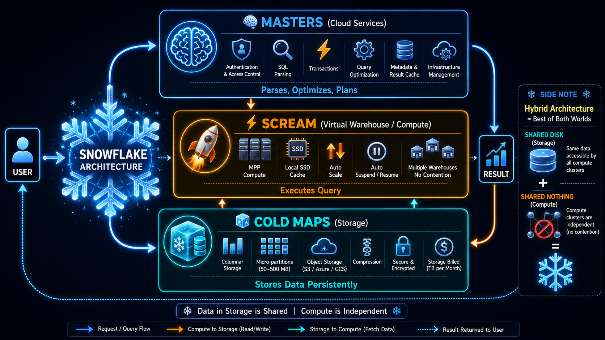
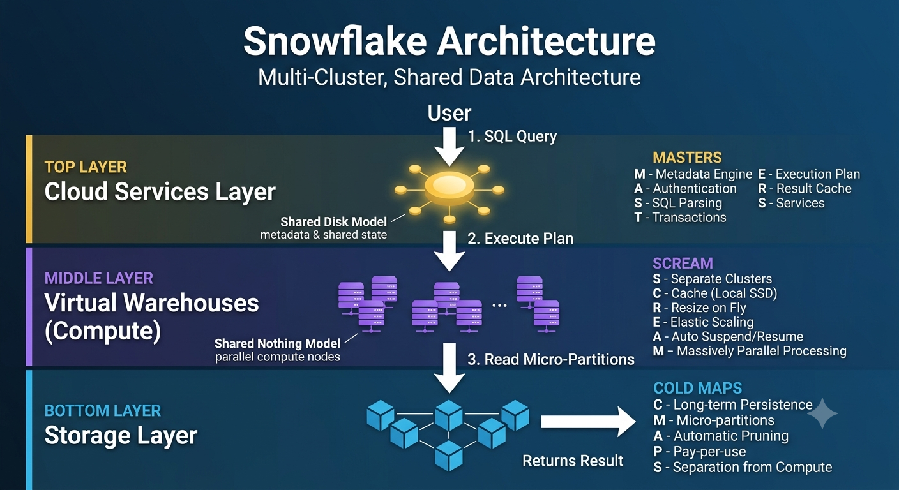

# ❄️ Snowflake Architecture Mnemonics

---
# Snowflake Architecture





# 🧠 Cloud Services = "MASTERS"

> Think: **The MASTER controls everything.**

| Letter | Meaning |
|---------|---------|
| **M** | Metadata Management |
| **A** | Authentication & Access Control |
| **S** | SQL Parsing |
| **T** | Transaction Management |
| **E** | Execution Plan (Query Optimization) |
| **R** | Result Cache |
| **S** | Snowflake Infrastructure Management |

✅ Brain of Snowflake

---

# ⚡ Compute Layer = "SCREAM"

> Think: **Queries SCREAM through the warehouse at lightning speed.**

| Letter | Meaning |
|---------|---------|
| **S** | Separate Warehouses (No Contention) |
| **C** | CPU + Local SSD Cache |
| **R** | Run Queries |
| **E** | Elastic Scaling (Resize Anytime) |
| **A** | Auto Suspend / Auto Resume |
| **M** | MPP (Massively Parallel Processing) |

✅ Executes Queries

---

# 🧊 Storage Layer = "COLD MAPS"

> Think: **Data is frozen like a COLD MAP waiting to be read.**

| Letter | Meaning |
|---------|---------|
| **C** | Compressed Data |
| **O** | Object Storage (S3 / Azure Blob / GCS) |
| **L** | Long-Term Persistent Storage |
| **D** | Database Storage Managed by Snowflake |
| **M** | Micro-partitions (50–500 MB) |
| **A** | Accessible by Multiple Warehouses |
| **P** | Pay for Storage Only |
| **S** | Stored in Columnar Format |

✅ Stores Data Persistently

---

# 🔄 Complete Query Flow

```text
          👤 USER
             │
             ▼
      🧠 MASTERS
 (Parse • Authenticate • Optimize)
             │
             ▼
      ⚡ SCREAM
    (Execute Query)
             │
             ▼
     🧊 COLD MAPS
      (Read Data)
             │
             ▲
      ⚡ SCREAM
 (Process & Aggregate)
             │
             ▼
         👤 RESULT
```

---

# 🏆 One-Line Story

> **"The MASTERS use the SCREAM engine to read the COLD MAPS."**

- 🧠 **MASTERS** → Thinks
- ⚡ **SCREAM** → Works
- 🧊 **COLD MAPS** → Stores

---

# 🎯 5-Mark Interview Answer

**Snowflake follows a Multi-Cluster Shared Data Architecture, which combines Shared Disk (Storage) and Shared Nothing (Compute).**

It consists of three layers:

### 🧠 Cloud Services (MASTERS)
- Metadata
- Authentication
- SQL Parsing
- Transactions
- Query Optimization
- Result Cache
- Infrastructure Management

### ⚡ Compute Layer (SCREAM)
- Independent Virtual Warehouses
- MPP Execution
- CPU, Memory & Local SSD Cache
- Elastic Scaling
- Auto Suspend/Resume
- No Resource Contention

### 🧊 Storage Layer (COLD MAPS)
- Cloud Object Storage
- Compressed Columnar Storage
- Immutable Micro-partitions
- Persistent Storage
- Shared Across Warehouses
- Storage billed separately

⭐ **Most Important Interview Point:** Snowflake separates **Storage** and **Compute**, allowing each to scale independently for better performance and concurrency.
