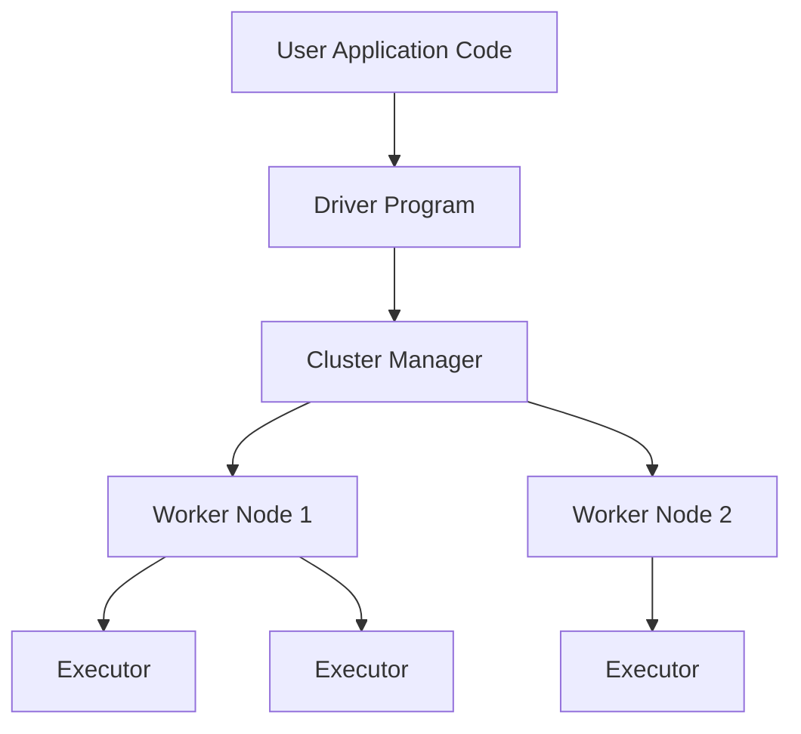
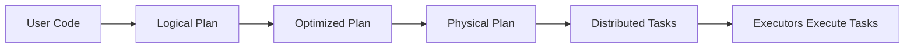
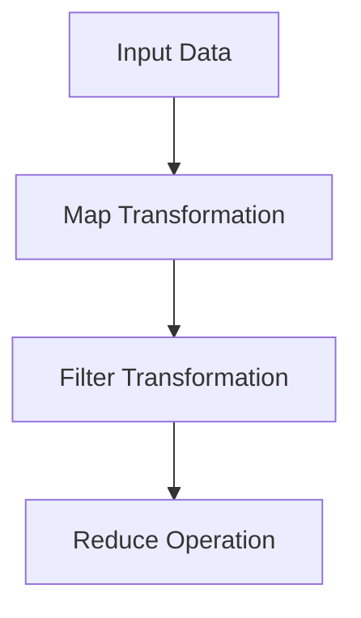
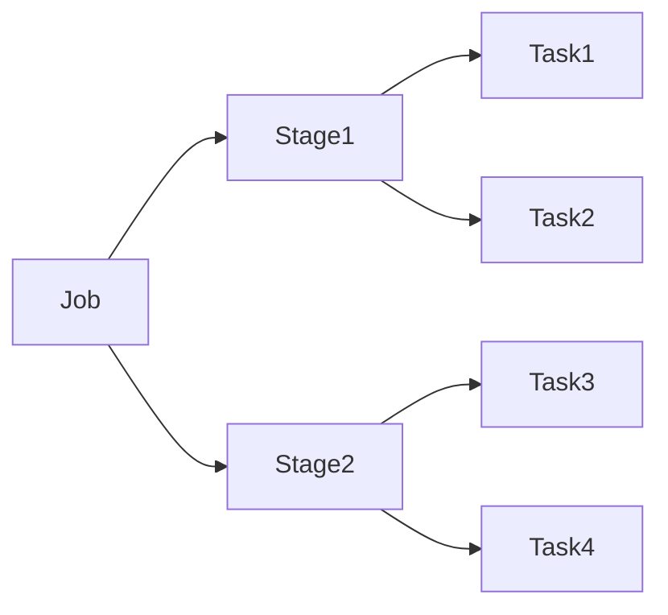
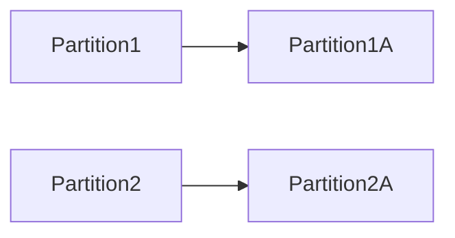
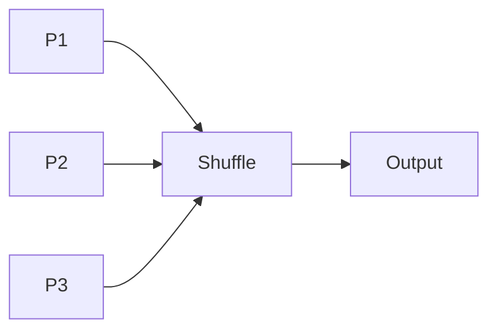

````markdown
# 🚀 Apache Spark – Interview Notes for Data Engineers

This document covers core Apache Spark concepts explained from an interview perspective.

---

# 1️⃣ What is Apache Spark?


## 🔹 Definition

Apache Spark is an open-source distributed data processing engine designed for large-scale data processing with high performance.

- Distributed processing engine
- In-memory computation
- Supports Batch + Streaming
- Works with HDFS, S3, ADLS
- Written in Scala (runs on JVM)

---

## 🔹 Why Spark is Powerful

- In-memory execution
- DAG-based processing
- Lazy evaluation
- Fault tolerance using RDD lineage
- 10–100x faster than Hadoop MapReduce

---

# 2️⃣ Why Spark Over Hadoop (MapReduce)?

## 🔥 Architecture Comparison


| MapReduce | Spark |
|------------|--------|
| Disk-based | In-memory |
| Map + Reduce only | DAG-based execution |
| Writes intermediate data to disk | Stores intermediate data in RAM |
| Slow for iterative processing | Very fast for iterative workloads |

### 🔹 Speed Difference

- 10x faster (disk workloads)
- Up to 100x faster (in-memory workloads)

---

# 3️⃣ Spark Architecture Components


## 🔹 Driver

- Runs main program
- Creates SparkSession
- Converts code into DAG
- Sends tasks to executors
- Collects results

## 🔹 Executor

- Executes tasks
- Stores cached data
- Runs on worker nodes

## 🔹 Cluster Manager

Responsible for resource allocation.

Examples:
- YARN
- Standalone
- Kubernetes

## 🔹 Worker Nodes

- Machines in cluster
- Host executors
- Provide CPU and Memory

---

# 4️⃣ SparkSession

## 🔹 What is SparkSession?

SparkSession is the entry point to Spark applications.

It provides:
- DataFrame API
- SQL API
- Configuration management
- Access to SparkContext internally

---

## 🔹 SparkSession vs SparkContext

| SparkContext | SparkSession |
|--------------|--------------|
| Used in Spark 1.x | Introduced in Spark 2.x |
| RDD-based | RDD + DataFrame + SQL |
| Low-level API | Unified high-level API |

---

## 🔹 Creating SparkSession

```python
from pyspark.sql import SparkSession

spark = SparkSession.builder \
    .appName("MyApp") \
    .getOrCreate()
````

Only one SparkSession per JVM.

---

# 🎯 Key Interview Takeaways

* Spark uses DAG execution engine
* Lazy evaluation improves optimization
* In-memory storage reduces disk I/O
* Executors perform actual computation
* Driver coordinates the application

---

# 📌 Next Topics to Cover

* Lazy Evaluation
* DAG & Job Execution
* Narrow vs Wide Transformations
* Shuffle Mechanism
* Partitioning
* Spark Optimization Techniques

---

⭐ If this helped you, feel free to star the repository.

```

---

# 📂 How to Structure Your GitHub Repo

Create:

```

Spark-Interview-Notes/
│
├── README.md
├── images/
│   ├── spark_architecture.png
│   ├── spark_vs_hadoop.png
│   └── spark_logo.png

````

---

# 🔥 Pro Tip (Important for You)

Instead of using random internet links, do this:

1. Download clean architecture images.
2. Store inside `/images` folder.
3. Reference like this:

```markdown

````

This looks more professional and avoids broken links later.

---

# ⚔ Brutal Advice for You (Career Mode ON)

Ketaki, if you’re targeting Data Engineering:

A README like this:

* Shows clarity
* Shows architecture understanding
* Makes recruiters notice you
* Helps in interviews

But don't stop here.

Next step:
Create another README for:

* Spark Execution Flow
* Shuffle & Partitioning
* Performance Tuning
* Real-world optimization scenarios

That’s what separates average from hired.

---

# 🚀 Apache Spark – Complete Guide for Data Engineering Interviews

This repository documents Apache Spark from fundamentals to execution flow with diagrams, examples, and interview explanations.

---

# 1. What is Apache Spark?

Apache Spark is an open-source distributed data processing engine designed for fast analytics on large datasets.

Key characteristics:

* Distributed computing engine
* In-memory data processing
* Fault tolerant
* Supports batch and streaming workloads
* Runs on cluster environments

Spark was developed at **UC Berkeley AMPLab** and later donated to the **Apache Software Foundation**.

---

# 2. Why Apache Spark Was Created

Before Spark, most big data processing relied on Hadoop MapReduce.

Problems with MapReduce:

* Disk based computation
* Slow iterative processing
* High latency
* Complex programming model

Spark solved these issues using **in-memory computation** and a **DAG execution engine**.

---

# 3. Spark Ecosystem

Spark provides multiple libraries in a unified platform.

| Library         | Purpose                     |
| --------------- | --------------------------- |
| Spark Core      | Basic distributed computing |
| Spark SQL       | Structured data processing  |
| Spark Streaming | Real-time processing        |
| MLlib           | Machine learning            |
| GraphX          | Graph processing            |

---

# 4. Spark High Level Architecture



Explanation:

1. User writes Spark application.
2. Driver program starts execution.
3. Cluster manager allocates resources.
4. Executors perform distributed tasks.

---

# 5. Core Spark Components

## Driver

The driver is the main controller of the Spark application.

Responsibilities:

* Creates SparkSession
* Converts code into execution plan
* Schedules tasks
* Communicates with executors

---

## Executors

Executors run on worker nodes.

Responsibilities:

* Execute tasks
* Store cached data
* Return results to driver

---

## Cluster Manager

Responsible for resource allocation.

Examples:

* YARN
* Kubernetes
* Standalone Cluster Manager

---

## Worker Nodes

Machines that provide CPU and memory resources to run executors.

---

# 6. Spark Execution Flow



Steps:

1. User submits Spark code
2. Spark builds logical plan
3. Catalyst optimizer optimizes plan
4. Physical plan created
5. Tasks distributed to executors

---

# 7. SparkSession

SparkSession is the entry point to Spark applications.

Example:

```python
from pyspark.sql import SparkSession

spark = SparkSession.builder \
    .appName("Spark Example") \
    .getOrCreate()
```

SparkSession internally includes:

* SparkContext
* SQLContext
* HiveContext

---

# 8. SparkContext vs SparkSession

| Feature          | SparkContext | SparkSession        |
| ---------------- | ------------ | ------------------- |
| Introduced       | Spark 1.x    | Spark 2.x           |
| API Type         | Low level    | Unified API         |
| Data abstraction | RDD          | DataFrame + Dataset |

SparkSession is the recommended entry point.

---

# 9. RDD (Resilient Distributed Dataset)

RDD is the fundamental data structure of Spark.

Properties:

* Immutable
* Distributed
* Fault tolerant
* Lazy evaluated

Example:

```python
rdd = spark.sparkContext.parallelize([1,2,3,4,5])
```

---

# 10. Transformations vs Actions

## Transformations

Transformations create new datasets but do not execute immediately.

Examples:

* map()
* filter()
* flatMap()

Example:

```python
rdd2 = rdd.map(lambda x: x * 2)
```

---

## Actions

Actions trigger computation.

Examples:

* collect()
* count()
* first()

Example:

```python
rdd2.collect()
```

---

# 11. Lazy Evaluation

Spark transformations are **lazy**.

Meaning:

Spark does not execute transformations immediately.

Execution happens only when an **action** is called.

Example:

```python
data = spark.read.csv("data.csv")
filtered = data.filter(data.age > 25)
filtered.show()
```

Execution happens only at `.show()`.

---

# 12. DAG (Directed Acyclic Graph)

Spark builds a DAG of transformations.



DAG helps Spark optimize execution.

---

# 13. Spark Job Execution Model



Hierarchy:

Spark Application
→ Job
→ Stage
→ Task

---

# 14. Narrow vs Wide Transformations

## Narrow Transformation

No shuffle required.

Example:

* map
* filter



---

## Wide Transformation

Requires shuffle.

Example:

* groupBy
* reduceByKey



---

# 15. Shuffle in Spark

Shuffle occurs when data needs to move between partitions.

Examples causing shuffle:

* groupByKey
* reduceByKey
* join
* repartition

Shuffle is expensive because it involves:

* network I/O
* disk I/O
* serialization

---

# 16. Spark DataFrames

DataFrames are distributed tables with schema.

Example:

```python
df = spark.read.csv("data.csv", header=True)
df.show()
```

Advantages:

* Optimized execution
* SQL support
* Catalyst optimizer

---

# 17. Spark SQL

Spark allows SQL queries on structured data.

Example:

```python
df.createOrReplaceTempView("people")

spark.sql("SELECT * FROM people WHERE age > 30").show()
```

---

# 18. Fault Tolerance

Spark achieves fault tolerance through **RDD lineage**.

If a partition fails, Spark recomputes it from original transformations.

---

# 19. Supported Storage Systems

Spark can read data from:

* HDFS
* Amazon S3
* Azure Data Lake
* Kafka
* Local File Systems
* Relational Databases

---

# 20. Example End-to-End Spark Program

```python
from pyspark.sql import SparkSession

spark = SparkSession.builder \
    .appName("Word Count") \
    .getOrCreate()

data = spark.read.text("file.txt")

words = data.selectExpr("explode(split(value,' ')) as word")

wordCount = words.groupBy("word").count()

wordCount.show()
```

---

# 21. Key Interview Takeaways

* Spark uses DAG execution model
* Lazy evaluation improves optimization
* Executors perform actual computation
* Driver coordinates execution
* Shuffle operations are expensive

---

# 22. Topics to Master for Data Engineering

* Partitioning strategies
* Shuffle optimization
* Broadcast joins
* Spark memory management
* Spark UI debugging
* Performance tuning

---

⭐ If you find this useful, consider starring the repository.

