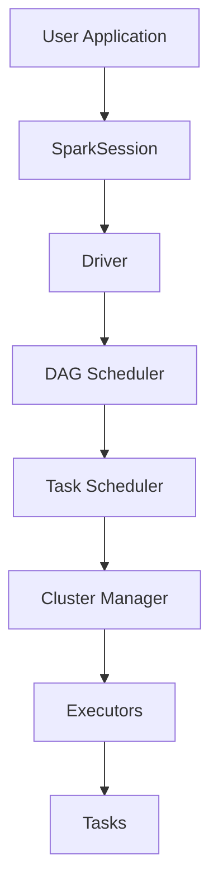

# 🚀 Spark & Data Engineering Handbook

A complete engineering guide to Apache Spark and Modern Data Engineering.

This repository explains Spark from fundamentals → internals → production pipelines with diagrams, examples, and interview questions.

**Topics include:**

- Spark Architecture
- Distributed Processing
- DAG Execution
- Joins & Shuffle
- Memory Management
- Performance Tuning
- ETL Pipelines
- Data Engineering Architecture

---

## 📚 Table of Contents

### Core Spark Concepts

| Chapter | Topic |
|---------|-------|
| 00 | [Architecture Diagrams](./docs/00-architecture-diagrams.md) |
| 00 | [Spark Master Architecture](./docs/00-spark-master-architecture.md) |
| 01 | [Introduction](./docs/01-introduction.md) |
| 02 | [What is Apache Spark](./docs/02-what-is-apache-spark.md) |
| 03 | [Spark vs Hadoop MapReduce](./docs/03-spark-vs-hadoop-mapreduce.md) |
| 04 | [Spark Architecture](./docs/04-spark-architecture.md) |
| 05 | [Application Master Container](./docs/05-application-master-container.md) |
| 06 | [SparkSession](./docs/06-spark-session.md) |
| 07 | [Lazy Evaluation & Actions](./docs/07-lazy-evaluation-actions.md) |
| 08 | [Spark Query Plans & Spark UI](./docs/08-query-plans-spark-ui.md) |

### Spark Core Internals

| Chapter | Topic |
|---------|-------|
| 09 | [Spark RDD](./docs/09-spark-rdd.md) |
| 10 | [Narrow vs Wide Transformations](./docs/10-narrow-wide-transformations.md) |
| 11 | [Repartition vs Coalesce](./docs/11-repartition-vs-coalesce.md) |
| 12 | [Jobs, Stages & Tasks](./docs/12-jobs-stages-tasks.md) |

### Spark Joins & Data Processing

| Chapter | Topic |
|---------|-------|
| 13 | [Shuffle Joins](./docs/13-shuffle-joins.md) |
| 14 | [Broadcast Joins](./docs/14-broadcast-joins.md) |
| 20 | [Salting for Data Skew](./docs/20-salting.md) |
| 21 | [Cache & Persist](./docs/21-cache-persist.md) |

### Spark SQL Engine

| Chapter | Topic |
|---------|-------|
| 15 | [Spark SQL Engine](./docs/15-spark-sql-engine.md) |
| 23 | [Dynamic Partition Pruning](./docs/23-dynamic-partition-pruning.md) |
| 24 | [Adaptive Query Execution](./docs/24-adaptive-query-execution.md) |

### Memory Management

| Chapter | Topic |
|---------|-------|
| 16 | [Driver Memory Management](./docs/16-driver-memory.md) |
| 17 | [Executor Memory Management](./docs/17-executor-memory.md) |
| 18 | [Unified Memory Management](./docs/18-unified-memory-management.md) |
| 19 | [Executor Out Of Memory](./docs/19-executor-out-of-memory.md) |

### Spark Performance

| Chapter | Topic |
|---------|-------|
| 25 | [Spark Performance Tuning](./docs/25-spark-performance-tuning.md) |

### Data Engineering Architecture

| Chapter | Topic |
|---------|-------|
| 26 | [Production Spark ETL Pipeline](./docs/26-production-spark-etl-pipeline.md) |
| 27 | [Spark Internals Deep Dive](./docs/docs/27-spark-internals-deep-dive.md) |
| 28 | [Modern Data Engineering Architecture](./docs/28-data-engineering-architecture.md) |
| 30 | [Production Data Engineering Project](./docs/30-production-data-engineering-project.md) |
| 31 | [System Design Diagram](./docs/31-system-design-diagram.md) |

### Interview Preparation

| Chapter | Topic |
|---------|-------|
| 29 | [PySpark Interview Questions](./docs/29-pyspark-interview-questions.md) |

---

## 🧠 Spark Execution Architecture

Spark applications follow this pipeline:

**User Code → Logical Plan → Optimized Plan → Physical Plan → DAG → Stages → Tasks**

---

## 🏗 Modern Data Engineering Architecture

This architecture powers modern analytics platforms.

---

## ⚙️ Technologies Covered

| Technology | Role |
|------------|------|
| Apache Spark | distributed data processing |
| Apache Kafka | event streaming |
| Apache Airflow | workflow orchestration |
| Data Lake | large-scale storage |
| Data Warehouse | analytics queries |
| BI Tools | dashboards and reporting |

---

## 🎯 Who This Repository Is For

This guide is designed for:

- Data Engineers
- Big Data Engineers
- Analytics Engineers
- Spark Developers
- Students preparing for Data Engineering interviews

---

## 📈 Learning Path

Recommended order:

**Spark Fundamentals** → **Spark Architecture** → **Spark SQL** → **Joins & Shuffle** → **Memory Management** → **Performance Tuning** → **Spark Internals** → **Data Engineering Pipelines**

---

## 📁 Project: Production ETL Pipeline

This repository includes a runnable Spark project:

- **[spark-data-engineering-project/](./spark-data-engineering-project/)** – Production-style ETL pipeline (Kafka → Spark → Data Lake)

---

## 💡 Why This Repository Exists

Most Spark tutorials explain how to write Spark code.

This handbook focuses on:

- **How Spark actually works**
- **How to debug Spark jobs**
- **How to optimize performance**
- **How real data platforms are built**

---

## ⭐ Contributing

If you'd like to improve this guide:

1. Fork the repository
2. Create a new branch
3. Submit a pull request

---

## 📌 Final Goal

By completing this guide you will understand:

- Distributed data processing
- Spark internals
- Performance tuning
- Real-world data engineering architectures

These skills are essential for modern data engineering roles.
