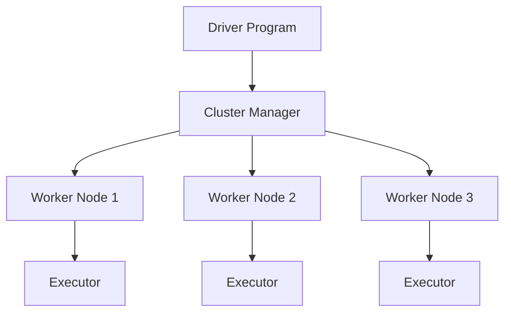
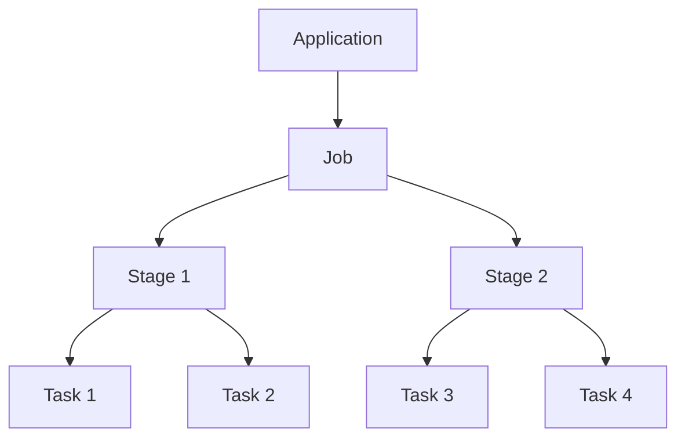
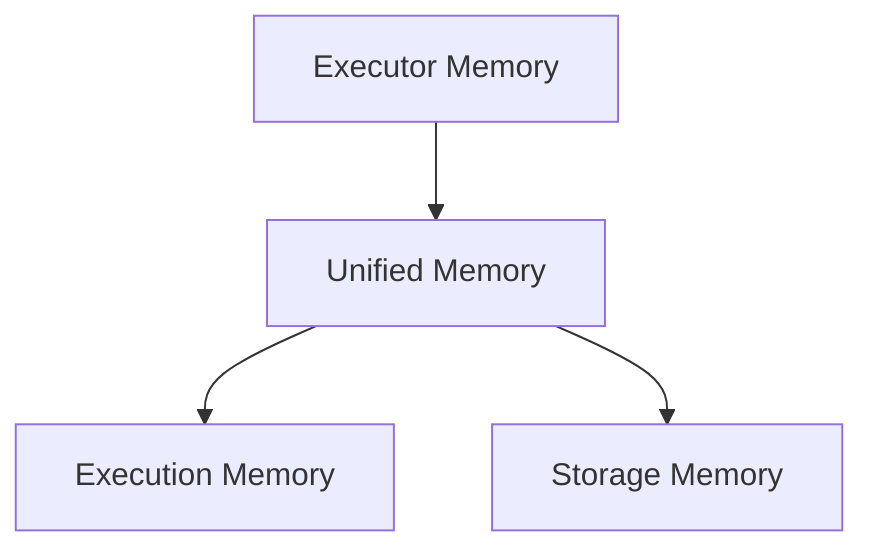
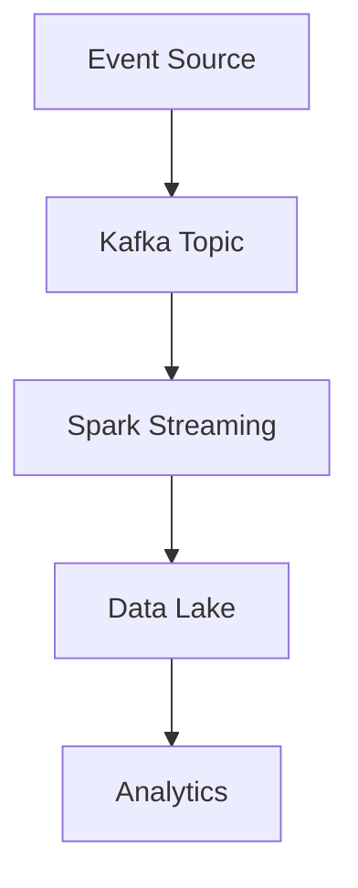
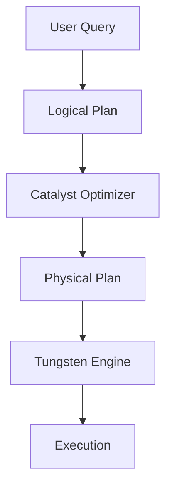

# Architecture Diagrams for Spark & Data Engineering

This section contains key diagrams used throughout the Spark Engineering Handbook.

These diagrams visualize how distributed data systems work in production.

---

## 1️⃣ Spark Cluster Architecture

This diagram shows how Spark applications run on a distributed cluster.

**Explanation:**

- Driver controls the application
- Cluster manager allocates resources
- Worker nodes run executors
- Executors process tasks

---

## 2️⃣ Spark DAG Execution Flow

Spark converts transformations into a Directed Acyclic Graph (DAG) before execution.

**Key idea:** Spark builds the DAG first and executes it only when an action occurs.

---

## 3️⃣ Spark Job → Stage → Task Execution

Spark jobs are broken down into stages and tasks.

**Definitions:**

| Level | Description |
|-------|-------------|
| Application | entire Spark program |
| Job | triggered by an action |
| Stage | separated by shuffle |
| Task | smallest execution unit |

---

## 4️⃣ Spark Memory Architecture

Spark uses a Unified Memory Model.

- **Execution memory** used for: joins, aggregations, shuffle buffers
- **Storage memory** used for: caching, persisted datasets

---

## 5️⃣ Modern Data Engineering Pipeline

Typical data engineering architecture used by modern companies.

**Pipeline stages:** Applications → Kafka → Spark Processing → Data Lake → Data Warehouse → BI Dashboards

---

## 6️⃣ Streaming Data Pipeline

Real-time data pipelines process events continuously.

**Example use cases:** fraud detection, real-time dashboards, clickstream analysis

---

## 7️⃣ Spark Query Optimization Pipeline

Spark SQL queries pass through multiple optimization stages.

**Stages explained:**

| Stage | Purpose |
|-------|---------|
| Logical Plan | describes transformations |
| Catalyst Optimizer | optimizes query |
| Physical Plan | defines execution strategy |
| Execution | runs tasks on executors |

---

## Key Takeaway

These diagrams represent the core architecture behind Spark and modern data engineering systems.

Understanding them helps engineers:

- Design scalable pipelines
- Debug performance issues
- Optimize distributed processing
- Build production-grade data platforms
