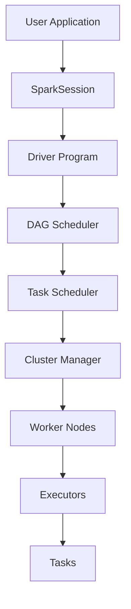
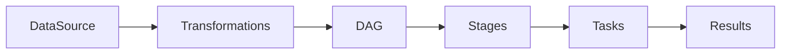
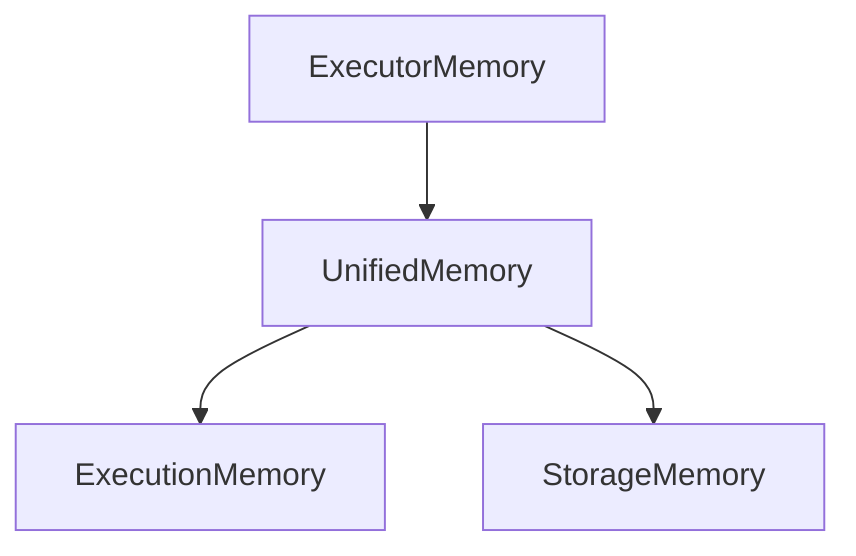
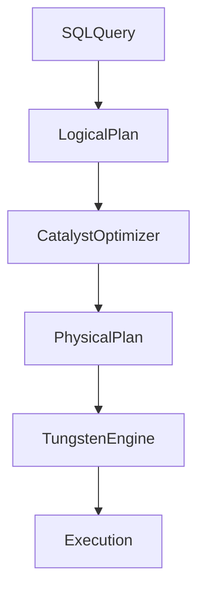
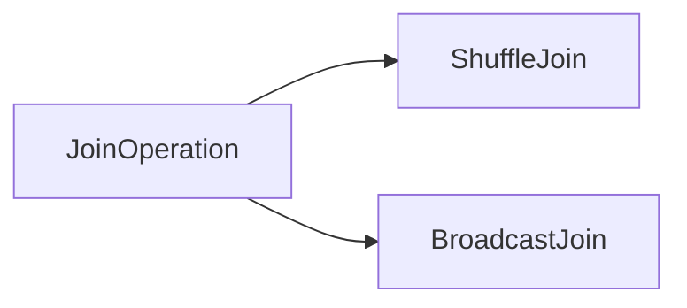
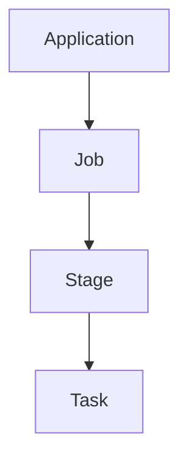

# Spark Master Architecture

This diagram shows the **complete flow of Apache Spark execution**, connecting:

* Spark Architecture
* DAG Execution
* Job → Stage → Task hierarchy
* Memory management
* Query optimization
* Cluster execution

It summarizes the entire Spark system.

---

# 1️⃣ Spark Master Architecture Overview



---

# 2️⃣ Execution Flow Explained

Spark execution follows a structured pipeline.

```text
User Application
      ↓
SparkSession
      ↓
Driver Program
      ↓
DAG Creation
      ↓
Job → Stage → Task
      ↓
Cluster Manager
      ↓
Executors
      ↓
Task Execution
```

---

# 3️⃣ Data Processing Pipeline



---

# 4️⃣ Spark Memory Architecture



Execution memory handles:

* joins
* aggregations
* shuffle operations

Storage memory handles:

* cached datasets
* persisted RDDs

---

# 5️⃣ Query Optimization Pipeline



Spark SQL optimizes queries before execution.

---

# 6️⃣ Join Execution Strategies

Spark supports multiple join strategies.



Broadcast join is used when one dataset is small.

---

# 7️⃣ Performance Optimization Layer

Spark uses multiple optimizations:

```text
Dynamic Partition Pruning
Adaptive Query Execution
Broadcast Joins
Caching
Partitioning
Salting
```

These optimizations improve large-scale data processing performance.

---

# 8️⃣ Spark Execution Hierarchy



Each task processes a partition.

---

# 9️⃣ Cluster Execution Model

Spark runs on clusters managed by:

* Hadoop YARN
* Kubernetes
* Spark Standalone

Cluster manager allocates resources to executors.

---

# 🔟 Complete Spark Stack

Spark consists of multiple layers:

| Layer              | Components            |
| ------------------ | --------------------- |
| Application Layer  | SparkSession, APIs    |
| Execution Layer    | Driver, DAG Scheduler |
| Resource Layer     | Cluster Manager       |
| Compute Layer      | Executors             |
| Optimization Layer | Catalyst, AQE         |
| Memory Layer       | Unified Memory        |

---

# Key Takeaway

Apache Spark processes large-scale data using:

```text
Distributed architecture
Parallel task execution
Advanced query optimization
Dynamic memory management
```

Understanding this architecture allows engineers to **debug performance issues, optimize pipelines, and design scalable data systems**.

---

➡️ Next: `01-introduction.md`
