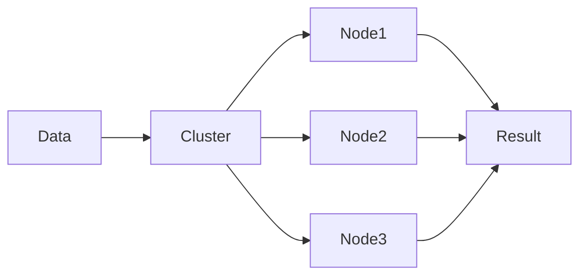

# Chapter 01 – Introduction

Big data systems require distributed processing frameworks to process massive datasets efficiently.

Apache Spark is one of the most widely used distributed processing engines.

---

## Why Big Data Frameworks Exist

Traditional systems cannot process terabytes or petabytes of data efficiently.

Distributed frameworks solve this problem by splitting computation across multiple machines.

---

## Example Scenario

Imagine processing:

* 5 TB of transaction logs
* 100 million rows

A single machine would take hours or days.

Distributed processing splits the work across many nodes.

---

## Visualization

---

⬅️ Previous: None
➡️ Next: [What is Apache Spark](./02-what-is-apache-spark.md)
