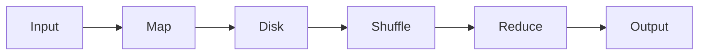
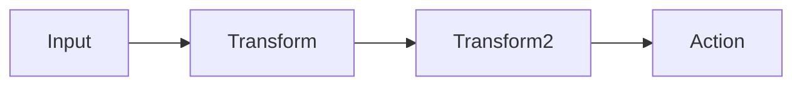

# Chapter 03 – Spark vs Hadoop MapReduce

Apache Hadoop MapReduce was the original distributed processing system.

Spark improved this model significantly.

---

## MapReduce Execution



MapReduce writes intermediate results to disk.

---

## Spark Execution



Spark keeps intermediate data in memory.

---

## Example

Spark word count:

```python
df = spark.read.text("file.txt")

words = df.selectExpr("explode(split(value,' ')) as word")

words.groupBy("word").count().show()
```

---

## Comparison Table

| Feature    | MapReduce | Spark  |
| ---------- | --------- | ------ |
| Processing | Disk      | Memory |
| Speed      | Slow      | Fast   |
| Streaming  | No        | Yes    |

---

⬅️ [Previous: What is Apache Spark](./02-what-is-apache-spark.md)
➡️ [Next: Spark Architecture](./04-spark-architecture.md)
