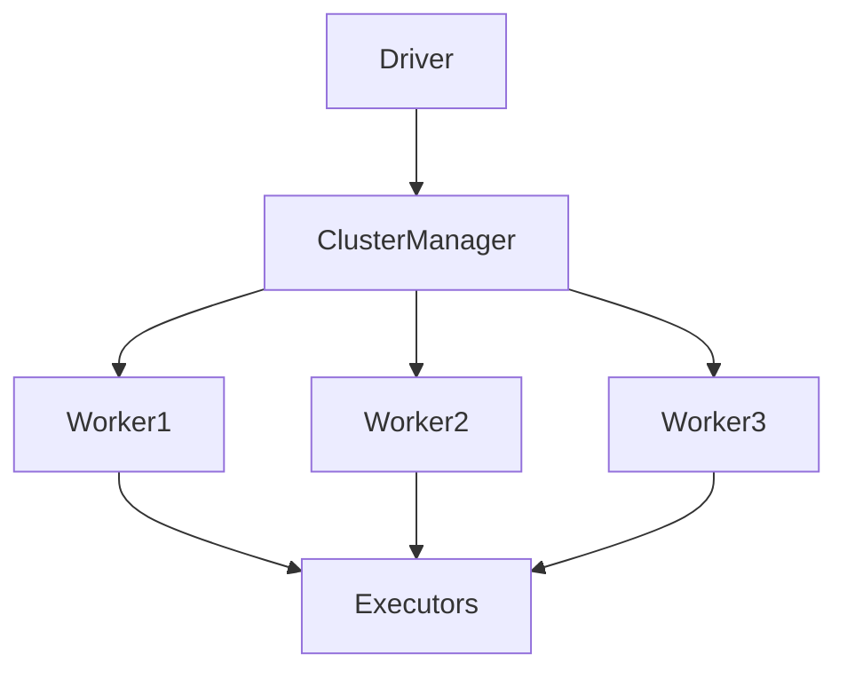

# Chapter 04 – Spark Architecture

Apache Spark follows a **master-worker architecture** for distributed computing.

Key components include:

* Driver
* Cluster Manager
* Worker Nodes
* Executors

---

# 1️⃣ Spark Architecture Overview



---

# 2️⃣ Spark Driver

The driver is the **main process of a Spark application**.

Responsibilities:

* creates SparkSession
* builds execution DAG
* schedules tasks
* communicates with executors
* collects results

---

# 3️⃣ Executors

Executors are worker processes running on cluster nodes.

Responsibilities:

* execute tasks
* store data partitions
* perform shuffle operations

Executors remain active throughout the Spark application.

---

# 4️⃣ Driver vs Executor

| Component | Responsibility                   |
| --------- | -------------------------------- |
| Driver    | orchestrates Spark application   |
| Executor  | performs distributed computation |

Driver creates tasks and sends them to executors.

Executors process partitions and return results.

---

# 5️⃣ Cluster Manager

Cluster managers allocate resources to Spark applications.

Common cluster managers:

* Hadoop YARN
* Kubernetes
* Spark Standalone

---

# 6️⃣ Execution Flow

```
User Application
    ↓
Driver Program
    ↓
Cluster Manager
    ↓
Executors
    ↓
Tasks
```

---

# 7️⃣ Interview Questions

### What is the role of the driver?

The driver coordinates Spark execution and schedules tasks.

### What is an executor?

An executor executes Spark tasks and processes data partitions.

---

# Key Takeaway

Spark architecture separates **coordination (driver)** from **computation (executors)** to enable scalable distributed processing.

---

➡️ Next: `05-application-master-container.md`
