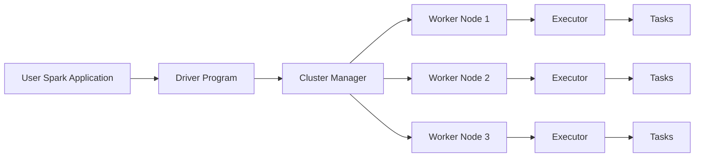
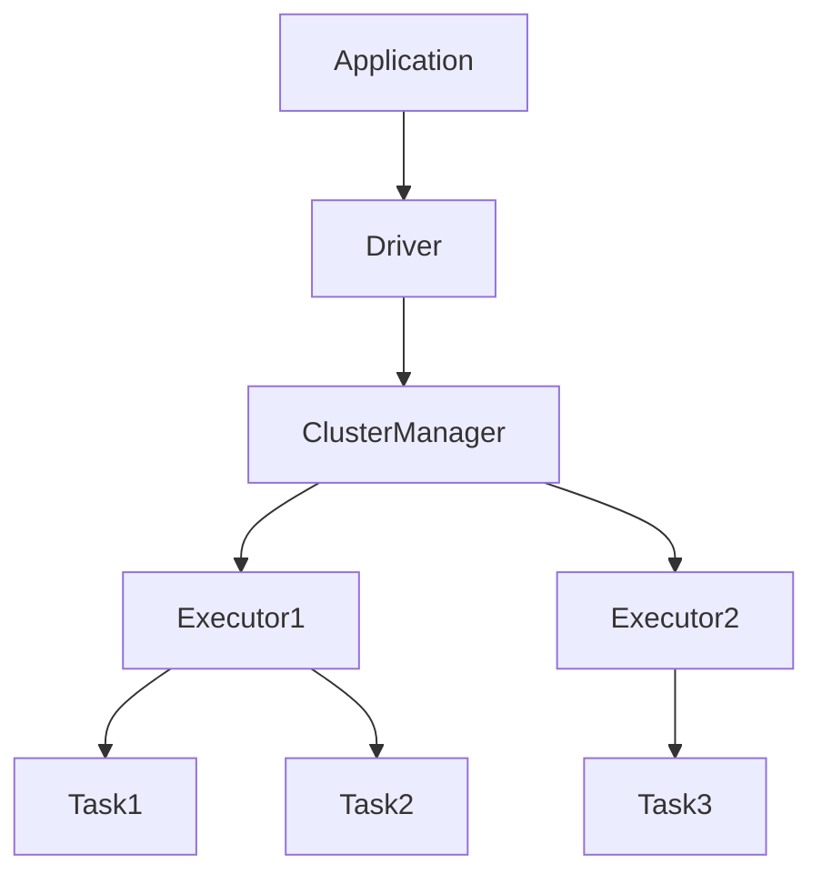

# Chapter 04 – Spark Architecture

Apache Spark uses a **master–worker distributed architecture** to process large datasets across clusters.

This architecture enables Spark to scale from a **single machine to thousands of machines**.

---

# 1️⃣ Core Components of Spark Architecture

Spark architecture consists of the following components:

| Component       | Description                  |
| --------------- | ---------------------------- |
| Driver          | Runs the Spark application   |
| Cluster Manager | Allocates resources          |
| Worker Nodes    | Machines that execute tasks  |
| Executors       | JVM processes that run tasks |
| Tasks           | Smallest unit of work        |

---

# 2️⃣ Spark Architecture Overview



---

# 3️⃣ Driver Program

The **Driver** is the main program that controls the Spark application.

Responsibilities:

* Creates SparkSession
* Builds execution plan
* Divides job into stages
* Sends tasks to executors
* Collects results

Example:

```python
from pyspark.sql import SparkSession

spark = SparkSession.builder.appName("ArchitectureExample").getOrCreate()

data = spark.read.csv("sales.csv")

data.show()
```

The driver coordinates execution but **does not process large datasets itself**.

---

# 4️⃣ Cluster Manager

The **Cluster Manager** allocates resources for Spark applications.

It decides:

* how many executors run
* how much memory is allocated
* which machines run tasks

Common cluster managers:

| Cluster Manager | Description                    |
| --------------- | ------------------------------ |
| YARN            | Hadoop resource manager        |
| Kubernetes      | Container orchestration        |
| Standalone      | Spark built-in cluster manager |

Example command:

```bash
spark-submit --master yarn app.py
```

---

# 5️⃣ Worker Nodes

Worker nodes are machines in the cluster that execute Spark tasks.

Each worker node provides:

* CPU
* memory
* storage

Workers run executors that process data.

---

# 6️⃣ Executors

Executors are **JVM processes running on worker nodes**.

Responsibilities:

* run tasks
* store cached data
* return results to driver

Example configuration:

```bash
--num-executors 5
--executor-memory 8G
--executor-cores 4
```

This configuration means:

* 5 executors
* each executor has 8GB memory
* each executor uses 4 CPU cores

---

# 7️⃣ Tasks

A **task is the smallest unit of work in Spark**.

Each partition of data becomes one task.

Example:

If dataset has **100 partitions**, Spark creates:

```
100 tasks
```

Each task processes one partition in parallel.

---

# 8️⃣ Execution Flow Example

Example Spark job:

```python
df = spark.read.csv("orders.csv")

df.filter("amount > 100") \
  .groupBy("city") \
  .sum("amount") \
  .show()
```

Execution flow:

1️⃣ Driver creates DAG
2️⃣ Cluster manager allocates executors
3️⃣ Executors receive tasks
4️⃣ Tasks process data partitions
5️⃣ Results returned to driver

---

# 9️⃣ Visualization of Execution Flow



---

# 🔟 Example Scenario (Real Production)

Imagine a banking company processing:

```
5 TB transaction data
```

Cluster setup:

| Machine | CPU      | Memory |
| ------- | -------- | ------ |
| Node1   | 16 cores | 64GB   |
| Node2   | 16 cores | 64GB   |
| Node3   | 16 cores | 64GB   |

Spark launches executors across nodes and processes data in parallel.

---

# 1️⃣1️⃣ Why Spark Architecture is Powerful

Spark architecture enables:

* distributed processing
* fault tolerance
* scalability
* parallel execution

If an executor fails, Spark recomputes lost tasks using lineage.

---

# 1️⃣2️⃣ Interview Questions

### What are the main components of Spark architecture?

Driver, Cluster Manager, Worker Nodes, Executors, Tasks.

---

### What is the role of the driver?

The driver coordinates execution and schedules tasks.

---

### What happens if executor fails?

Spark recomputes lost partitions using lineage.

---

### What is the smallest unit of execution in Spark?

Task.

---

# Key Takeaway

Spark architecture separates:

* **coordination (Driver)**
* **resource allocation (Cluster Manager)**
* **data processing (Executors)**

This separation allows Spark to process massive datasets efficiently.

---

⬅️ [Previous: Spark vs Hadoop MapReduce](./03-spark-vs-hadoop-mapreduce.md)
➡️ [Next: Application Master Container](./05-application-master-container.md)
