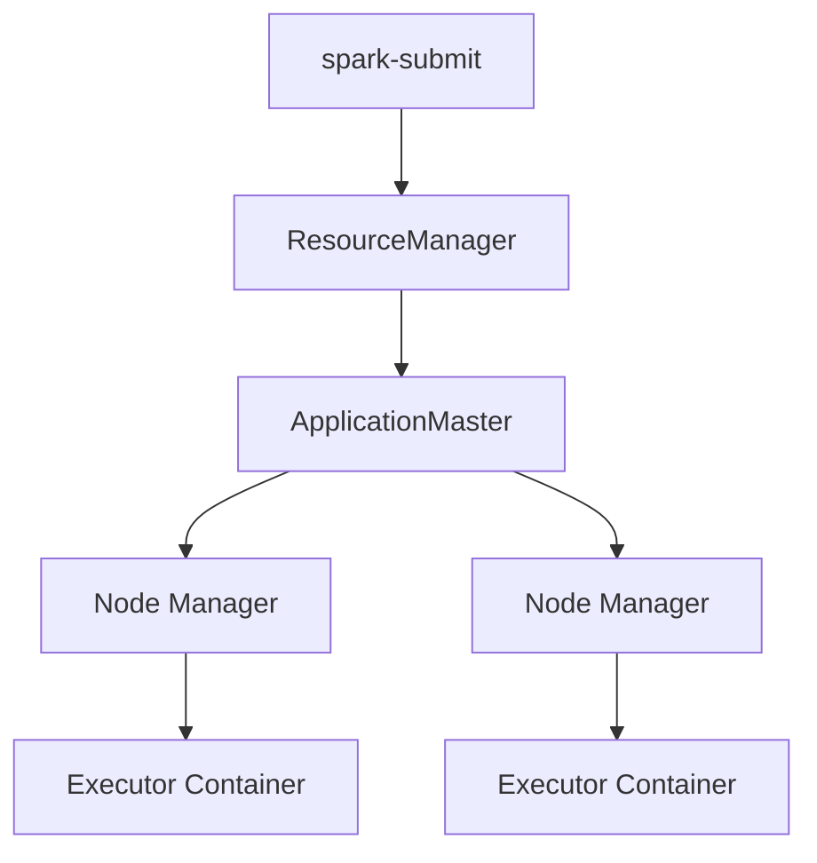
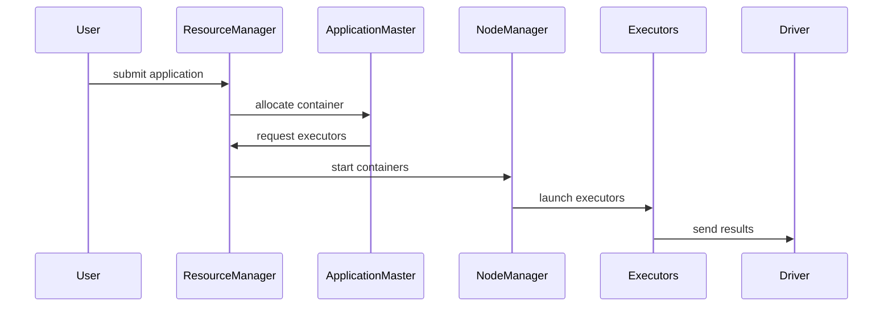

# Chapter 05 – Application Master Container (Spark on YARN)

When Apache Spark runs on **YARN**, it does not directly control cluster resources.

Instead, Spark uses **YARN containers** to run executors.

The **ApplicationMaster** manages these containers.

---

# 1️⃣ What is YARN?

YARN stands for **Yet Another Resource Negotiator**.

It is the cluster resource manager used in the Hadoop ecosystem.

YARN manages:

* CPU
* Memory
* Application scheduling
* Resource allocation

---

# 2️⃣ Components of YARN Architecture

| Component         | Description                    |
| ----------------- | ------------------------------ |
| ResourceManager   | Global resource manager        |
| NodeManager       | Runs on each cluster node      |
| ApplicationMaster | Manages a single application   |
| Containers        | Resource units where tasks run |

---

# 3️⃣ Spark on YARN Architecture



---

# 4️⃣ What is ApplicationMaster?

The **ApplicationMaster (AM)** is responsible for managing a single Spark application on YARN.

Responsibilities:

* negotiate resources from ResourceManager
* request containers
* launch executors
* monitor execution

Each Spark application gets **one ApplicationMaster**.

---

# 5️⃣ What is a Container?

A **container** is a bundle of resources allocated by YARN.

It contains:

* CPU
* Memory
* Environment variables
* Application code

Executors run inside containers.

Example container resources:

| Resource | Value   |
| -------- | ------- |
| Memory   | 8GB     |
| CPU      | 4 cores |

---

# 6️⃣ Execution Flow (Spark on YARN)

When you run:

```bash
spark-submit --master yarn app.py
```

Execution steps:

1️⃣ Spark job submitted
2️⃣ YARN ResourceManager allocates container
3️⃣ ApplicationMaster starts
4️⃣ ApplicationMaster requests executor containers
5️⃣ Executors start inside containers
6️⃣ Tasks executed on executors

---

# 7️⃣ Execution Visualization



---

# 8️⃣ Example Configuration

Spark job configuration for YARN:

```bash
spark-submit \
--master yarn \
--deploy-mode cluster \
--num-executors 5 \
--executor-memory 4G \
--executor-cores 2 \
app.py
```

Explanation:

| Parameter       | Meaning                       |
| --------------- | ----------------------------- |
| num-executors   | number of executor containers |
| executor-memory | memory per container          |
| executor-cores  | CPU cores per executor        |

---

# 9️⃣ Real Production Example

Imagine a Spark job processing **1TB data**.

Cluster configuration:

| Node  | CPU      | Memory |
| ----- | -------- | ------ |
| Node1 | 16 cores | 64GB   |
| Node2 | 16 cores | 64GB   |
| Node3 | 16 cores | 64GB   |

Spark request:

```
10 executors
8GB memory per executor
4 cores per executor
```

YARN allocates containers across cluster nodes.

Each container runs an executor.

---

# 🔟 Why ApplicationMaster is Important

ApplicationMaster ensures:

* resource negotiation
* executor monitoring
* job failure recovery

Without ApplicationMaster, Spark cannot run efficiently on YARN.

---

# 1️⃣1️⃣ Interview Questions

### What is ApplicationMaster in Spark on YARN?

ApplicationMaster manages the lifecycle of a Spark application on YARN and negotiates resources.

---

### What is a container in YARN?

A container is a bundle of resources (CPU + memory) used to run tasks.

---

### How many ApplicationMasters run per application?

One ApplicationMaster per Spark application.

---

### What happens if ApplicationMaster fails?

YARN restarts the application depending on retry configuration.

---

# Key Takeaway

When Spark runs on YARN:

* **ApplicationMaster manages the application**
* **Executors run inside containers**
* **YARN allocates cluster resources**

This architecture allows Spark to scale across large clusters.

---

⬅️ [Previous: Spark Architecture](./04-spark-architecture.md)
➡️ [Next: Spark Session](./06-spark-session.md)
