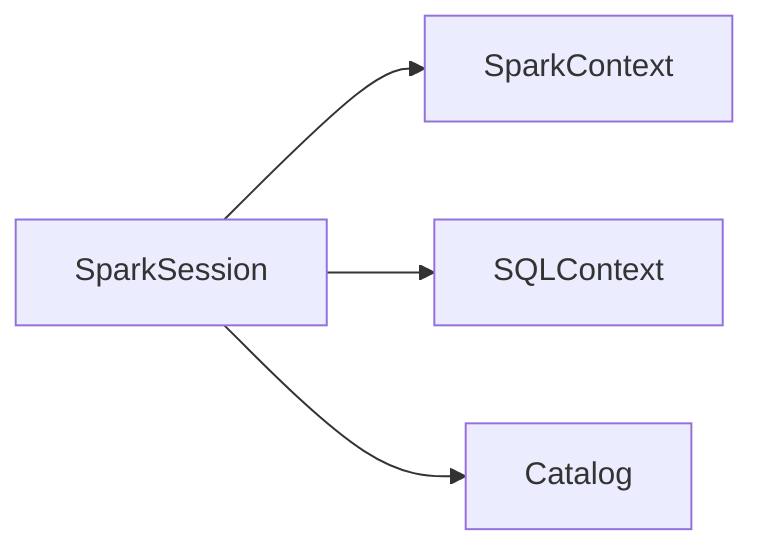
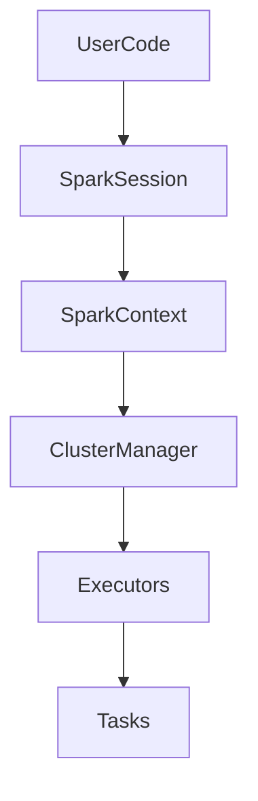

# Chapter 06 – SparkSession

`SparkSession` is the **entry point to all Spark functionality**.

It allows you to work with:

* DataFrames
* Spark SQL
* Structured Streaming
* Spark configuration

Before Spark 2.0, developers used multiple contexts like:

* SparkContext
* SQLContext
* HiveContext

Spark 2.0 unified them into **SparkSession**.

---

# 1️⃣ Why SparkSession Was Introduced

Before Spark 2.0:

```python
sc = SparkContext()
sqlContext = SQLContext(sc)
hiveContext = HiveContext(sc)
```

Managing multiple contexts created complexity.

Spark introduced **SparkSession** to unify them.

---

# 2️⃣ Creating SparkSession

Example:

```python
from pyspark.sql import SparkSession

spark = SparkSession.builder \
    .appName("SparkSessionExample") \
    .getOrCreate()
```

Explanation:

| Method      | Purpose                                 |
| ----------- | --------------------------------------- |
| builder     | creates SparkSession builder            |
| appName     | sets application name                   |
| getOrCreate | returns existing or creates new session |

---

# 3️⃣ SparkSession Architecture



SparkSession internally manages multiple components.

---

# 4️⃣ SparkSession Internals

SparkSession provides access to:

| Component     | Description                |
| ------------- | -------------------------- |
| SparkContext  | core engine                |
| SQLContext    | SQL processing             |
| Catalog       | metadata management        |
| DataFrame API | structured data processing |

---

# 5️⃣ Example – Reading Data

Example reading CSV:

```python
from pyspark.sql import SparkSession

spark = SparkSession.builder.appName("ReadCSV").getOrCreate()

df = spark.read.csv("sales.csv", header=True)

df.show()
```

SparkSession handles:

* cluster connection
* schema inference
* distributed data reading

---

# 6️⃣ Example – Spark SQL

```python
df.createOrReplaceTempView("sales")

spark.sql("SELECT country, SUM(amount) FROM sales GROUP BY country").show()
```

SparkSession allows running SQL queries on DataFrames.

---

# 7️⃣ SparkSession Execution Flow



SparkSession connects the application to the cluster.

---

# 8️⃣ SparkSession vs SparkContext

| Feature    | SparkSession        | SparkContext       |
| ---------- | ------------------- | ------------------ |
| Introduced | Spark 2.0           | Spark 1.x          |
| Purpose    | unified entry point | cluster connection |
| Supports   | DataFrame + SQL     | RDD operations     |

SparkSession internally **contains SparkContext**.

---

# 9️⃣ Stopping SparkSession

When the application completes, you can stop the session.

Example:

```python
spark.stop()
```

This releases cluster resources.

---

# 🔟 Real Production Example

Processing e-commerce data:

```python
spark = SparkSession.builder.appName("OrdersAnalysis").getOrCreate()

orders = spark.read.parquet("orders_data")

orders.groupBy("state").count().show()
```

SparkSession coordinates distributed execution across executors.

---

# 1️⃣1️⃣ Interview Questions

### What is SparkSession?

SparkSession is the unified entry point for working with Spark APIs.

---

### Why was SparkSession introduced?

To replace multiple contexts like SQLContext and HiveContext.

---

### Does SparkSession replace SparkContext?

SparkSession wraps SparkContext internally.

---

### How do you create SparkSession?

Using:

```python
SparkSession.builder.getOrCreate()
```

---

# Key Takeaway

SparkSession simplifies Spark programming by providing **one unified interface** for:

* RDD operations
* DataFrame operations
* SQL queries
* configuration management

---

⬅️ [Previous: Application Master Container](./05-application-master-container.md)
➡️ [Next: Lazy Evaluation and Actions](./07-lazy-evaluation-actions.md)
