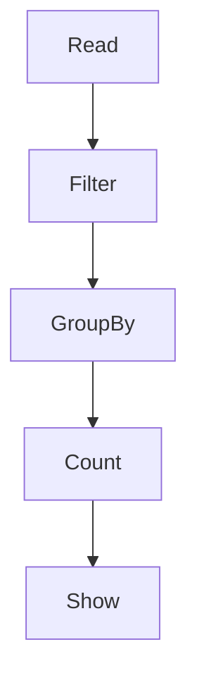
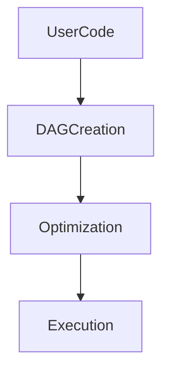

# Chapter 07 – Lazy Evaluation and Actions

One of the most important concepts in Apache Spark is **Lazy Evaluation**.

Spark does **not execute operations immediately**.

Instead, it builds a **logical execution plan (DAG)** and runs it only when an **action** is called.

---

# 1️⃣ What is Lazy Evaluation?

Lazy evaluation means:

Spark **delays execution of transformations until an action is triggered**.

Example:

```python id="a1x7m9"
df = spark.read.csv("sales.csv")

filtered = df.filter("amount > 100")

grouped = filtered.groupBy("city").count()
```

At this point:

❌ Spark has **not executed anything yet**.

Spark is only **building the DAG**.

---

# 2️⃣ When Does Spark Execute?

Execution happens when an **action** is called.

Example:

```python id="p9h2sq"
grouped.show()
```

Now Spark executes all previous transformations.

---

# 3️⃣ Transformations vs Actions

## Transformations

Transformations create a **new dataset from an existing dataset**.

Examples:

| Transformation | Description        |
| -------------- | ------------------ |
| map            | transform each row |
| filter         | filter rows        |
| select         | choose columns     |
| groupBy        | group records      |

Example:

```python id="egpaz7"
df.filter("amount > 100")
```

Transformations are **lazy**.

---

## Actions

Actions trigger **execution of the Spark job**.

Examples:

| Action  | Description           |
| ------- | --------------------- |
| show    | display rows          |
| count   | count rows            |
| collect | bring data to driver  |
| save    | write data to storage |

Example:

```python id="fhk16d"
df.count()
```

Actions force Spark to execute transformations.

---

# 4️⃣ Lazy Evaluation Workflow

```mermaid id="lazy1"
flowchart LR

Read[Read Data]

Filter[Filter Transformation]

GroupBy[GroupBy Transformation]

Action[Action: show()]

Read --> Filter
Filter --> GroupBy
GroupBy --> Action
```

Spark executes the pipeline only at the **action stage**.

---

# 5️⃣ DAG Creation

During lazy evaluation, Spark creates a **Directed Acyclic Graph (DAG)**.

Example pipeline:

```python id="2bt6v9"
df = spark.read.csv("sales.csv")

df1 = df.filter("amount > 100")

df2 = df1.groupBy("city").count()

df2.show()
```

Spark builds this DAG:



---

# 6️⃣ Why Lazy Evaluation is Powerful

Lazy evaluation allows Spark to:

* optimize execution plans
* combine transformations
* reduce unnecessary operations
* minimize shuffle operations

This is done using the **Catalyst Optimizer**.

---

# 7️⃣ Example – Optimized Execution

Consider this code:

```python id="d8sw8u"
df = spark.read.csv("data.csv")

df.filter("age > 20") \
  .filter("salary > 5000") \
  .select("name", "salary") \
  .show()
```

Spark optimizer may combine filters into one operation.

This improves performance.

---

# 8️⃣ Real Production Example

Suppose a company processes **10 TB data**.

Spark pipeline:

```python id="yd8btx"
df = spark.read.parquet("transactions")

df.filter("amount > 1000") \
  .groupBy("country") \
  .sum("amount") \
  .show()
```

Execution steps:

1️⃣ Build DAG
2️⃣ Optimize query
3️⃣ Create stages
4️⃣ Run tasks on executors

---

# 9️⃣ Common Beginner Mistake

Running multiple actions:

```python id="37g7z0"
df.count()
df.show()
```

Spark runs **two separate jobs**.

Better approach:

Cache the dataset.

---

# 🔟 Visualization of Lazy Execution



---

# 1️⃣1️⃣ Interview Questions

### What is lazy evaluation in Spark?

Lazy evaluation means Spark delays execution until an action is called.

---

### Why does Spark use lazy evaluation?

To optimize query execution and reduce unnecessary computations.

---

### Difference between transformation and action?

| Type           | Behavior           |
| -------------- | ------------------ |
| Transformation | lazy operation     |
| Action         | triggers execution |

---

### Example of transformations?

map, filter, select, groupBy.

---

### Example of actions?

count, show, collect, save.

---

# Key Takeaway

Spark builds a **logical execution plan (DAG)** during transformations.

Execution happens **only when an action is triggered**.

This design enables:

* better optimization
* faster execution
* efficient resource utilization

---

⬅️ [Previous: Spark Session](./06-spark-session.md)
➡️ [Next: Spark Query Plans and Spark UI](./08-query-plans-spark-ui.md)
