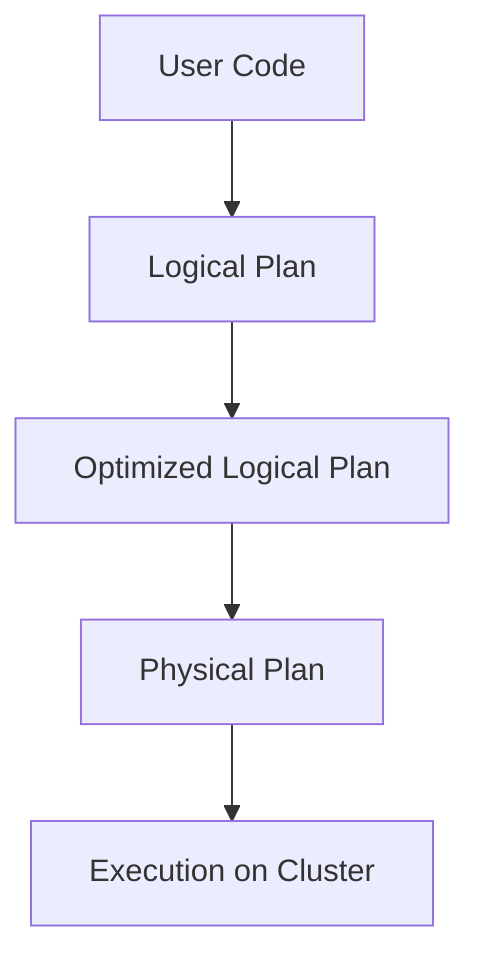
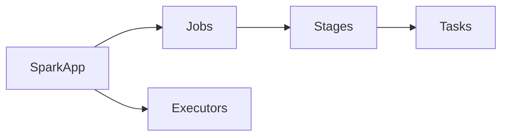

# Chapter 08 – Spark Query Plans and Spark UI

When a Spark job runs, Spark does not immediately execute the code.

Instead, Spark builds **query execution plans** and optimizes them before running tasks.

Spark also provides a **Spark UI** to monitor jobs, stages, and tasks.

---

# 1️⃣ What is a Spark Query Plan?

A **query plan** describes how Spark will execute a computation.

Spark creates multiple levels of plans before execution.

| Plan Type              | Description                             |
| ---------------------- | --------------------------------------- |
| Logical Plan           | describes what operations should happen |
| Optimized Logical Plan | optimized version of logical plan       |
| Physical Plan          | actual execution strategy               |

---

# 2️⃣ Query Plan Example

Example PySpark code:

```python
df = spark.read.csv("sales.csv", header=True)

df.filter("amount > 100") \
  .groupBy("city") \
  .sum("amount") \
  .show()
```

Spark internally creates execution plans before running tasks.

---

# 3️⃣ Query Execution Flow



Spark uses this pipeline to optimize execution.

---

# 4️⃣ Logical Plan

Logical plan represents **what the query does**.

Example operations:

* filter rows
* select columns
* groupBy aggregation

Spark represents these operations as a **logical DAG**.

Example logical plan:

```
Project
  Filter
    Scan CSV
```

---

# 5️⃣ Optimized Logical Plan

Spark optimizes the logical plan using **Catalyst Optimizer**.

Optimization techniques include:

| Optimization       | Description                        |
| ------------------ | ---------------------------------- |
| Predicate Pushdown | move filters closer to data source |
| Column Pruning     | read only required columns         |
| Constant Folding   | pre-compute constant expressions   |
| Filter Combination | combine multiple filters           |

Example:

Original:

```
Filter age > 20
Filter salary > 5000
```

Optimized:

```
Filter age > 20 AND salary > 5000
```

---

# 6️⃣ Physical Plan

Physical plan defines **how Spark executes the query**.

It decides:

* join strategies
* shuffle operations
* partitioning

Example physical plan:

```
HashAggregate
  Exchange
    Filter
      FileScan
```

---

# 7️⃣ Viewing Query Plans

Spark allows you to inspect execution plans.

Example:

```python
df.explain()
```

Detailed output:

```python
df.explain(True)
```

This prints:

* logical plan
* optimized logical plan
* physical plan

---

# 8️⃣ Example Output of Explain

Example result:

```
== Physical Plan ==
HashAggregate
Exchange hashpartitioning
Filter amount > 100
FileScan csv
```

This shows how Spark executes the query.

---

# 9️⃣ Spark UI Overview

Spark provides a **web interface to monitor job execution**.

Default Spark UI URL:

```
http://localhost:4040
```

Spark UI provides information about:

| Section   | Description             |
| --------- | ----------------------- |
| Jobs      | list of Spark jobs      |
| Stages    | execution stages        |
| Tasks     | individual task details |
| Storage   | cached data             |
| Executors | executor resource usage |

---

# 🔟 Spark UI Visualization



This hierarchy shows how Spark jobs are executed.

---

# 1️⃣1️⃣ Debugging with Spark UI

Spark UI helps engineers diagnose problems.

Common issues:

| Problem           | Cause                |
| ----------------- | -------------------- |
| Slow stage        | data skew            |
| Large shuffle     | wide transformations |
| Executor failures | memory issues        |

Using Spark UI you can:

* identify slow tasks
* analyze shuffle stages
* monitor resource usage

---

# 1️⃣2️⃣ Real Production Example

Imagine processing **3TB data**.

You run:

```python
df.groupBy("country").sum("amount")
```

Spark UI shows:

* Job execution timeline
* Stage duration
* Task distribution across executors

Engineers use this to optimize queries.

---

# 1️⃣3️⃣ Interview Questions

### What are the different query plans in Spark?

Logical Plan, Optimized Logical Plan, Physical Plan.

---

### What optimizer does Spark use?

Spark uses the **Catalyst Optimizer**.

---

### What does df.explain() do?

It prints the query execution plan.

---

### What is Spark UI used for?

Monitoring job execution, stages, tasks, and performance debugging.

---

# Key Takeaway

Spark uses **multi-stage query planning** to optimize execution.

Query planning pipeline:

```
User Code
   ↓
Logical Plan
   ↓
Optimized Logical Plan
   ↓
Physical Plan
   ↓
Execution
```

Spark UI helps engineers **monitor and debug distributed jobs**.

---

⬅️ [Previous: Lazy Evaluation and Actions](./07-lazy-evaluation-actions.md)
➡️ [Next: Spark RDD](./09-spark-rdd.md)
