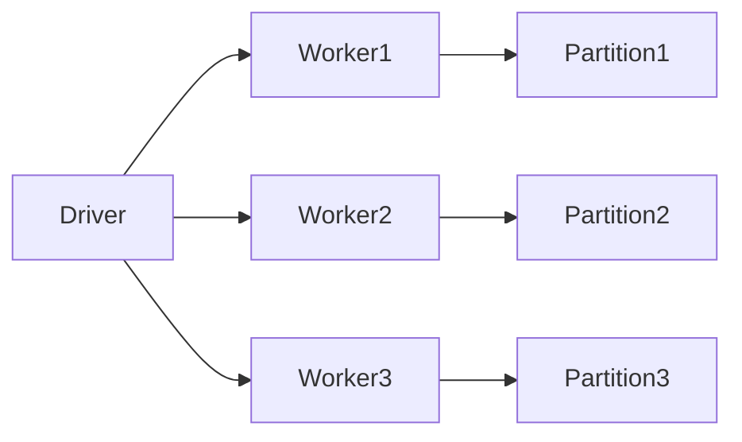
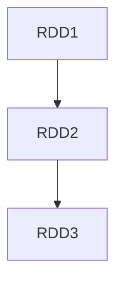

# Chapter 09 – Spark RDD (Resilient Distributed Dataset)

RDD stands for **Resilient Distributed Dataset**.

It is the **fundamental data structure in Apache Spark**.

RDD represents an **immutable distributed collection of objects** processed in parallel across a cluster.

---

# 1️⃣ What is RDD?

An RDD is:

* **Resilient** → fault tolerant
* **Distributed** → spread across cluster nodes
* **Dataset** → collection of data

RDDs allow distributed processing of large datasets.

---

# 2️⃣ RDD Architecture



Each worker processes **one partition of the dataset**.

---

# 3️⃣ Properties of RDD

| Property       | Description                           |
| -------------- | ------------------------------------- |
| Immutable      | Data cannot be changed after creation |
| Distributed    | Stored across cluster nodes           |
| Lazy Evaluated | Computed only when action triggered   |
| Fault Tolerant | Uses lineage to recover lost data     |

---

# 4️⃣ Creating RDD

RDDs can be created in multiple ways.

## From Collection

```python
from pyspark import SparkContext

sc = SparkContext()

rdd = sc.parallelize([1,2,3,4,5])

print(rdd.collect())
```

Spark distributes the collection across partitions.

---

## From External Data

```python
rdd = sc.textFile("hdfs://data.txt")
```

Spark reads the file and splits it into partitions.

---

# 5️⃣ RDD Transformations

Transformations create **new RDDs** from existing RDDs.

They are **lazy operations**.

Examples:

| Transformation | Description                        |
| -------------- | ---------------------------------- |
| map            | apply function to each element     |
| filter         | remove elements based on condition |
| flatMap        | expand elements                    |
| distinct       | remove duplicates                  |

Example:

```python
rdd = sc.parallelize([1,2,3,4])

result = rdd.map(lambda x: x*2)

print(result.collect())
```

Output:

```text
[2,4,6,8]
```

---

# 6️⃣ RDD Actions

Actions trigger execution.

Examples:

| Action         | Description               |
| -------------- | ------------------------- |
| collect        | return all data to driver |
| count          | count elements            |
| first          | return first element      |
| saveAsTextFile | write output              |

Example:

```python
rdd = sc.parallelize([10,20,30])

print(rdd.count())
```

Output:

```text
3
```

---

# 7️⃣ RDD Lineage

RDD lineage tracks the **history of transformations**.

Example:

```python
rdd1 = sc.parallelize([1,2,3,4])

rdd2 = rdd1.map(lambda x: x*2)

rdd3 = rdd2.filter(lambda x: x>4)
```

Lineage:



Spark uses lineage to recompute lost partitions.

---

# 8️⃣ Fault Tolerance in RDD

If a worker node fails:

Spark recomputes lost partitions using lineage.

Example scenario:

```
Partition1 lost
```

Spark recomputes:

```
RDD1 → map → filter
```

This ensures **fault tolerance**.

---

# 9️⃣ RDD Partitioning

RDD data is split into partitions.

Example:

```python
rdd = sc.parallelize(range(100), 4)

print(rdd.getNumPartitions())
```

Output:

```
4
```

Each partition is processed by a task.

---

# 🔟 Example – Word Count using RDD

```python
rdd = sc.textFile("file.txt")

words = rdd.flatMap(lambda line: line.split(" "))

pairs = words.map(lambda word: (word,1))

counts = pairs.reduceByKey(lambda a,b: a+b)

print(counts.collect())
```

Execution steps:

1️⃣ Read file
2️⃣ Split words
3️⃣ Map words to key-value pairs
4️⃣ Reduce by key

---

# 1️⃣1️⃣ RDD vs DataFrame

| Feature      | RDD           | DataFrame      |
| ------------ | ------------- | -------------- |
| Level        | Low-level API | High-level API |
| Optimization | Manual        | Automatic      |
| Performance  | Slower        | Faster         |

Modern Spark applications mostly use **DataFrames**.

RDDs are still useful for:

* low-level transformations
* custom distributed algorithms

---

# 1️⃣2️⃣ Interview Questions

### What is RDD in Spark?

RDD is an immutable distributed dataset used for parallel processing.

---

### Why is RDD fault tolerant?

Because Spark tracks lineage of transformations.

---

### What are RDD transformations?

map, filter, flatMap, distinct.

---

### What are RDD actions?

collect, count, first, save.

---

### Difference between RDD and DataFrame?

RDD is low-level, DataFrame is optimized and structured.

---

# Key Takeaway

RDD is the **core abstraction of Spark**.

It provides:

* distributed data processing
* fault tolerance
* lazy evaluation
* parallel execution

---

⬅️ [Previous: Spark Query Plans and Spark UI](./08-query-plans-spark-ui.md)
➡️ [Next: Narrow and Wide Transformations](./10-narrow-wide-transformations.md)
