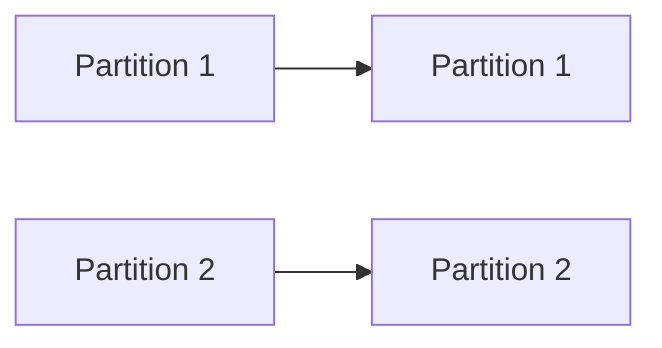
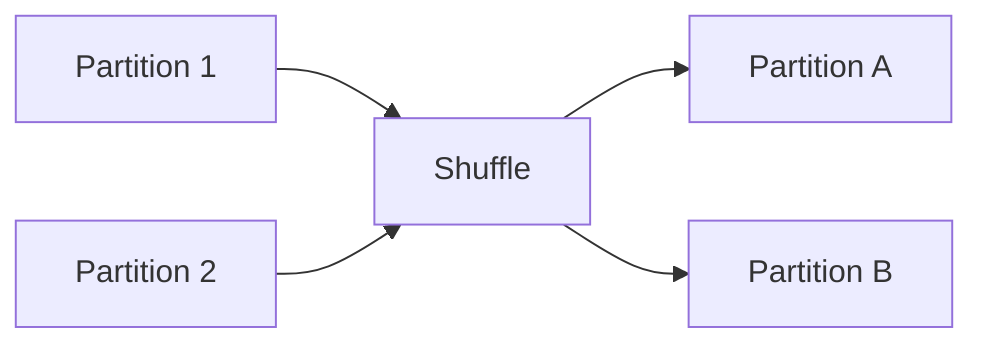

# Chapter 10 – Narrow and Wide Transformations

In Apache Spark, transformations can be categorized into **Narrow Transformations** and **Wide Transformations**.

Understanding this distinction is important because **wide transformations cause shuffle operations**, which significantly impact performance.

---

# 1️⃣ What is a Transformation?

A transformation is an operation that **creates a new dataset from an existing dataset**.

Transformations are **lazy operations**.

Example:

```python
df.filter("amount > 100")
```

Spark does not execute immediately. Instead, it builds a **logical execution plan**.

---

# 2️⃣ Types of Transformations

Spark transformations are divided into two categories:

| Type                  | Description                                     |
| --------------------- | ----------------------------------------------- |
| Narrow Transformation | Data stays within the same partition            |
| Wide Transformation   | Data moves across partitions (shuffle required) |

---

# 3️⃣ Narrow Transformations

A **narrow transformation** does not require data movement between partitions.

Each input partition contributes to **only one output partition**.

Examples:

| Operation | Description           |
| --------- | --------------------- |
| map       | transform each record |
| filter    | filter rows           |
| flatMap   | expand records        |
| union     | combine datasets      |

---

## Example – Narrow Transformation

```python
rdd = sc.parallelize([1,2,3,4])

result = rdd.map(lambda x: x*2)

print(result.collect())
```

Execution happens **within the same partition**.

---

# 4️⃣ Narrow Transformation Visualization



Each partition processes its own data independently.

---

# 5️⃣ Wide Transformations

A **wide transformation** requires data redistribution across partitions.

This process is called **shuffle**.

Examples:

| Operation   | Description          |
| ----------- | -------------------- |
| groupByKey  | group records by key |
| reduceByKey | aggregate values     |
| join        | join datasets        |
| distinct    | remove duplicates    |

---

# 6️⃣ Example – Wide Transformation

```python
rdd = sc.parallelize([(1,10),(2,20),(1,30)])

result = rdd.reduceByKey(lambda a,b: a+b)

print(result.collect())
```

Here Spark must move records with the same key to the **same partition**.

This requires **shuffle**.

---

# 7️⃣ Wide Transformation Visualization



Data is redistributed across partitions.

---

# 8️⃣ Shuffle Operation

Shuffle occurs when Spark redistributes data across executors.

Shuffle involves:

* network transfer
* disk writes
* sorting
* repartitioning

Because of this, shuffle operations are **expensive**.

---

# 9️⃣ Example – Wide Transformation with DataFrame

```python
df = spark.read.csv("sales.csv", header=True)

df.groupBy("city").sum("amount").show()
```

Spark redistributes rows with the same **city** across partitions.

---

# 🔟 Performance Impact

Wide transformations create **stage boundaries** in Spark execution.

Example pipeline:

```text
Stage 1 → map → filter
Stage 2 → groupBy → reduce
```

Wide transformations create new stages because shuffle is required.

---

# 1️⃣1️⃣ Real Production Example

Imagine a dataset:

```text
100 million sales records
```

Operation:

```python
df.groupBy("country").sum("sales")
```

Spark must:

1️⃣ redistribute records by country
2️⃣ move data across executors
3️⃣ perform aggregation

This process is a **wide transformation**.

---

# 1️⃣2️⃣ Narrow vs Wide Comparison

| Feature        | Narrow | Wide   |
| -------------- | ------ | ------ |
| Data movement  | No     | Yes    |
| Shuffle        | No     | Yes    |
| Performance    | Faster | Slower |
| Stage boundary | No     | Yes    |

---

# 1️⃣3️⃣ Optimization Tips

To improve performance:

* avoid unnecessary shuffles
* use reduceByKey instead of groupByKey
* partition data efficiently
* use broadcast joins for small tables

---

# 1️⃣4️⃣ Interview Questions

### What is a narrow transformation?

A transformation where data remains within the same partition.

---

### What is a wide transformation?

A transformation that requires data redistribution across partitions.

---

### What causes shuffle in Spark?

Wide transformations like groupBy, join, and reduceByKey.

---

### Why are wide transformations expensive?

Because they involve network transfer, disk I/O, and sorting.

---

# Key Takeaway

Narrow transformations operate within partitions and are fast.

Wide transformations require shuffle, which creates stage boundaries and impacts performance.

Understanding this concept is crucial for **Spark performance optimization**.

---

⬅️ [Previous: Spark RDD](./09-spark-rdd.md)
➡️ [Next: Repartition vs Coalesce](./11-repartition-vs-coalesce.md)
