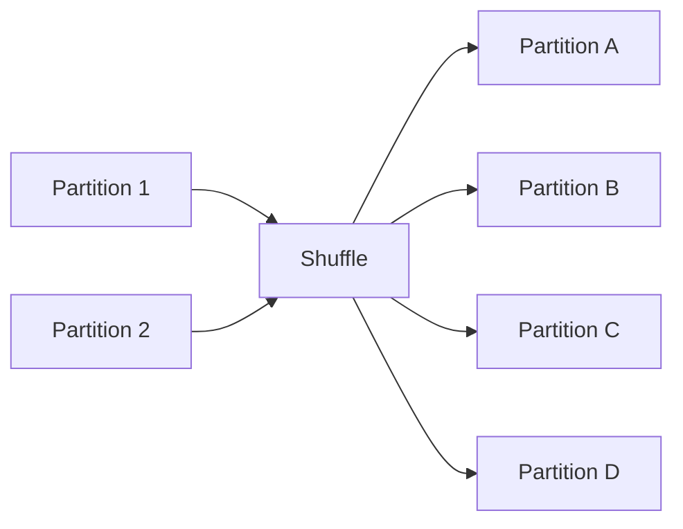
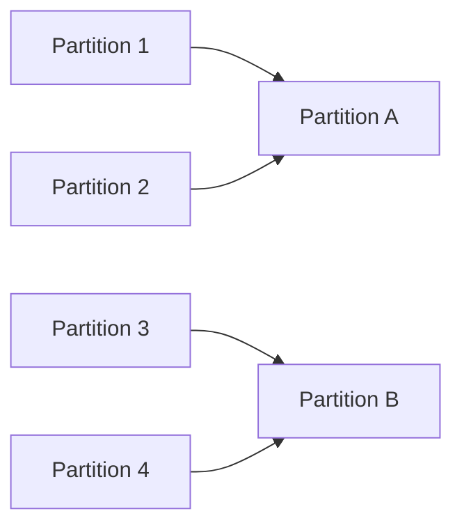

# Chapter 11 – Repartition vs Coalesce

In Apache Spark, **partitioning** determines how data is distributed across the cluster.

Proper partitioning improves:

* parallelism
* performance
* resource utilization

Two commonly used functions to change partitions are:

* `repartition()`
* `coalesce()`

---

# 1️⃣ What is a Partition?

A partition is a **chunk of data processed by one Spark task**.

Example:

```python
df = spark.read.csv("sales.csv")

print(df.rdd.getNumPartitions())
```

Output:

```
4
```

This means Spark will create **4 tasks** to process the dataset.

---

# 2️⃣ Why Partitioning Matters

Partitioning determines:

* number of tasks
* CPU utilization
* memory usage
* job execution time

Example scenario:

Dataset size = **1 TB**

Cluster = **10 executors**

If partitions are too small or too large, Spark performance decreases.

---

# 3️⃣ What is Repartition?

`repartition()` **reshuffles data across partitions** to evenly distribute it.

It **increases or decreases partitions** but requires **full shuffle**.

Example:

```python
df = spark.read.parquet("orders")

df2 = df.repartition(10)
```

This redistributes data across **10 partitions**.

---

# 4️⃣ Repartition Visualization



Data is redistributed across the cluster.

---

# 5️⃣ What is Coalesce?

`coalesce()` reduces the number of partitions **without full shuffle**.

It merges existing partitions.

Example:

```python
df2 = df.coalesce(2)
```

Spark reduces partitions from current number to **2 partitions**.

---

# 6️⃣ Coalesce Visualization



Partitions are merged instead of shuffled.

---

# 7️⃣ Repartition vs Coalesce

| Feature             | Repartition | Coalesce     |
| ------------------- | ----------- | ------------ |
| Shuffle             | Yes         | No (usually) |
| Increase partitions | Yes         | No           |
| Decrease partitions | Yes         | Yes          |
| Performance         | Slower      | Faster       |

---

# 8️⃣ When to Use Repartition

Use `repartition()` when:

* increasing partitions
* balancing skewed data
* redistributing data before joins
* improving parallelism

Example:

```python
df.repartition(20)
```

---

# 9️⃣ When to Use Coalesce

Use `coalesce()` when:

* reducing partitions
* writing output files
* avoiding expensive shuffle

Example:

```python
df.coalesce(1).write.csv("output")
```

This creates **one output file**.

---

# 🔟 Real Production Example

Suppose Spark reads **500 partitions** from input files.

If we write output directly:

```
500 output files
```

Better approach:

```python
df.coalesce(10).write.parquet("sales_output")
```

Result:

```
10 output files
```

---

# 1️⃣1️⃣ Performance Considerations

Too many partitions cause:

* scheduling overhead
* small tasks

Too few partitions cause:

* underutilized CPUs
* slow execution

A common rule:

```
number_of_partitions ≈ 2–3 × total CPU cores
```

---

# 1️⃣2️⃣ Example Workflow

```python
df = spark.read.parquet("transactions")

df = df.repartition(50)

df.groupBy("country").sum("amount")

df.coalesce(10).write.parquet("result")
```

Execution steps:

1️⃣ repartition for parallel processing
2️⃣ run aggregation
3️⃣ reduce partitions before writing output

---

# 1️⃣3️⃣ Interview Questions

### What is repartition in Spark?

Repartition redistributes data across partitions using shuffle.

---

### What is coalesce in Spark?

Coalesce reduces partitions without full shuffle.

---

### When should you use repartition?

When increasing partitions or balancing skewed data.

---

### When should you use coalesce?

When reducing partitions for writing output files.

---

# Key Takeaway

Partitioning is critical for Spark performance.

Use:

* **repartition()** when you need full redistribution
* **coalesce()** when reducing partitions efficiently

Proper partitioning ensures **optimal resource utilization and faster Spark jobs**.

---

⬅️ [Previous: Narrow vs Wide Transformations](./10-narrow-wide-transformations.md)
➡️ [Next: Jobs, Stages and Tasks](./12-jobs-stages-tasks.md)
