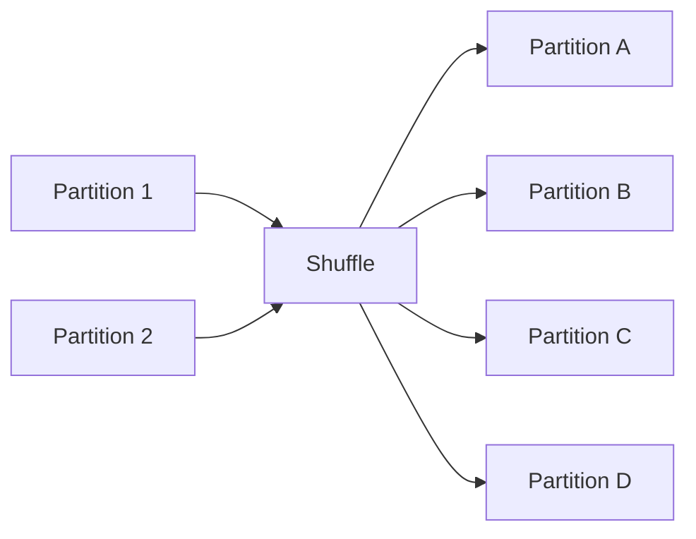
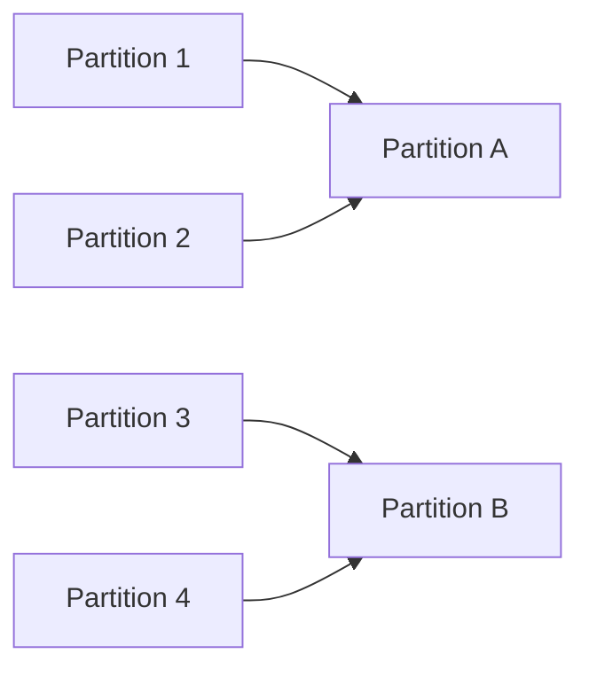

# Chapter 11 – Repartition vs Coalesce

In Apache Spark, **partitioning** determines how data is distributed across the cluster.

Proper partitioning improves:

* parallelism
* performance
* resource utilization

Two commonly used functions to change partitions are:

* `repartition()`
* `coalesce()`

---

# 1️⃣ What is a Partition?

A partition is a **chunk of data processed by one Spark task**.

Example:

```python
df = spark.read.csv("sales.csv")

print(df.rdd.getNumPartitions())
```

Output:

```
4
```

This means Spark will create **4 tasks** to process the dataset.

---

# 2️⃣ Why Partitioning Matters

Partitioning determines:

* number of tasks
* CPU utilization
* memory usage
* job execution time

Example scenario:

Dataset size = **1 TB**

Cluster = **10 executors**

If partitions are too small or too large, Spark performance decreases.

---

# 3️⃣ What is Repartition?

`repartition()` **reshuffles data across partitions** to evenly distribute it.

It **increases or decreases partitions** but requires **full shuffle**.

Example:

```python
df = spark.read.parquet("orders")

df2 = df.repartition(10)
```

This redistributes data across **10 partitions**.

---

# 4️⃣ Repartition Visualization



Data is redistributed across the cluster.

---

# Why Do We Need Repartition in Spark?

`repartition()` is used to **redistribute data across partitions using a full shuffle** to achieve balanced parallel processing.

In simple terms: repartition spreads the data evenly across executors so Spark can use the cluster efficiently.

### The Real Problem: Data Skew

Imagine a dataset of **100 GB**.

Spark initially creates partitions like this:

| Partition  | Size   |
| ---------- | ------ |
| Partition 1| 60 GB  |
| Partition 2| 20 GB  |
| Partition 3| 10 GB  |
| Partition 4| 10 GB  |

Execution happens like this:

* Executor 1 → 60 GB (very slow)
* Executor 2 → 20 GB
* Executor 3 → 10 GB
* Executor 4 → 10 GB

The whole job waits for Executor 1. This is called **Data Skew**.

### Solution: repartition()

`repartition()` performs a full shuffle to distribute data evenly.

```python
df = df.repartition(4)
```

Now Spark redistributes the data:

| Partition  | Size   |
| ---------- | ------ |
| Partition 1| 25 GB  |
| Partition 2| 25 GB  |
| Partition 3| 25 GB  |
| Partition 4| 25 GB  |

All executors finish at nearly the same time. This improves parallelism.

### Visualization

**Before repartition:**

```
Node1 → 70%
Node2 → 10%
Node3 → 10%
Node4 → 10%
```

**After repartition:**

```
Node1 → 25%
Node2 → 25%
Node3 → 25%
Node4 → 25%
```

Balanced workload = faster job.

### Another Reason: Increasing Partitions

Sometimes you start with very few partitions.

Example:

* Dataset size → 200 GB
* Partitions → 4
* Executors available → 20 executors

Spark can only run 4 tasks at once, wasting the cluster.

Solution:

```python
df = df.repartition(100)
```

Now Spark can run 100 parallel tasks. Cluster utilization increases.

### Real Data Engineering Scenario

Suppose you read a file:

```python
df = spark.read.parquet("sales.parquet")
```

It creates 8 partitions. But your cluster has 32 CPU cores.

To use full parallelism:

```python
df = df.repartition(32)
```

Now Spark can use all cores efficiently.

### Repartition by Column (Very Important)

You can repartition based on a column.

```python
df = df.repartition(10, "country")
```

All records of the same country go to the same partition.

Example distribution:

* Partition 1 → India
* Partition 2 → USA
* Partition 3 → UK
* Partition 4 → Germany

This is useful before joins, aggregations, and groupBy operations.

### Real Join Optimization Example

**Bad join:**

```python
df1.join(df2, "customer_id")
```

Spark shuffles huge data.

**Better approach:**

```python
df1 = df1.repartition("customer_id")
df2 = df2.repartition("customer_id")
df1.join(df2, "customer_id")
```

Now the join becomes much faster.

### One Brutally Honest Truth

Most Spark performance issues happen because of **bad partition strategy**—not because of bad code.

Good Data Engineers always ask: *How is my data distributed across partitions?*

---

# 5️⃣ What is Coalesce?

`coalesce()` reduces the number of partitions **without full shuffle**.

It merges existing partitions.

Example:

```python
df2 = df.coalesce(2)
```

Spark reduces partitions from current number to **2 partitions**.

---

# 6️⃣ Coalesce Visualization



Partitions are merged instead of shuffled.

---

# Why Do We Need Coalesce in Spark?

In Spark (especially PySpark / Spark SQL), `coalesce()` is mainly used to **reduce the number of partitions** in a DataFrame or RDD **without performing a full shuffle**.

### The Real Problem: Too Many Partitions

When Spark processes data, it splits it into partitions so tasks can run in parallel.

Example:

```
Input File → Spark → 200 partitions
```

Now imagine you write the output:

```python
df.write.csv("output/")
```

Spark will create **200 output files**—because 1 partition = 1 output file.

This creates problems:

* Too many small files ❌
* Slow downstream processing ❌
* Hard to manage in data lakes ❌

This is called the **Small File Problem**.

### Solution: coalesce()

`coalesce()` reduces the number of partitions.

```python
df = df.coalesce(10)
```

Now: 200 partitions → 10 partitions.

When writing:

```python
df.coalesce(10).write.csv("output/")
```

Output: **10 files instead of 200**.

### Why Spark Created coalesce

Spark created `coalesce()` to avoid expensive shuffles.

If Spark shuffled data every time partitions changed, it would be very slow.

So: **coalesce → avoids full shuffle**. It simply merges partitions together.

Example:

```
Partition 1 ┐
Partition 2 ├──> Partition A
Partition 3 ┘

Partition 4 ┐
Partition 5 ├──> Partition B
Partition 6 ┘
```

No data redistribution across cluster.

### coalesce vs repartition (Summary)

| Feature       | coalesce | repartition  |
| ------------- | -------- | ------------ |
| Shuffle       | ❌ No full shuffle | ✅ Full shuffle |
| Use case      | Reduce partitions  | Increase/decrease partitions |
| Speed         | Faster   | Slower       |
| Data balance  | Not guaranteed | Balanced   |

Example:

* Reduce partitions: `df.coalesce(5)`
* Increase partitions: `df.repartition(200)`

`coalesce()` cannot efficiently increase partitions.

### Real Data Engineering Example

Suppose you process **1 TB logs**.

Spark creates 1000 partitions. Output: 1000 small files.

Instead:

```python
df.coalesce(50).write.parquet("s3://logs/")
```

Now: **50 optimized files**. Better for Athena, Presto, Hive, Databricks.

### Important Warning ⚠️

**Bad practice:**

```python
df.coalesce(1)
```

Why? All data goes to 1 executor.

Problems:

* Memory overflow
* Slow processing
* Single node bottleneck

Use it only for small datasets.

### Visualization

**Without coalesce:**

```
Executor1 → file1
Executor2 → file2
Executor3 → file3
Executor4 → file4
Executor5 → file5
```

**With `df.coalesce(2)`:**

```
Executor1 → file1
Executor2 → file2
```

### SQL COALESCE (Different Meaning)

Important: Spark also has a SQL `COALESCE` function, which is **different**.

```sql
SELECT COALESCE(name, 'Unknown')
FROM employees
```

Meaning: Return first non-null value.

| name  | output   |
| ----- | -------- |
| NULL  | Unknown  |
| John  | John     |

---

# 7️⃣ Repartition vs Coalesce

| Feature             | Repartition | Coalesce     |
| ------------------- | ----------- | ------------ |
| Shuffle             | Yes         | No (usually) |
| Increase partitions | Yes         | No           |
| Decrease partitions | Yes         | Yes          |
| Performance         | Slower      | Faster       |

---

# 8️⃣ When to Use Repartition

Use `repartition()` when:

* increasing partitions
* balancing skewed data
* redistributing data before joins
* improving parallelism

Example:

```python
df.repartition(20)
```

---

# 9️⃣ When to Use Coalesce

Use `coalesce()` when:

* reducing partitions
* writing output files
* avoiding expensive shuffle

Example:

```python
df.coalesce(10).write.csv("output")
```

This creates **10 output files** instead of hundreds. (Avoid `coalesce(1)` for large datasets—see warning above.)

---

# 🔟 Real Production Example

Suppose Spark reads **500 partitions** from input files.

If we write output directly:

```
500 output files
```

Better approach:

```python
df.coalesce(10).write.parquet("sales_output")
```

Result:

```
10 output files
```

---

# 1️⃣1️⃣ Performance Considerations

Too many partitions cause:

* scheduling overhead
* small tasks

Too few partitions cause:

* underutilized CPUs
* slow execution

A common rule:

```
number_of_partitions ≈ 2–3 × total CPU cores
```

---

# 1️⃣2️⃣ Example Workflow

```python
df = spark.read.parquet("transactions")

df = df.repartition(50)

df.groupBy("country").sum("amount")

df.coalesce(10).write.parquet("result")
```

Execution steps:

1️⃣ repartition for parallel processing
2️⃣ run aggregation
3️⃣ reduce partitions before writing output

---

# 1️⃣3️⃣ Interview Questions

### Why do we use repartition in Spark?

**Answer:** `repartition()` is used to redistribute data evenly across partitions using a full shuffle. It helps improve parallelism, fix data skew, and optimize performance for operations like joins and aggregations.

---

### Why do we use coalesce in Spark?

**Answer:** `coalesce()` is used to reduce the number of partitions in a DataFrame or RDD without performing a full shuffle, which helps optimize output file count and improve performance when writing data.

---

### What is repartition in Spark?

Repartition redistributes data across partitions using shuffle.

---

### What is coalesce in Spark?

Coalesce reduces partitions without full shuffle (merges partitions together).

---

### When should you use repartition?

When increasing partitions or balancing skewed data.

---

### When should you use coalesce?

When reducing partitions for writing output files.

---

# Key Takeaway

Partitioning is critical for Spark performance.

Use:

* **repartition()** when you need full redistribution
* **coalesce()** when reducing partitions efficiently

Proper partitioning ensures **optimal resource utilization and faster Spark jobs**.

---

⬅️ [Previous: Narrow vs Wide Transformations](./10-narrow-wide-transformations.md)
➡️ [Next: Jobs, Stages and Tasks](./12-jobs-stages-tasks.md)
