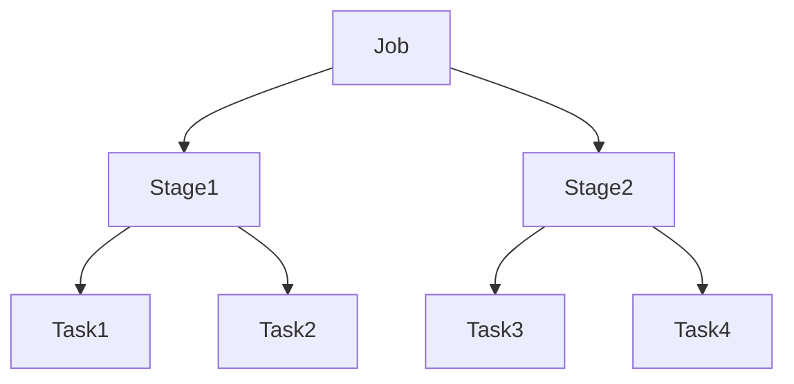

# Chapter 12 – Jobs, Stages, and Tasks

Spark executes applications using a hierarchical structure.

```
Application
   ↓
Job
   ↓
Stage
   ↓
Task
```

---

# 1️⃣ Spark Job

### What is a Spark Job?

A **job** is triggered when an **action** is executed. It represents one unit of work that Spark performs in response to an action.

### Why Do We Need to Understand Jobs?

Understanding jobs helps you:

* **Debug performance** — Each job appears in the Spark UI; you can identify slow jobs
* **Optimize costs** — Fewer unnecessary jobs = less cluster time
* **Troubleshoot failures** — When a job fails, you know exactly which action caused it

### Example

```python
df = spark.read.parquet("sales.parquet")

df.filter("amount > 100").show()   # Action 1 → Job 1
df.count()                         # Action 2 → Job 2
df.write.parquet("output/")        # Action 3 → Job 3
```

Each **action** (`show()`, `count()`, `write`) triggers a **separate job**.

### Common Actions That Trigger Jobs

| Action | Purpose |
| ------ | ------- |
| `show()` | Display rows |
| `count()` | Count rows |
| `collect()` | Bring data to driver |
| `write` | Save to storage |
| `foreach()` | Process each partition |

---

# 2️⃣ Stage

### What is a Stage?

A **stage** is a set of tasks that can run in parallel without shuffling data. Stages are separated by **shuffle boundaries** (wide transformations).

### Why Do Stages Matter?

* **Performance insight** — More stages often mean more shuffles = slower execution
* **Optimization** — Minimizing stages reduces shuffle overhead
* **Pipeline efficiency** — All operations within a stage can be pipelined (no disk I/O between them)

### How Stages Are Created

Stages are split whenever Spark needs to **shuffle** data across partitions:

| Wide Transformation | Why It Causes Shuffle |
| ------------------- | --------------------- |
| `groupBy` | Data must be regrouped by key |
| `join` | Matching keys must be on same partition |
| `reduceByKey` | All values for a key must be together |
| `repartition` | Explicit data redistribution |
| `distinct` | Needs to compare across partitions |

### Example

```python
df = spark.read.parquet("orders")

df.filter("status = 'completed'")     # Narrow - same stage
  .groupBy("customer_id")             # Wide - NEW STAGE (shuffle)
  .agg(sum("amount").alias("total"))  # Same stage as groupBy
  .filter("total > 1000")             # Narrow - same stage
  .write.parquet("output/")           # Action - triggers job
```

This creates **2 stages** (one before `groupBy`, one after the shuffle).

### Visualization

```
Stage 1: read → filter
    ↓ (shuffle - groupBy)
Stage 2: aggregation → filter → write
```

---

# 3️⃣ Task

### What is a Task?

A **task** is the smallest unit of work in Spark. One task processes **one partition** of data on **one executor**.

### Why Do Tasks Matter?

* **Parallelism** — More tasks = more parallel execution (up to a point)
* **Resource utilization** — Tasks map to CPU cores; too few = wasted cluster
* **Failure recovery** — Spark can retry failed tasks independently
* **Monitoring** — Task duration in Spark UI reveals skew (one slow task = bottleneck)

### The Relationship

```
Partitions → Tasks (1:1 mapping)
100 partitions = 100 tasks (in that stage)
```

### Example

```python
df = spark.read.parquet("sales.parquet")  # Creates 8 partitions (from file)

print(df.rdd.getNumPartitions())          # Output: 8

df = df.repartition(20)                   # Now 20 partitions
result = df.groupBy("region").count()     # Stage has 20 tasks
result.write.parquet("output/")           # 20 tasks to write
```

**Stage 1:** 20 tasks (one per partition for `groupBy`)  
**Stage 2:** 20 tasks (one per partition to write)

### Real Data Engineering Scenario

| Scenario | Partitions | Tasks per Stage | Impact |
| -------- | ---------- | --------------- | ------ |
| 1 TB data, 200 partitions | 200 | 200 | Good parallelism |
| 1 TB data, 4 partitions | 4 | 4 | Only 4 cores used; 16+ idle |
| 1 GB data, 10,000 partitions | 10,000 | 10,000 | Too many small tasks; scheduling overhead |

**Rule of thumb:** `number_of_partitions ≈ 2–4 × total CPU cores`

---

# 4️⃣ Spark Schedulers

### Why Two Schedulers?

Spark uses **two schedulers** to separate high-level planning from low-level execution:

### DAG Scheduler

**What it does:** Converts a job into a Directed Acyclic Graph (DAG) of stages.

**Responsibilities:**

* Dividing jobs into stages
* Detecting shuffle boundaries
* Optimizing the execution plan (pipeline narrow transformations)

**Example:** For `read → filter → groupBy → agg → write`, the DAG Scheduler creates 2 stages (split at `groupBy`).

### Task Scheduler

**What it does:** Takes stages and launches actual tasks on executors.

**Responsibilities:**

* Assigning tasks to executors
* Handling retries (if a task fails)
* Monitoring task execution
* Managing locality (prefer same node for data)

### Example Flow

```
Your Code → DAG Scheduler → Stages → Task Scheduler → Tasks on Executors
```

---

# 5️⃣ Execution Visualization



---

# 6️⃣ Real Production Example

```python
from pyspark.sql.functions import col, sum

# Job 1: Read and aggregate
df = spark.read.parquet("s3://data/transactions/")
result = (
    df.filter(col("date") >= "2024-01-01")    # Stage 1 - narrow
    .repartition(100, "customer_id")           # Stage 2 - shuffle
    .groupBy("customer_id")                    # Same stage
    .agg(sum("amount").alias("total"))         # Same stage
    .filter(col("total") > 1000)               # Same stage
)
result.write.parquet("s3://output/customers/")  # Action - triggers job
```

**Breakdown:**

| Level | Count | Explanation |
| ----- | ----- | ----------- |
| Jobs | 1 | One `write` action |
| Stages | 2 | Split at `repartition` (shuffle) |
| Tasks | 100 per stage | 100 partitions after repartition |

---

# 7️⃣ Interview Questions

### What triggers a Spark job?

**Answer:** An **action** triggers a Spark job. Examples: `show()`, `count()`, `collect()`, `write`, `foreach()`.

---

### What is the smallest execution unit in Spark?

**Answer:** A **task**. One task processes one partition on one executor.

---

### Why do we have stages in Spark?

**Answer:** Stages separate work that can be pipelined (no shuffle) from work that requires shuffling. All narrow transformations within a stage run together; wide transformations create new stages.

---

### How do jobs, stages, and tasks relate?

**Answer:** One **job** (triggered by an action) contains one or more **stages** (split by shuffles). Each stage contains multiple **tasks** (one per partition).

---

### What creates a stage boundary?

**Answer:** **Shuffle operations** (wide transformations) like `groupBy`, `join`, `repartition`, `reduceByKey`, and `distinct`.

---

# Key Takeaway

Spark execution hierarchy:

```
Job → Stage → Task
```

* **Job** = work triggered by an action
* **Stage** = work separated by shuffles
* **Task** = one partition processed on one executor

Schedulers coordinate execution across cluster nodes.

---

⬅️ [Previous: Repartition vs Coalesce](./11-repartition-vs-coalesce.md)
➡️ [Next: Shuffle Joins](./13-shuffle-joins.md)
