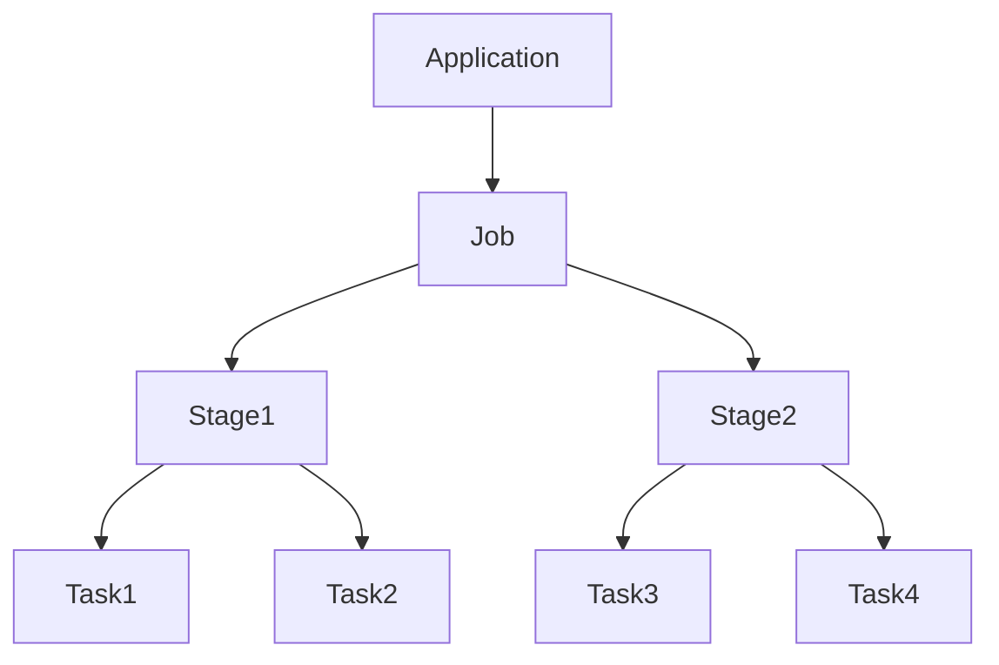
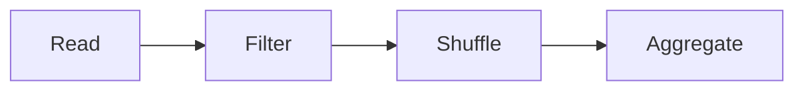
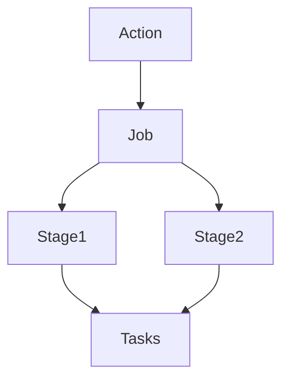

# Chapter 12 – Jobs, Stages, and Tasks in PySpark

Spark executes applications using a hierarchy of execution units.

Execution hierarchy:

```text id="a6ntsd"
Application
   ↓
Job
   ↓
Stage
   ↓
Task
```

Understanding this hierarchy is essential for debugging Spark jobs and optimizing performance.

---

# 1️⃣ What is a Spark Job?

A **job** is created whenever an **action** is triggered.

Example action:

```python id="5h3g0r"
df.show()
```

Each action creates **one Spark job**.

Example:

```python id="v1p3en"
df.count()
df.show()
```

This creates **two separate jobs**.

---

# 2️⃣ What is a Stage?

A stage is a **set of tasks that can be executed without shuffle**.

Stages are separated by **wide transformations**.

Example wide transformation:

```python id="bg00ze"
groupBy()
join()
reduceByKey()
```

These operations create **stage boundaries**.

---

# 3️⃣ What is a Task?

A task is the **smallest unit of execution**.

Each partition corresponds to one task.

Example:

Dataset partitions = **100**

Spark creates:

```text id="mwtr4u"
100 tasks
```

Each task processes one partition.

---

# 4️⃣ Spark Execution Hierarchy Visualization



---

# 5️⃣ Example Spark Pipeline

Example code:

```python id="k8tfle"
df = spark.read.csv("orders.csv")

df.filter("amount > 100") \
  .groupBy("city") \
  .sum("amount") \
  .show()
```

Execution steps:

1️⃣ Read data
2️⃣ Filter rows
3️⃣ Group by city
4️⃣ Aggregate values

---

# 6️⃣ Stage Creation

Execution stages:

```text id="nsc3a2"
Stage 1
Read → Filter

Stage 2
Shuffle → GroupBy → Sum
```

Why?

Because **groupBy requires shuffle**.

Shuffle creates **stage boundary**.

---

# 7️⃣ Execution Visualization



Spark divides execution into stages around shuffle.

---

# 8️⃣ Tasks Execution

Suppose the dataset has **4 partitions**.

Stage execution:

```text id="vjx0m4"
Stage 1
Task1
Task2
Task3
Task4
```

Each task runs on a different executor.

---

# 9️⃣ Real Production Example

Imagine processing **500 million records**.

Spark cluster:

| Executor  | CPU     | Memory |
| --------- | ------- | ------ |
| Executor1 | 8 cores | 16GB   |
| Executor2 | 8 cores | 16GB   |

Dataset partitions = **200**

Spark creates:

```text id="6wjquk"
200 tasks
```

These tasks are distributed across executors.

---

# 🔟 Spark Execution Timeline



Execution begins when **action is triggered**.

---

# 1️⃣1️⃣ Spark UI Example

In Spark UI you will see:

| Tab    | Shows                   |
| ------ | ----------------------- |
| Jobs   | list of Spark jobs      |
| Stages | stage execution         |
| Tasks  | individual task details |

This helps diagnose:

* slow stages
* skewed tasks
* memory issues

---

# 1️⃣2️⃣ Example Using RDD

```python id="p22pck"
rdd = sc.textFile("file.txt")

words = rdd.flatMap(lambda line: line.split(" "))

pairs = words.map(lambda word: (word,1))

counts = pairs.reduceByKey(lambda a,b: a+b)

counts.collect()
```

Execution:

Job created by `collect()`.

Stages created around **reduceByKey shuffle**.

---

# 1️⃣3️⃣ Interview Questions

### What triggers a Spark job?

An **action** triggers a Spark job.

---

### What is a stage in Spark?

A stage is a group of tasks executed without shuffle.

---

### What causes a new stage?

Wide transformations that require shuffle.

---

### What is the smallest unit of execution?

Task.

---

# Key Takeaway

Spark execution hierarchy:

```text id="p52b5v"
Application
   ↓
Job
   ↓
Stage
   ↓
Task
```

Understanding this hierarchy helps engineers:

* optimize Spark pipelines
* analyze Spark UI
* debug performance issues

---

⬅️ [Previous: Repartition vs Coalesce](./11-repartition-vs-coalesce.md)
➡️ [Next: Shuffle Joins](./13-shuffle-joins.md)
