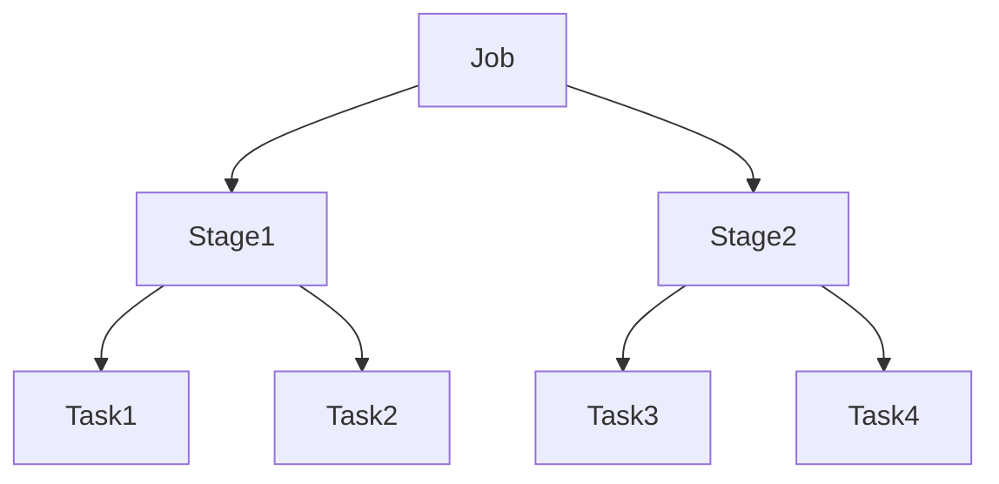

# Chapter 12 – Jobs, Stages, and Tasks

Spark executes applications using a hierarchical structure.

```
Application
   ↓
Job
   ↓
Stage
   ↓
Task
```

---

# 1️⃣ Spark Job

A job is triggered when an **action** is executed.

Example:

```python
df.show()
```

---

# 2️⃣ Stage

Stages are separated by **shuffle operations**.

Example wide transformations:

```
groupBy
join
reduceByKey
```

---

# 3️⃣ Task

A task processes one partition.

Example:

```
100 partitions → 100 tasks
```

---

# 4️⃣ Spark Schedulers

Spark uses two schedulers.

### DAG Scheduler

Responsible for:

* dividing jobs into stages
* detecting shuffle boundaries

### Task Scheduler

Responsible for:

* assigning tasks to executors
* handling retries
* monitoring task execution

---

# 5️⃣ Execution Visualization



---

# 6️⃣ Interview Questions

### What triggers a Spark job?

An action triggers a Spark job.

### What is the smallest execution unit?

Task.

---

# Key Takeaway

Spark execution hierarchy:

```
Job → Stage → Task
```

Schedulers coordinate execution across cluster nodes.

---

➡️ Next: `13-shuffle-joins.md`
