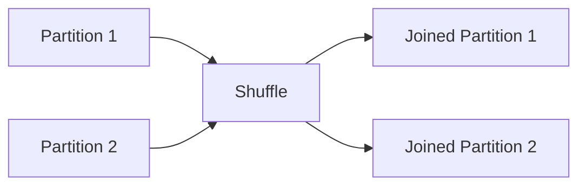

# Chapter 13 – Shuffle Joins in PySpark

In Apache Spark, when joining large datasets, Spark often performs a **Shuffle Join**.

A shuffle join redistributes data across the cluster so that rows with the same join key are brought to the same partition.

This process is called **shuffle**.

---

# 1️⃣ What is a Shuffle Join?

A shuffle join happens when:

* both datasets are large
* data must be redistributed across partitions
* join keys must be grouped together

Example join:

```python id="nd7r7o"
df1.join(df2, "customer_id")
```

Spark must move rows with the same `customer_id` to the same partition.

---

# 2️⃣ Why Shuffle Happens

Consider two datasets:

```text id="gq9m77"
Orders Table
CustomerID | Amount

Customers Table
CustomerID | Name
```

To join them, Spark must ensure records with the same `CustomerID` are in the same partition.

This requires **data movement across executors**.

---

# 3️⃣ Shuffle Join Visualization



Data is redistributed before the join operation.

---

# 4️⃣ Example – Shuffle Join in PySpark

Example dataset:

```python id="9q6wh8"
orders = spark.read.parquet("orders")

customers = spark.read.parquet("customers")

result = orders.join(customers, "customer_id")

result.show()
```

Spark performs:

1️⃣ shuffle orders dataset
2️⃣ shuffle customers dataset
3️⃣ match records by key
4️⃣ produce joined dataset

---

# 5️⃣ Shuffle Join Execution Steps

Execution process:

```text id="p5h39q"
Step 1 – Partition datasets
Step 2 – Shuffle data across network
Step 3 – Sort records by key
Step 4 – Perform join
```

Shuffle operations involve:

* disk I/O
* network transfer
* sorting

Because of this, shuffle joins are **expensive operations**.

---

# 6️⃣ Spark Physical Plan for Shuffle Join

You can see shuffle joins using:

```python id="ld8ntn"
df.explain(True)
```

Example output:

```text id="e07ktk"
SortMergeJoin
Exchange hashpartitioning
Scan parquet orders
Scan parquet customers
```

Here:

```text id="y9h3d7"
Exchange
```

indicates a **shuffle operation**.

---

# 7️⃣ Types of Shuffle Joins

Spark may use different shuffle-based join strategies.

| Join Type         | Description                        |
| ----------------- | ---------------------------------- |
| Sort Merge Join   | default for large datasets         |
| Shuffle Hash Join | used when memory allows hash table |
| Cartesian Join    | cross join (rare)                  |

---

# 8️⃣ Example – Sort Merge Join

Example:

```python id="7f5g7j"
df1.join(df2, "id")
```

Spark performs:

1️⃣ shuffle both datasets
2️⃣ sort by join key
3️⃣ merge records

---

# 9️⃣ Performance Challenges of Shuffle Joins

Shuffle joins are expensive because they require:

* network communication
* disk writes
* sorting large datasets

Problems that may occur:

| Issue              | Description             |
| ------------------ | ----------------------- |
| Data skew          | uneven partition sizes  |
| Shuffle spill      | memory overflow to disk |
| Network bottleneck | large data transfers    |

---

# 🔟 Optimization Tips

To optimize joins:

* reduce dataset size before join
* filter unnecessary rows
* use broadcast joins when possible
* partition datasets properly

Example optimization:

```python id="h9l7sm"
orders.filter("amount > 100")
```

Filtering early reduces shuffle data.

---

# 1️⃣1️⃣ Real Production Example

Imagine joining:

```text id="m3ixpo"
Orders table → 500 million rows
Customers table → 20 million rows
```

Spark must redistribute rows across executors to match customer IDs.

This requires large shuffle operations.

---

# 1️⃣2️⃣ Spark UI Observation

In Spark UI you may observe:

* large shuffle read size
* long-running stages
* skewed tasks

These indicate shuffle-heavy joins.

---

# 1️⃣3️⃣ Interview Questions

### What is a shuffle join?

A shuffle join redistributes data across partitions so that matching keys can be joined.

---

### Why are shuffle joins expensive?

Because they involve network transfer, disk I/O, and sorting.

---

### How can shuffle joins be optimized?

Using broadcast joins, filtering early, and proper partitioning.

---

### How can you detect shuffle joins?

Using:

```python id="d9n0gs"
df.explain(True)
```

Look for `Exchange` in the physical plan.

---

# Key Takeaway

Shuffle joins are necessary when joining large datasets.

However, they are **expensive operations** due to:

```text id="r6y3q3"
Network Transfer
Disk I/O
Sorting
```

Understanding shuffle joins is critical for **Spark performance optimization**.

---

⬅️ [Previous: Jobs, Stages and Tasks](./12-jobs-stages-tasks.md)
➡️ [Next: Broadcast Joins](./14-broadcast-joins.md)
