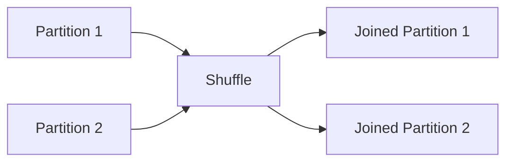

# Chapter 13 – Shuffle Joins in PySpark

In Apache Spark, when joining large datasets, Spark often performs a **Shuffle Join**.

A shuffle join redistributes data across the cluster so that rows with the same join key are brought to the same partition.

This process is called **shuffle**.

A **Shuffle Join** in **Apache Spark** happens when **both datasets need to be redistributed (shuffled) across the cluster so that rows with the same join key end up on the same executor**. Only then Spark can perform the join.

This is one of the **most expensive operations in Spark** because it involves **network data transfer, disk spill, and sorting**.

---

# 1️⃣ What is a Shuffle Join?

A shuffle join happens when:

* both datasets are large
* data must be redistributed across partitions
* join keys must be grouped together

Example join:

```python
df1.join(df2, "customer_id")
```

Spark must move rows with the same `customer_id` to the same partition.

---

# 2️⃣ Why Shuffle Happens

Consider two datasets:

```text
Orders Table
CustomerID | Amount

Customers Table
CustomerID | Name
```

To join them, Spark must ensure records with the same `CustomerID` are in the same partition.

This requires **data movement across executors**.

Suppose you have two DataFrames:

```
Orders
+---------+-----------+
|order_id |customer_id|
+---------+-----------+
|1        |101        |
|2        |102        |
|3        |101        |
```

```
Customers
+-----------+--------+
|customer_id|name    |
+-----------+--------+
|101        |Alice   |
|102        |Bob     |
```

You run:

```python
orders.join(customers, "customer_id")
```

Spark needs to match rows where:

```
orders.customer_id = customers.customer_id
```

But the problem is:

* Data is **distributed across many partitions**
* Matching rows may exist on **different machines**

Example:

```
Executor 1: Orders (customer_id = 101)
Executor 2: Customers (customer_id = 101)
```

Spark **cannot join them unless they are on the same machine**.

So Spark performs a **shuffle**.

---

# 3️⃣ What Shuffle Actually Means

Shuffle means:

**Redistribute data across executors based on a key.**

For joins Spark uses:

```
partition = hash(join_key)
```

Rows with the same key are sent to the **same partition**.

This ensures matching rows meet during the join.

---

# 4️⃣ Shuffle Join Visualization



Data is redistributed before the join operation.

---

# 5️⃣ Example – Shuffle Join in PySpark

Example dataset:

```python
orders = spark.read.parquet("orders")

customers = spark.read.parquet("customers")

result = orders.join(customers, "customer_id")

result.show()
```

Spark performs:

1️⃣ shuffle orders dataset  
2️⃣ shuffle customers dataset  
3️⃣ match records by key  
4️⃣ produce joined dataset  

---

# 6️⃣ Shuffle Join Execution Steps

Execution process:

```text
Step 1 – Read datasets
Step 2 – Shuffle data across network
Step 3 – Sort records by key
Step 4 – Perform join
```

Shuffle operations involve:

* disk I/O
* network transfer
* sorting

Because of this, shuffle joins are **expensive operations**.

---

# 7️⃣ Step-by-Step Shuffle Join Execution

Example query:

```python
orders.join(customers, "customer_id")
```

### Step 1 — Read Data

```
Orders partitions
P1 → 101
P2 → 102

Customers partitions
P1 → 101
P2 → 102
```

But partitions are **not aligned**.

---

### Step 2 — Shuffle Both Tables

Spark redistributes both tables based on `customer_id`.

```
hash(customer_id)
```

After shuffle:

```
Partition 1
Orders → 101
Customers → 101

Partition 2
Orders → 102
Customers → 102
```

Now matching keys are together.

---

### Step 3 — Join Happens

Each executor performs **local join**.

```
Executor 1 → join rows with 101
Executor 2 → join rows with 102
```

Result produced.

---

# 8️⃣ Visualization of Shuffle

Before Shuffle

```
Orders                Customers
Executor1: 101        Executor1: 102
Executor2: 102        Executor2: 101
```

After Shuffle

```
Executor1: 101 + 101
Executor2: 102 + 102
```

Now join is possible.

---

# 9️⃣ Spark Physical Plan for Shuffle Join

You can see shuffle joins using:

```python
df.explain(True)
```

Example output:

```
SortMergeJoin
Exchange hashpartitioning
Scan parquet orders
Scan parquet customers
```

Here:

```
Exchange
```

indicates a **shuffle operation**.

Example detailed plan:

```
SortMergeJoin
:- Sort
:  +- Exchange hashpartitioning(id)
+- Sort
   +- Exchange hashpartitioning(id)
```

The line:

```
Exchange hashpartitioning
```

means Spark **shuffled the data based on the join key**.

---

# 🔟 Types of Shuffle Joins

Spark may use different shuffle-based join strategies.

| Join Type | Description |
|-----------|-------------|
| Sort Merge Join | Default for large datasets |
| Shuffle Hash Join | Used when memory allows hash table |
| Broadcast Hash Join | Used when one dataset is small |
| Broadcast Nested Loop Join | Used for cross joins |

---

# 1️⃣1️⃣ Example – Sort Merge Join

Example:

```python
df1.join(df2, "id")
```

Spark performs:

1️⃣ shuffle both datasets  
2️⃣ sort by join key  
3️⃣ merge records  

Execution pattern:

```
Shuffle → Sort → Merge
```

---

# 1️⃣2️⃣ Performance Challenges of Shuffle Joins

Shuffle joins are expensive because they require:

* network communication
* disk writes
* sorting large datasets

Problems that may occur:

| Issue | Description |
|------|-------------|
| Data skew | uneven partition sizes |
| Shuffle spill | memory overflow to disk |
| Network bottleneck | large data transfers |

---

# 1️⃣3️⃣ Optimization Tips

To optimize joins:

* reduce dataset size before join
* filter unnecessary rows
* use broadcast joins when possible
* partition datasets properly

Example optimization:

```python
orders.filter("amount > 100")
```

Filtering early reduces shuffle data.

---

# 1️⃣4️⃣ How Senior Data Engineers Reduce Shuffle

Experienced Spark engineers try to **avoid shuffle operations** because they slow jobs.

### Broadcast Join

If one table is small.

```
spark.conf.set("spark.sql.autoBroadcastJoinThreshold", 10MB)
```

Small dataset is broadcast to all executors.

No shuffle needed.

---

### Bucketing

Data is pre-partitioned on disk to reduce shuffle.

---

### Repartition Before Join

```
df.repartition("customer_id")
```

Improves partition alignment.

---

### Skew Handling

Hot keys can create large partitions.

Example:

```
customer_id = 1 appears 10M times
```

Solutions:

```
salting
AQE skew join
```

---

# 1️⃣5️⃣ Real Production Example

Imagine joining:

```
Orders table → 500 million rows
Customers table → 20 million rows
```

Spark must redistribute rows across executors to match customer IDs.

This requires massive shuffle operations.

---

# 1️⃣6️⃣ Spark UI Observation

In Spark UI you may observe:

* large shuffle read size
* long-running stages
* skewed tasks

These indicate shuffle-heavy joins.

---

# 1️⃣7️⃣ Important Concept: Shuffle Creates New Stages

Shuffle operations create **stage boundaries** in Spark.

```
Shuffle = wide transformation
```

Execution becomes:

```
Stage 1 → Shuffle Write
Stage 2 → Shuffle Read + Join
```

Because the next stage must wait until shuffle data is fully written.

---

# 1️⃣8️⃣ Interview Questions

### What is a shuffle join?

A shuffle join redistributes data across partitions so that matching keys can be joined.

---

### Why are shuffle joins expensive?

Because they involve **network transfer, disk I/O, and sorting**.

---

### How can shuffle joins be optimized?

Using broadcast joins, filtering early, and proper partitioning.

---

### How can you detect shuffle joins?

Using:

```python
df.explain(True)
```

Look for:

```
Exchange
```

in the physical plan.

---

# Key Takeaway

Shuffle joins are necessary when joining large datasets.

However, they are **expensive operations** due to:

```
Network Transfer
Disk I/O
Sorting
```


---

⬅️ [Previous: Jobs, Stages and Tasks](./12-jobs-stages-tasks.md)  
➡️ [Next: Broadcast Joins](./14-broadcast-joins.md)
