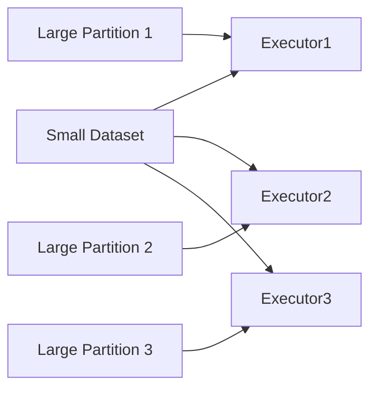
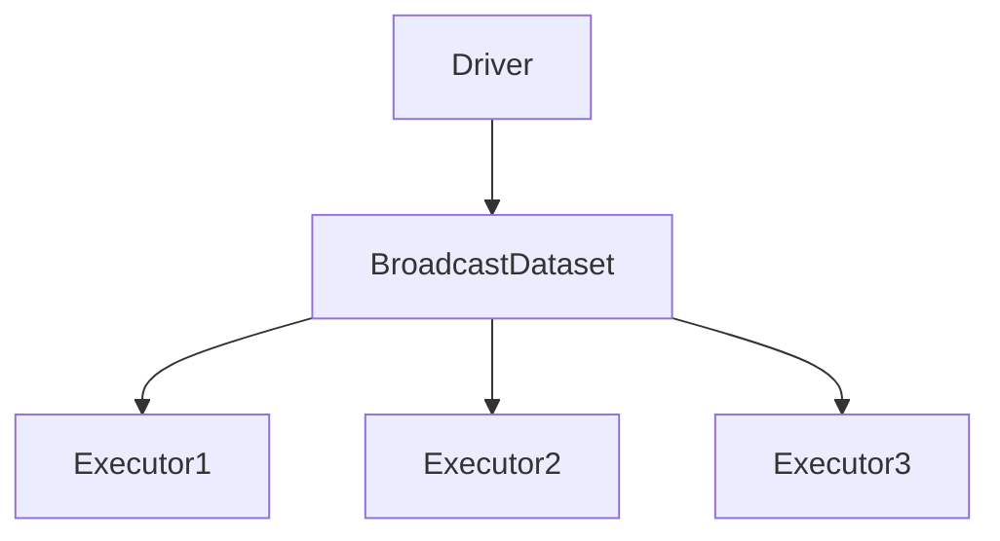

# Chapter 14 – Broadcast Joins in PySpark

Broadcast Join is an optimization technique in Apache Spark used when **one dataset is significantly smaller than the other**.

Instead of shuffling both datasets across the cluster, Spark **broadcasts the small dataset to all executors**.

This avoids expensive shuffle operations.

---

# 1️⃣ What is a Broadcast Join?

A broadcast join works by:

1️⃣ sending the **small dataset** to every executor
2️⃣ joining it locally with partitions of the large dataset

Example scenario:

| Dataset         | Size             |
| --------------- | ---------------- |
| Orders table    | 500 million rows |
| Customers table | 50,000 rows      |

Here the **customers table is small**, so Spark can broadcast it.

---

# 2️⃣ Broadcast Join Visualization



The small table is copied to each executor.

---

# 3️⃣ Example – Broadcast Join in PySpark

Example:

```python
from pyspark.sql.functions import broadcast

orders = spark.read.parquet("orders")

customers = spark.read.parquet("customers")

result = orders.join(broadcast(customers), "customer_id")

result.show()
```

Here Spark sends the **customers dataset to every executor**.

---

# 4️⃣ Why Broadcast Join is Faster

Broadcast joins eliminate shuffle operations.

Comparison:

| Join Type      | Data Movement           |
| -------------- | ----------------------- |
| Shuffle Join   | move both datasets      |
| Broadcast Join | send small dataset only |

Broadcast joins avoid:

* network-heavy shuffle
* sorting large datasets
* disk spills

---

# 5️⃣ Automatic Broadcast Join

Spark can automatically broadcast small datasets.

Configuration:

```python
spark.conf.get("spark.sql.autoBroadcastJoinThreshold")
```

Default value:

```text
10 MB
```

If a table is smaller than this threshold, Spark may automatically broadcast it.

---

# 6️⃣ Physical Plan Example

You can verify broadcast joins using:

```python
df.explain(True)
```

Example output:

```text
BroadcastHashJoin
BroadcastExchange
```

This indicates Spark is using broadcast join.

---

# 7️⃣ Example Scenario

Imagine joining:

```text
Orders table → 1 billion rows
Product table → 1000 rows
```

Spark will:

1️⃣ broadcast the product table
2️⃣ perform join locally on each executor

This dramatically reduces network traffic.

---

# 8️⃣ Broadcast Join Execution Steps

```text
Step 1 – Identify small dataset
Step 2 – Broadcast dataset to executors
Step 3 – Perform local joins
Step 4 – Combine results
```

---

# 9️⃣ Broadcast Join Visualization (Execution)



Each executor receives a copy of the broadcast dataset.

---

# 🔟 When to Use Broadcast Joins

Broadcast joins work best when:

* one dataset is small
* the other dataset is large
* join keys are indexed

Common example:

```text
fact table + dimension table
```

Example:

| Table Type      | Example  |
| --------------- | -------- |
| Fact table      | Orders   |
| Dimension table | Products |

---

# 1️⃣1️⃣ Performance Benefits

Broadcast joins improve performance by:

* eliminating shuffle
* reducing network overhead
* enabling local joins

This results in **faster execution times**.

---

# 1️⃣2️⃣ Broadcast Join vs Shuffle Join

| Feature       | Broadcast Join   | Shuffle Join |
| ------------- | ---------------- | ------------ |
| Shuffle       | No               | Yes          |
| Data movement | Small table only | Both tables  |
| Performance   | Faster           | Slower       |

---

# 1️⃣3️⃣ Interview Questions

### What is a broadcast join?

A broadcast join sends a small dataset to all executors to avoid shuffle.

---

### When does Spark use broadcast joins?

When one dataset is smaller than the broadcast threshold.

---

### How do you force broadcast join?

Using:

```python
broadcast(df)
```

---

### What is the default broadcast threshold?

```text
10 MB
```

---

# Key Takeaway

Broadcast joins are one of the most important Spark optimization techniques.

They improve performance by **avoiding shuffle operations** when joining large datasets with small datasets.

---

⬅️ [Previous: Shuffle Joins](./13-shuffle-joins.md)
➡️ [Next: Spark SQL Engine](./15-spark-sql-engine.md)
