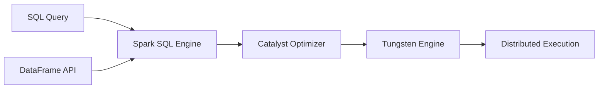

# Chapter 15 – Spark SQL Engine

Spark SQL is a module of Apache Spark that enables **structured data processing using SQL queries and DataFrames**.

It allows users to query data using:

* SQL
* DataFrame API
* Dataset API

Spark SQL internally uses an optimized query engine for efficient execution.

---

# 1️⃣ What is Spark SQL?

Spark SQL allows structured data processing similar to relational databases.

Example query:

```python
df = spark.read.csv("sales.csv", header=True)

df.createOrReplaceTempView("sales")

spark.sql("SELECT city, SUM(amount) FROM sales GROUP BY city").show()
```

Spark SQL converts this query into an optimized execution plan.

---

# 2️⃣ Spark SQL Architecture



Spark SQL transforms user queries into optimized execution plans.

---

# 3️⃣ Query Processing Pipeline

Spark SQL processes queries in multiple stages:

| Stage             | Description                         |
| ----------------- | ----------------------------------- |
| Parsing           | convert SQL query into logical plan |
| Analysis          | validate query and resolve schema   |
| Optimization      | apply Catalyst optimizations        |
| Physical Planning | choose execution strategy           |
| Execution         | run tasks on cluster                |

---

# 4️⃣ Logical Plan

The logical plan represents **what operations should be performed**.

Example logical operations:

```text
Project
 Filter
  Scan CSV
```

Spark identifies the operations needed to produce results.

---

# 5️⃣ Catalyst Optimizer

The **Catalyst Optimizer** is Spark's query optimization framework.

It improves performance using rule-based optimization.

Examples of optimizations:

| Optimization       | Description                           |
| ------------------ | ------------------------------------- |
| Predicate Pushdown | push filters close to data source     |
| Column Pruning     | read only required columns            |
| Constant Folding   | compute constants during optimization |
| Filter Combination | merge multiple filters                |

Example:

Original query:

```text
Filter age > 20
Filter salary > 5000
```

Optimized query:

```text
Filter age > 20 AND salary > 5000
```

---

# 6️⃣ Physical Plan

The physical plan determines **how Spark executes the query**.

Example physical operators:

| Operator      | Description            |
| ------------- | ---------------------- |
| HashAggregate | aggregation operation  |
| SortMergeJoin | join operation         |
| Exchange      | shuffle operation      |
| Scan          | read data from storage |

Example physical plan:

```text
HashAggregate
 Exchange
  FileScan
```

---

# 7️⃣ Tungsten Execution Engine

The **Tungsten Engine** improves performance by optimizing memory and CPU usage.

Key improvements:

| Feature                     | Benefit                    |
| --------------------------- | -------------------------- |
| Binary memory format        | reduces serialization cost |
| Cache-aware computation     | better CPU utilization     |
| Whole-stage code generation | faster execution           |

Tungsten reduces overhead between JVM and CPU.

---

# 8️⃣ Example – Spark SQL Execution

Example code:

```python
df = spark.read.parquet("orders")

df.groupBy("country").sum("amount").show()
```

Execution steps:

1️⃣ parse query
2️⃣ generate logical plan
3️⃣ optimize plan using Catalyst
4️⃣ generate physical plan
5️⃣ execute tasks across executors

---

# 9️⃣ Viewing Query Plan

You can inspect Spark SQL execution plans using:

```python
df.explain(True)
```

Example output:

```text
== Physical Plan ==
HashAggregate
 Exchange hashpartitioning
 FileScan parquet
```

This helps analyze performance.

---

# 🔟 Spark SQL vs Traditional SQL

| Feature      | Traditional SQL | Spark SQL           |
| ------------ | --------------- | ------------------- |
| Execution    | single machine  | distributed cluster |
| Optimization | query optimizer | Catalyst optimizer  |
| Processing   | disk-based      | in-memory           |

Spark SQL can process **terabytes of data efficiently**.

---

# 1️⃣1️⃣ Real Production Example

Imagine analyzing **2 TB of sales data**.

Spark SQL query:

```python
spark.sql("""
SELECT country, SUM(amount)
FROM sales
GROUP BY country
""").show()
```

Spark SQL distributes computation across executors and aggregates results.

---

# 1️⃣2️⃣ Interview Questions

### What is Spark SQL?

Spark SQL is a module that enables structured data processing using SQL queries and DataFrames.

---

### What is Catalyst Optimizer?

Catalyst is Spark’s query optimization engine.

---

### What is Tungsten Engine?

Tungsten optimizes memory and CPU usage for faster query execution.

---

### How can you inspect query plans?

Using:

```python
df.explain(True)
```

---

# Key Takeaway

Spark SQL combines:

* **Catalyst Optimizer**
* **Tungsten Execution Engine**
* **Distributed processing**

to efficiently execute SQL queries on large datasets.

---

⬅️ [Previous: Broadcast Joins](./14-broadcast-joins.md)
➡️ [Next: Driver Memory Management](./16-driver-memory.md)
