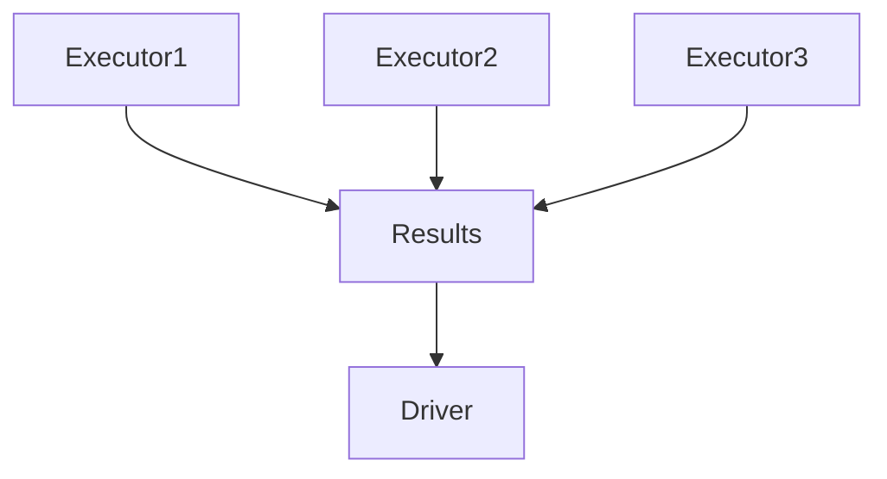

# Chapter 16 – Driver Memory Management

In Apache Spark, the **Driver** is responsible for coordinating the entire Spark application.

The driver performs tasks such as:

* building the execution plan
* scheduling tasks
* communicating with executors
* collecting results

Because of these responsibilities, proper **driver memory management** is critical.

---

# 1️⃣ What is the Spark Driver?

The driver is the process that runs the **main Spark application**.

Responsibilities:

* create SparkSession
* create DAG (execution plan)
* divide jobs into stages
* schedule tasks
* collect results from executors

---

# 2️⃣ Spark Driver Architecture


The driver controls the execution of the Spark job.

---

# 3️⃣ Driver Memory Configuration

Driver memory can be configured using:

```bash
spark.driver.memory
```

Example:

```bash
spark-submit \
--driver-memory 4G \
app.py
```

This allocates **4GB memory to the driver**.

---

# 4️⃣ Why Driver Memory is Important

The driver stores:

* metadata of RDD/DataFrames
* task scheduling information
* collected results
* broadcast variables

If driver memory is insufficient, the application may fail.

---

# 5️⃣ Example – Driver Memory Usage

Example Spark job:

```python
df = spark.read.parquet("sales")

result = df.groupBy("country").sum("amount")

result.collect()
```

Here the **collect() action** sends all results to the driver.

If the dataset is large, driver memory may overflow.

---

# 6️⃣ Driver Out of Memory Example

Suppose result size:

```text
5 million rows
```

Using:

```python
result.collect()
```

Spark tries to bring **all rows to driver memory**.

This may cause:

```
java.lang.OutOfMemoryError
```

---

# 7️⃣ Avoiding Driver Memory Issues

Best practices:

| Practice                          | Description                   |
| --------------------------------- | ----------------------------- |
| Avoid collect() on large datasets | use show() or write instead   |
| Limit results                     | use limit()                   |
| Increase driver memory            | configure spark.driver.memory |

Example:

```python
df.limit(100).collect()
```

---

# 8️⃣ Driver vs Executor Memory

| Component       | Purpose                          |
| --------------- | -------------------------------- |
| Driver Memory   | scheduling and result collection |
| Executor Memory | data processing                  |

Executors handle most computation, but the driver still needs sufficient memory.

---

# 9️⃣ Real Production Example

Imagine analyzing **2 TB dataset**.

If you run:

```python
df.collect()
```

Spark attempts to load **all data into driver memory**.

This will crash the driver.

Correct approach:

```python
df.write.parquet("output")
```

---

# 🔟 Driver Memory Visualization



Executors send results to the driver.

---

# 1️⃣1️⃣ Driver Memory Configuration Parameters

Important Spark configurations:

| Configuration              | Description                 |
| -------------------------- | --------------------------- |
| spark.driver.memory        | driver memory size          |
| spark.driver.cores         | number of driver CPU cores  |
| spark.driver.maxResultSize | maximum result size allowed |

Example:

```bash
spark.driver.memory=8g
spark.driver.maxResultSize=2g
```

---

# 1️⃣2️⃣ Interview Questions

### What is the Spark driver?

The driver is the process that runs the main Spark application and coordinates execution.

---

### Why is driver memory important?

Because it stores execution plans, metadata, and results collected from executors.

---

### What causes driver OutOfMemory errors?

Using actions like `collect()` on large datasets.

---

### How can driver memory issues be avoided?

Avoid collecting large datasets and increase driver memory when necessary.

---

# Key Takeaway

The Spark driver coordinates job execution and must manage memory efficiently.

Avoid operations that bring large datasets to the driver.

Proper driver memory configuration ensures **stable and scalable Spark applications**.

---

⬅️ [Previous: Spark SQL Engine](./15-spark-sql-engine.md)
➡️ [Next: Executor Memory Management](./17-executor-memory.md)
