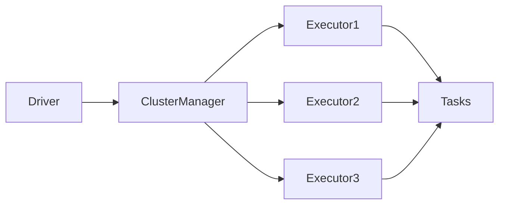
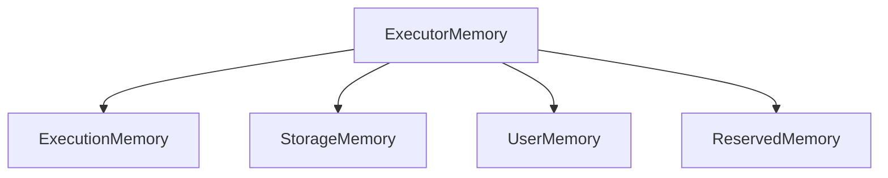
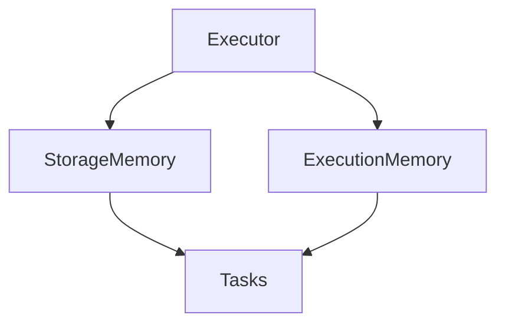

# Chapter 17 – Executor Memory Management

In Apache Spark, **executors are the worker processes responsible for executing tasks and processing data**.

Each executor runs on a worker node and uses memory for:

* data processing
* shuffle operations
* caching datasets
* intermediate computations

Efficient executor memory management is critical for Spark performance.

---

# 1️⃣ What is an Executor?

An executor is a **JVM process launched on a worker node** that runs Spark tasks.

Responsibilities of executors:

* execute tasks assigned by the driver
* store data partitions
* cache datasets
* perform shuffle operations

Executors remain active throughout the lifetime of a Spark application.

---

# 2️⃣ Executor Architecture



Each executor processes tasks independently.

---

# 3️⃣ Executor Memory Configuration

Executor memory is configured using:

```bash
spark.executor.memory
```

Example:

```bash
spark-submit \
--executor-memory 8G \
--num-executors 4 \
app.py
```

This allocates **8 GB memory per executor**.

---

# 4️⃣ Executor Memory Structure

Executor memory is divided into multiple regions.



Memory regions serve different purposes.

---

# 5️⃣ Execution Memory

Execution memory is used for:

* shuffle operations
* sorting
* joins
* aggregations

Example operations using execution memory:

```python
df.groupBy("city").sum("amount")
```

These operations require intermediate data structures.

---

# 6️⃣ Storage Memory

Storage memory is used for:

* caching datasets
* persisting RDDs
* storing broadcast variables

Example:

```python
df.cache()
```

Spark stores cached data in storage memory.

---

# 7️⃣ User Memory

User memory is used by:

* user-defined functions
* custom data structures
* Spark internal metadata

Developers may consume this memory through custom code.

---

# 8️⃣ Reserved Memory

Reserved memory is used internally by Spark for:

* safety buffer
* internal bookkeeping
* memory management operations

This memory is not available for user workloads.

---

# 9️⃣ Example – Caching Data

Example:

```python
df = spark.read.parquet("sales")

df.cache()

df.count()
```

Here Spark stores the dataset in **executor storage memory**.

Subsequent operations reuse cached data.

---

# 🔟 Example – Shuffle Operation

Example:

```python
df.groupBy("country").sum("amount")
```

Spark uses **execution memory** to:

* sort records
* group keys
* perform aggregation

---

# 1️⃣1️⃣ Executor Memory Visualization



Tasks consume executor memory while executing operations.

---

# 1️⃣2️⃣ Real Production Example

Consider processing **500 million rows**.

Spark cluster:

| Executors | Memory | Cores |
| --------- | ------ | ----- |
| 6         | 16GB   | 4     |

Memory usage:

```text
Execution memory → join operations
Storage memory → cached dataset
```

Efficient memory allocation improves performance.

---

# 1️⃣3️⃣ Common Executor Memory Issues

Typical issues include:

| Problem              | Cause                        |
| -------------------- | ---------------------------- |
| Executor OutOfMemory | insufficient executor memory |
| Shuffle spill        | execution memory overflow    |
| Cache eviction       | storage memory insufficient  |

These issues impact job performance.

---

# 1️⃣4️⃣ Important Configuration Parameters

Key Spark configurations:

| Parameter             | Description                                  |
| --------------------- | -------------------------------------------- |
| spark.executor.memory | memory allocated to each executor            |
| spark.executor.cores  | CPU cores per executor                       |
| spark.memory.fraction | fraction of memory for execution and storage |

Example configuration:

```bash
spark.executor.memory=8g
spark.executor.cores=4
spark.memory.fraction=0.6
```

---

# 1️⃣5️⃣ Interview Questions

### What is an executor in Spark?

An executor is a worker process responsible for executing Spark tasks and storing data partitions.

---

### What types of memory exist inside executors?

Execution memory, storage memory, user memory, and reserved memory.

---

### What happens when executor memory is insufficient?

Spark may spill data to disk or throw OutOfMemory errors.

---

### What is execution memory used for?

Operations like joins, aggregations, and shuffle processing.

---

# Key Takeaway

Executors perform most of the computation in Spark.

Proper executor memory configuration ensures:

* efficient data processing
* minimal disk spill
* improved Spark performance

---

⬅️ [Previous: Driver Memory Management](./16-driver-memory.md)
➡️ [Next: Unified Memory Management](./18-unified-memory-management.md)
