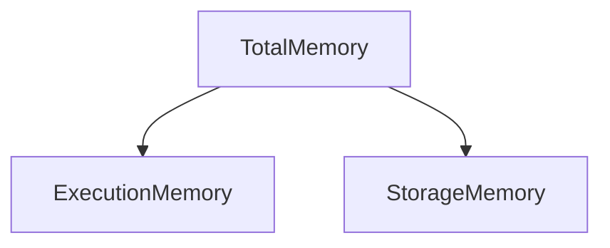
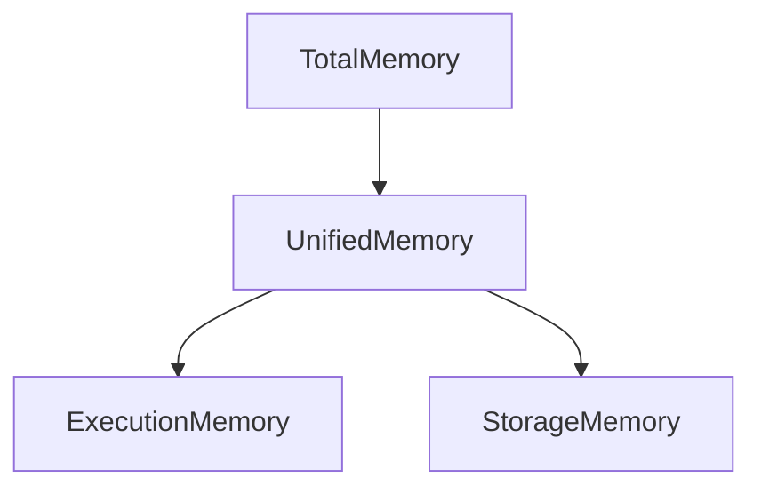
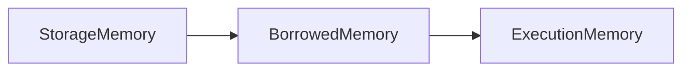
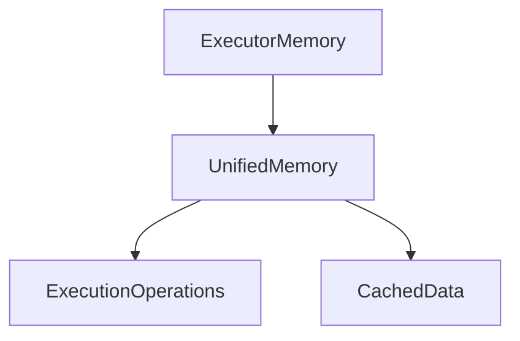

# Chapter 18 – Unified Memory Management

Unified Memory Management is the **modern memory model used by Apache Spark**.

It was introduced in **Spark 1.6** to simplify memory usage and improve performance.

Earlier Spark versions had **separate memory pools** for execution and storage.
Unified memory allows them to **share memory dynamically**.

---

# 1️⃣ Why Unified Memory Was Introduced

Before Spark 1.6:

Memory was divided **statically**.

Example:

```
Execution Memory → 50%
Storage Memory → 50%
```

Problem:

If storage memory was unused, execution memory **could not use it**.

This caused inefficient memory utilization.

---

# 2️⃣ Old Memory Model (Static Memory)

Old Spark memory model:



Limitations:

* fixed memory boundaries
* inefficient usage
* frequent disk spills

---

# 3️⃣ Unified Memory Model

In the unified memory model, execution and storage share the same memory pool.



Memory can be **borrowed dynamically** between execution and storage.

---

# 4️⃣ Spark Memory Regions

Executor memory contains several regions:

| Memory Region    | Purpose                      |
| ---------------- | ---------------------------- |
| Execution Memory | joins, aggregations, sorting |
| Storage Memory   | caching datasets             |
| User Memory      | user-defined objects         |
| Reserved Memory  | Spark internal usage         |

---

# 5️⃣ Memory Allocation Formula

Spark divides executor memory approximately as follows:

```
Spark Memory = spark.executor.memory × spark.memory.fraction
```

Default:

```
spark.memory.fraction = 0.6
```

Meaning:

```
60% → Spark execution + storage memory
40% → user memory
```

---

# 6️⃣ Dynamic Memory Sharing

Unified memory allows dynamic borrowing.

Example scenario:

```
Storage Memory Used → 10%
Execution Memory Needs → 70%
```

Execution memory can **borrow unused storage memory**.

Visualization:



---

# 7️⃣ Example – Aggregation Operation

Example:

```python
df.groupBy("country").sum("amount")
```

During this operation:

* Spark uses **execution memory**
* performs sorting
* performs aggregation

If execution memory runs out:

Spark may **borrow memory from storage region**.

---

# 8️⃣ Example – Cached Dataset

Example:

```python
df.cache()
```

Spark stores cached data in **storage memory**.

If execution operations require more memory:

Spark may **evict cached data**.

---

# 9️⃣ Memory Eviction

If storage memory is full:

Spark removes cached blocks using **LRU (Least Recently Used)** policy.

Example:

```
Old cached dataset → removed
New dataset → stored
```

This keeps memory usage balanced.

---

# 🔟 Unified Memory Execution Flow



Execution and storage operations share memory.

---

# 1️⃣1️⃣ Real Production Example

Spark job processing **1 TB dataset**.

Operations:

```
Join
Aggregation
Caching
```

Memory usage:

| Operation      | Memory Type      |
| -------------- | ---------------- |
| Join           | Execution memory |
| Aggregation    | Execution memory |
| Cached dataset | Storage memory   |

Unified memory allows both to share available space.

---

# 1️⃣2️⃣ Key Configuration Parameters

Important Spark configurations:

| Parameter                    | Description                              |
| ---------------------------- | ---------------------------------------- |
| spark.memory.fraction        | memory available for execution + storage |
| spark.memory.storageFraction | portion reserved for storage             |

Example configuration:

```bash
spark.memory.fraction=0.6
spark.memory.storageFraction=0.5
```

---

# 1️⃣3️⃣ Advantages of Unified Memory

Benefits include:

* better memory utilization
* reduced disk spill
* dynamic allocation
* improved Spark performance

Unified memory allows Spark to **adapt memory usage based on workload**.

---

# 1️⃣4️⃣ Interview Questions

### What is Unified Memory Management in Spark?

Unified memory management allows execution and storage memory to share a common memory pool dynamically.

---

### Why was unified memory introduced?

To improve memory utilization and avoid inefficient static memory allocation.

---

### What happens when execution memory needs more space?

Execution memory can borrow unused memory from storage.

---

### What happens when storage memory needs space?

Spark evicts cached blocks using LRU policy.

---

# Key Takeaway

Unified memory management enables **dynamic memory sharing between execution and storage memory**.

This improves:

```
Memory utilization
Spark performance
Resource efficiency
```

It is a core part of **modern Spark memory architecture**.

---

⬅️ [Previous: Executor Memory Management](./17-executor-memory.md)
➡️ [Next: Executor Out Of Memory](./19-executor-out-of-memory.md)
