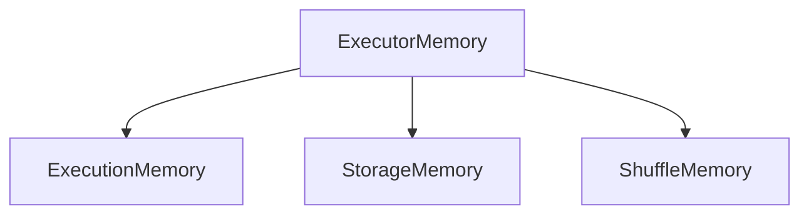

# Chapter 19 – Executor Out Of Memory (OOM)

One of the most common failures in Apache Spark is **Executor Out Of Memory (OOM)**.

It occurs when the executor **does not have enough memory to process data** during a Spark job.

Typical error:

```text
java.lang.OutOfMemoryError: Java heap space
```

Understanding this problem is critical for **debugging Spark jobs in production systems**.

---

# 1️⃣ What is Executor Out Of Memory?

Executor Out Of Memory happens when:

* executor memory is insufficient
* large datasets are processed
* shuffle or join operations consume excessive memory

When this happens:

```text
Executor process crashes
Tasks fail
Spark retries tasks
Job may fail
```

---

# 2️⃣ Executor Memory Usage

Executors use memory for:

| Memory Usage     | Example                     |
| ---------------- | --------------------------- |
| Execution memory | joins, aggregations         |
| Storage memory   | cached datasets             |
| Shuffle buffers  | data exchange between nodes |

If memory exceeds the allocated limit, Spark throws **OOM errors**.

---

# 3️⃣ Executor OOM Architecture



If any component exceeds memory capacity, the executor may crash.

---

# 4️⃣ Example – Executor OOM Scenario

Example Spark job:

```python
df = spark.read.parquet("sales_data")

df.groupBy("country").sum("amount").show()
```

Suppose:

```text
Dataset size → 500 GB
Executor memory → 4 GB
```

During aggregation:

* Spark creates intermediate hash tables
* Memory requirement increases
* Executor memory limit is exceeded

Result:

```text
Executor OutOfMemoryError
```

---

# 5️⃣ Common Causes of Executor OOM

| Cause                        | Explanation                 |
| ---------------------------- | --------------------------- |
| Large shuffle operations     | join or groupBy operations  |
| Data skew                    | uneven data distribution    |
| Large partitions             | partitions too big          |
| Insufficient executor memory | memory allocation too small |

---

# 6️⃣ Data Skew Example

Suppose dataset:

```text
Country
USA
USA
USA
USA
India
India
```

If one partition contains most records:

```text
Partition 1 → 90% of data
Partition 2 → 10% of data
```

Partition 1 executor may run out of memory.

---

# 7️⃣ Shuffle Spill Behavior

If memory becomes insufficient:

Spark may spill data to disk.


Disk spill slows down job execution but prevents crashes.

---

# 8️⃣ Example – Join Causing OOM

Example:

```python
df1.join(df2, "customer_id")
```

If both datasets are large:

Spark performs shuffle join.

This may require:

```text
large memory buffers
sorting
hash tables
```

Executors may run out of memory.

---

# 9️⃣ Detecting OOM in Spark UI

Spark UI helps diagnose memory issues.

Important metrics:

| Metric        | Meaning                           |
| ------------- | --------------------------------- |
| Shuffle Read  | amount of data received           |
| Shuffle Spill | disk spill due to memory shortage |
| Task failures | repeated executor crashes         |

These indicators help identify OOM problems.

---

# 🔟 Solutions to Executor OOM

Several strategies can prevent executor memory issues.

| Solution                 | Description           |
| ------------------------ | --------------------- |
| Increase executor memory | allocate more memory  |
| Increase partitions      | reduce partition size |
| Use broadcast joins      | avoid shuffle joins   |
| Filter early             | reduce dataset size   |

Example:

```python
df.filter("amount > 100")
```

Filtering reduces memory usage.

---

# 1️⃣1️⃣ Increase Executor Memory

Configuration example:

```bash
spark-submit \
--executor-memory 8G \
--num-executors 5 \
app.py
```

Increasing executor memory allows Spark to handle larger workloads.

---

# 1️⃣2️⃣ Repartition to Reduce Partition Size

Example:

```python
df = df.repartition(200)
```

More partitions means **smaller data per executor**.

---

# 1️⃣3️⃣ Broadcast Join Optimization

Example:

```python
from pyspark.sql.functions import broadcast

df1.join(broadcast(df2), "id")
```

Broadcast joins eliminate shuffle and reduce memory usage.

---

# 1️⃣4️⃣ Real Production Example

Scenario:

```text
Transaction dataset → 1 TB
Executors → 6
Executor memory → 8 GB
```

Spark performs join + aggregation.

Result:

```text
Executors crash due to insufficient memory
```

Solution applied:

```text
Increase partitions
Use broadcast join
Increase executor memory
```

Job runs successfully.

---

# 1️⃣5️⃣ Interview Questions

### What is Executor Out Of Memory?

It occurs when executor memory is insufficient for Spark tasks.

---

### What causes executor OOM errors?

Large shuffles, joins, data skew, and large partitions.

---

### How can executor OOM be fixed?

Increase memory, repartition data, filter early, and use broadcast joins.

---

### What is shuffle spill?

When Spark writes intermediate data to disk because memory is insufficient.

---

# Key Takeaway

Executor Out Of Memory is a common Spark failure caused by insufficient memory during data processing.

Proper tuning of:

```text
Executor memory
Partition size
Join strategies
```

ensures **stable Spark job execution in production systems**.

---

⬅️ [Previous: Unified Memory Management](./18-unified-memory-management.md)
➡️ [Next: Salting in PySpark](./20-salting.md)
