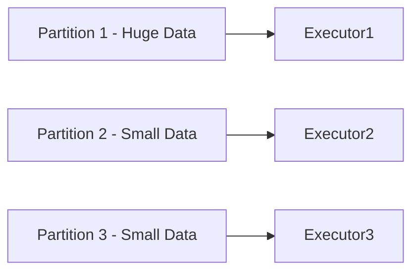
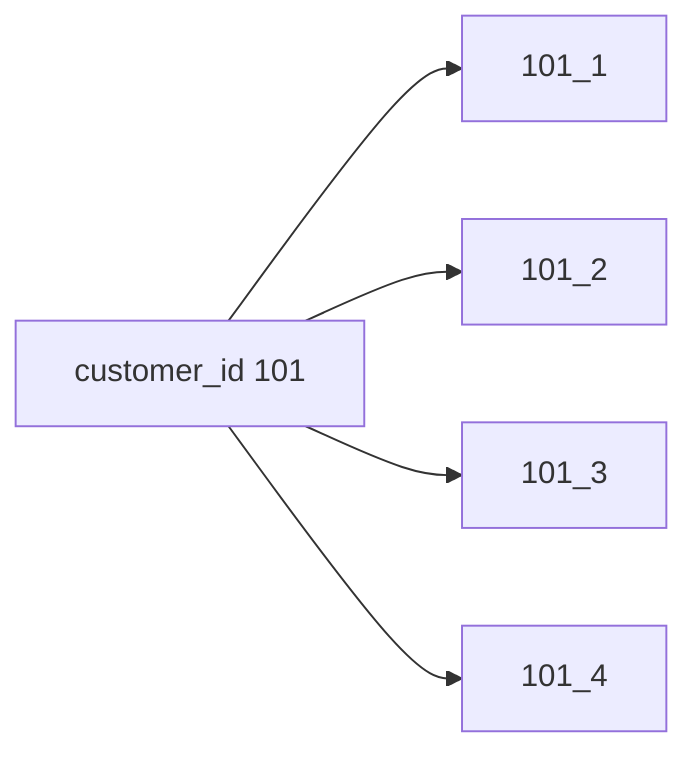
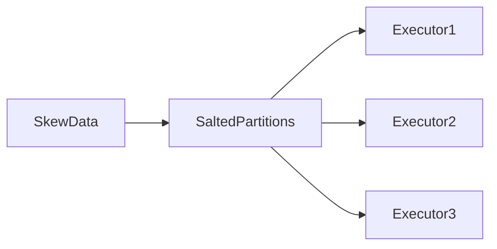

# Chapter 20 – Salting in PySpark

Salting is a technique used in Apache Spark to **solve data skew problems during joins or aggregations**.

Data skew happens when **one key contains much more data than others**, causing uneven workload distribution across executors.

Salting distributes skewed data across multiple partitions.

---

# 1️⃣ What is Data Skew?

Data skew occurs when some keys appear **much more frequently than others**.

Example dataset:

```text
CustomerID
101
101
101
101
101
102
103
104
```

Here:

```text
CustomerID 101 → very frequent
```

This creates uneven partitions.

---

# 2️⃣ Data Skew Visualization



Executor1 becomes overloaded while others remain idle.

---

# 3️⃣ Problem with Skewed Joins

Example join:

```python
orders.join(customers, "customer_id")
```

If one key appears very frequently:

```text
customer_id = 101 → millions of records
```

All records for that key go to **one partition**.

Result:

```text
One executor overloaded
Other executors idle
Slow job execution
```

---

# 4️⃣ What is Salting?

Salting means **adding random values to skewed keys** to distribute them across partitions.

Example:

Original key:

```text
customer_id = 101
```

After salting:

```text
101_1
101_2
101_3
101_4
```

This distributes records across multiple partitions.

---

# 5️⃣ Salting Visualization



Data is now spread across partitions.

---

# 6️⃣ Example – Detecting Skew

Example query:

```python
df.groupBy("customer_id").count().orderBy("count", ascending=False).show()
```

Output might show:

```text
customer_id | count
101         | 10,000,000
102         | 500
103         | 300
```

Customer 101 causes skew.

---

# 7️⃣ Implementing Salting in PySpark

Step 1 – Add random salt column

```python
from pyspark.sql.functions import rand, floor

df1 = df.withColumn("salt", floor(rand()*5))
```

Now each record gets a salt value.

Example:

```text
customer_id | salt
101         | 1
101         | 3
101         | 0
```

---

# 8️⃣ Create Salted Key

```python
from pyspark.sql.functions import concat

df1 = df1.withColumn("salted_key", concat(df1.customer_id, df1.salt))
```

Example output:

```text
101_0
101_1
101_2
101_3
```

---

# 9️⃣ Join Using Salted Key

```python
df1.join(df2, "salted_key")
```

Now records are distributed across multiple partitions.

---

# 🔟 Salting Execution Visualization



Workload is evenly distributed.

---

# 1️⃣1️⃣ Real Production Example

Suppose an **e-commerce dataset**:

```text
Orders → 2 billion rows
customer_id = 500 → extremely frequent
```

Without salting:

```text
One executor processes millions of rows
Job becomes extremely slow
```

With salting:

```text
customer_id 500 split across 10 partitions
Executors process data evenly
```

Job runs significantly faster.

---

# 1️⃣2️⃣ Advantages of Salting

Benefits:

| Benefit               | Explanation                     |
| --------------------- | ------------------------------- |
| Fixes data skew       | distributes heavy keys          |
| Improves parallelism  | multiple executors process data |
| Prevents executor OOM | avoids memory overload          |

---

# 1️⃣3️⃣ Limitations of Salting

Salting increases:

* dataset size
* join complexity
* additional computation

It should be used **only when skew exists**.

---

# 1️⃣4️⃣ Interview Questions

### What is data skew in Spark?

Data skew occurs when some keys have significantly more data than others.

---

### What is salting?

Salting adds random values to skewed keys to distribute data evenly across partitions.

---

### Why is salting used?

To prevent one executor from processing disproportionately large data.

---

### When should salting be applied?

When join operations suffer from data skew.

---

# Key Takeaway

Salting is an effective technique to handle **data skew during joins and aggregations**.

By distributing skewed keys across multiple partitions, Spark achieves **better parallelism and faster execution**.

---

⬅️ [Previous: Executor Out Of Memory](./19-executor-out-of-memory.md)
➡️ [Next: Cache and Persist](./21-cache-persist.md)
