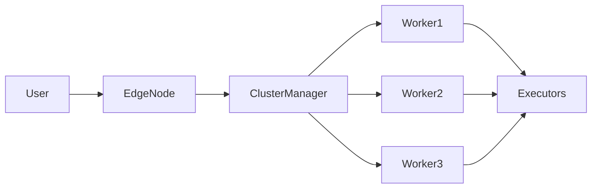
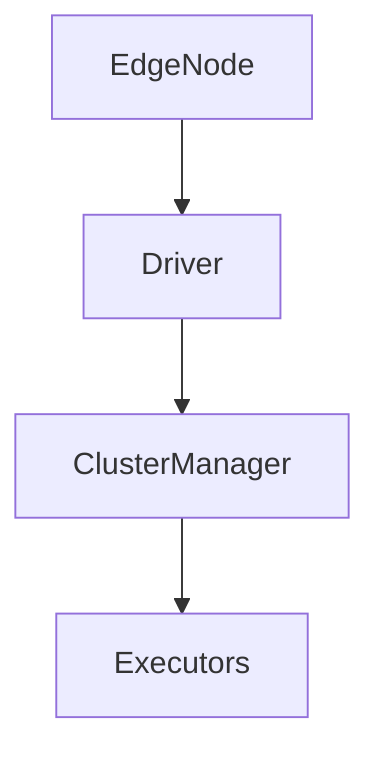
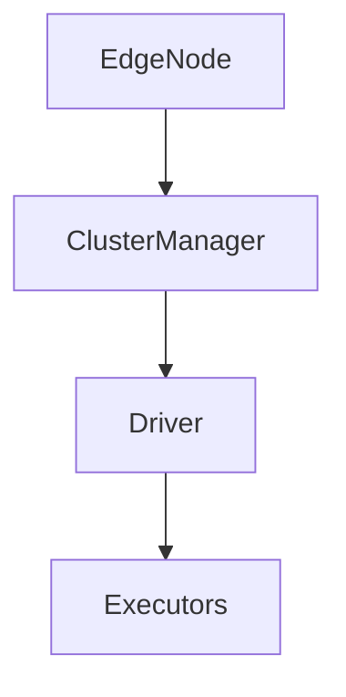

# Chapter 22 – Edge Node and Deployment Mode

In distributed data platforms like Hadoop or Spark clusters, **Edge Nodes** and **Deployment Modes** determine how Spark applications interact with the cluster.

Understanding this concept is important for:

* production deployments
* cluster architecture
* Spark job submission

---

# 1️⃣ What is an Edge Node?

An **Edge Node** is a machine that acts as an **entry point to the cluster**.

Users connect to the edge node to:

* submit Spark jobs
* run scripts
* access cluster resources

Edge nodes typically contain:

```text
Spark
Hadoop client
Python / Scala environment
CLI tools
```

But they **do not store cluster data**.

---

# 2️⃣ Edge Node Architecture



Users interact with the cluster through the edge node.

---

# 3️⃣ Example – Submitting a Spark Job from Edge Node

Example command:

```bash
spark-submit \
--master yarn \
--deploy-mode cluster \
app.py
```

Steps:

```text
1. User logs into edge node
2. Runs spark-submit
3. Job is sent to cluster manager
4. Executors are created on worker nodes
```

---

# 4️⃣ What is Spark Deployment Mode?

Deployment mode determines **where the Spark driver runs**.

Spark supports two modes:

| Mode         | Driver Location            |
| ------------ | -------------------------- |
| Client Mode  | Driver runs on edge node   |
| Cluster Mode | Driver runs inside cluster |

---

# 5️⃣ Client Deployment Mode

In client mode:

```text
Driver runs on edge node
Executors run on cluster workers
```

Visualization:



Advantages:

* easier debugging
* direct log visibility

Disadvantages:

* edge node must stay connected
* network latency may increase

---

# 6️⃣ Cluster Deployment Mode

In cluster mode:

```text
Driver runs inside the cluster
```

Visualization:



Advantages:

* more fault tolerant
* edge node not required after submission

Disadvantages:

* logs stored in cluster
* debugging slightly harder

---

# 7️⃣ Deployment Mode Comparison

| Feature          | Client Mode | Cluster Mode |
| ---------------- | ----------- | ------------ |
| Driver location  | Edge node   | Worker node  |
| Debugging        | easier      | harder       |
| Fault tolerance  | lower       | higher       |
| Production usage | less common | common       |

---

# 8️⃣ Real Production Example

Suppose a company runs Spark jobs using **YARN cluster**.

Workflow:

```text
Data engineer → logs into edge node
Edge node → submits Spark job
Cluster manager → schedules executors
Executors → process data
```

Cluster mode is typically used for **large production jobs**.

---

# 9️⃣ Spark Deployment Commands

Client mode example:

```bash
spark-submit \
--master yarn \
--deploy-mode client \
job.py
```

Cluster mode example:

```bash
spark-submit \
--master yarn \
--deploy-mode cluster \
job.py
```

---

# 🔟 When to Use Each Mode

Client mode:

```text
Development
Testing
Debugging
```

Cluster mode:

```text
Production pipelines
Scheduled jobs
Large data processing
```

---

# 1️⃣1️⃣ Interview Questions

### What is an edge node?

An edge node is the gateway machine used to submit Spark jobs to a cluster.

---

### What is Spark deployment mode?

Deployment mode determines where the Spark driver runs.

---

### What is the difference between client and cluster mode?

Client mode runs the driver on the edge node, while cluster mode runs the driver inside the cluster.

---

### Which deployment mode is used in production?

Cluster mode is commonly used in production environments.

---

# Key Takeaway

Edge nodes provide a **gateway to the Spark cluster**, while deployment modes determine **where the driver runs**.

Understanding deployment architecture helps engineers design **scalable Spark pipelines in production environments**.

---

⬅️ [Previous: Cache and Persist](./21-cache-persist.md)
➡️ [Next: Dynamic Partition Pruning](./23-dynamic-partition-pruning.md)
