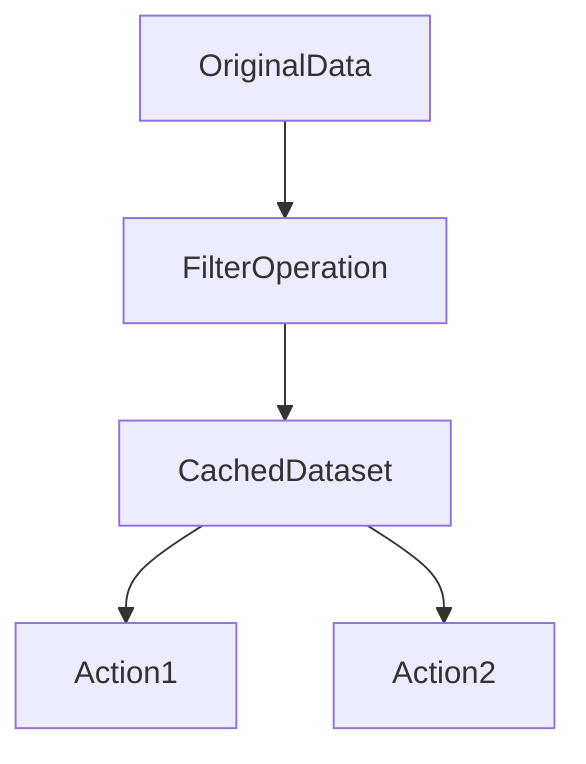

# Chapter 21 – Cache and Persist in Apache Spark

In Apache Spark, **Cache** and **Persist** are techniques used to store intermediate datasets in memory so that they can be reused without recomputation.

Spark transformations are **lazy**, meaning Spark recomputes the entire lineage every time an action is executed unless the dataset is cached.

Caching helps improve performance by avoiding repeated computations.

---

# 1️⃣ Why Cache is Needed

Consider this example:

```python
df = spark.read.parquet("sales_data")

filtered = df.filter("amount > 100")

filtered.count()
filtered.groupBy("country").count().show()
```

Without caching:

```text
Spark will recompute:
read → filter → count
read → filter → groupBy
```

The dataset is processed **twice**, increasing execution time.

---

# 2️⃣ Using Cache

Spark provides `.cache()` to store datasets in memory.

Example:

```python
df = spark.read.parquet("sales_data")

filtered = df.filter("amount > 100").cache()

filtered.count()
filtered.groupBy("country").count().show()
```

Now Spark computes the filter **once** and stores the result in memory.

---

# 3️⃣ Cache Execution Flow



The cached dataset is reused across multiple actions.

---

# 4️⃣ What Happens Internally

When `.cache()` is used:

1️⃣ Spark marks the dataset for caching
2️⃣ The first action triggers computation
3️⃣ Spark stores partitions in executor memory
4️⃣ Future operations reuse cached data

---

# 5️⃣ Example – Caching DataFrame

```python
df = spark.read.parquet("orders")

df.cache()

df.count()
df.groupBy("country").sum("amount").show()
```

Execution steps:

```text
Step 1 → read dataset
Step 2 → cache partitions in executor memory
Step 3 → reuse cached partitions
```

---

# 6️⃣ What is Persist?

`.persist()` is similar to cache but allows specifying **storage levels**.

Example:

```python
from pyspark import StorageLevel

df.persist(StorageLevel.MEMORY_AND_DISK)
```

This means:

```text
Store dataset in memory
If memory is insufficient → spill to disk
```

---

# 7️⃣ Storage Levels

Spark supports multiple storage levels.

| Storage Level   | Description                              |
| --------------- | ---------------------------------------- |
| MEMORY_ONLY     | store dataset only in memory             |
| MEMORY_AND_DISK | store in memory, spill to disk if needed |
| DISK_ONLY       | store only on disk                       |
| MEMORY_ONLY_SER | store serialized objects                 |

Example:

```python
df.persist(StorageLevel.MEMORY_ONLY)
```

---

# 8️⃣ Cache vs Persist

| Feature         | Cache       | Persist       |
| --------------- | ----------- | ------------- |
| Default storage | MEMORY_ONLY | configurable  |
| Ease of use     | simpler     | more flexible |

Internally:

```text
cache() = persist(MEMORY_ONLY)
```

---

# 9️⃣ Example – Persist Usage

```python
from pyspark import StorageLevel

df = spark.read.parquet("transactions")

df.persist(StorageLevel.MEMORY_AND_DISK)

df.count()
df.groupBy("city").count().show()
```

Spark stores partitions in memory or disk.

---

# 🔟 Unpersist

When cached data is no longer required, Spark allows releasing memory.

Example:

```python
df.unpersist()
```

This removes cached partitions from executor memory.

---

# 1️⃣1️⃣ Real Production Example

Suppose a pipeline processes **1 billion records**.

Pipeline steps:

```text
Read Data → Filter → Join → Aggregation
```

If intermediate dataset is reused multiple times:

```python
filtered = df.filter("amount > 100").cache()
```

Benefits:

```text
Avoid repeated filtering
Reduce CPU usage
Improve pipeline speed
```

---

# 1️⃣2️⃣ Cache Memory Visualization


Cached data resides in executor **storage memory**.

---

# 1️⃣3️⃣ When to Use Cache

Caching is useful when:

* dataset reused multiple times
* iterative machine learning algorithms
* repeated aggregations

Example:

```text
ML training iterations
Graph algorithms
ETL pipelines
```

---

# 1️⃣4️⃣ When NOT to Cache

Avoid caching when:

* dataset used only once
* dataset extremely large
* insufficient executor memory

Otherwise Spark may evict cached blocks frequently.

---

# 1️⃣5️⃣ Interview Questions

### What is caching in Spark?

Caching stores intermediate datasets in memory for faster reuse.

---

### What is the difference between cache and persist?

Cache stores data in memory by default, while persist allows custom storage levels.

---

### What does unpersist do?

It removes cached datasets from executor memory.

---

### When should caching be used?

When a dataset is reused multiple times in the computation.

---

# Key Takeaway

Caching improves Spark performance by **avoiding recomputation of intermediate datasets**.

Proper use of cache and persist enables:

```text
Faster pipelines
Lower CPU usage
Efficient memory utilization
```

---

⬅️ [Previous: Salting in PySpark](./20-salting.md)
➡️ [Next: Edge Node and Deployment Mode](./22-edge-node-deployment.md)
