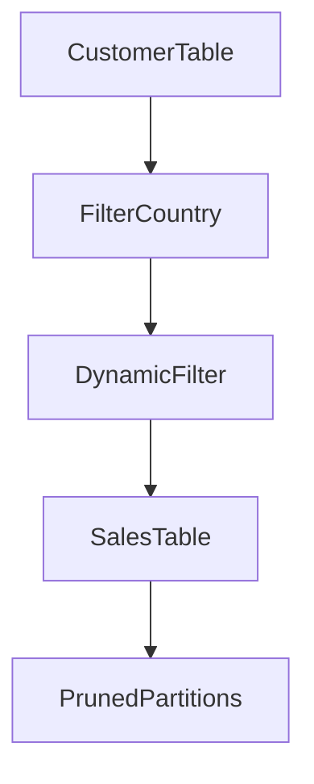

# Chapter 23 – Dynamic Partition Pruning (DPP)

Dynamic Partition Pruning is a **Spark SQL optimization technique** that reduces the amount of data scanned during joins.

It works by **eliminating unnecessary partitions at runtime**.

This significantly improves performance when working with **partitioned tables**.

---

# 1️⃣ What is Partition Pruning?

Partition pruning means **reading only relevant partitions from a dataset**.

Example table partitioned by:

```text
country
```

Partitions:

```text
country=USA
country=India
country=UK
country=Germany
```

If a query only needs `country=India`, Spark will read **only that partition**.

---

# 2️⃣ Static Partition Pruning

Example query:

```sql
SELECT *
FROM sales
WHERE country = 'India'
```

Spark reads only:

```text
country=India partition
```

This is called **static partition pruning** because the filter is known before execution.

---

# 3️⃣ Problem with Joins

Consider this query:

```sql
SELECT *
FROM sales s
JOIN customers c
ON s.customer_id = c.customer_id
WHERE c.country = 'India'
```

Problem:

```text
Spark may scan all sales partitions
```

Even though we only need **India customers**.

---

# 4️⃣ Dynamic Partition Pruning Solution

Spark solves this using **Dynamic Partition Pruning**.

Execution flow:

1️⃣ filter customer table
2️⃣ determine required partitions
3️⃣ prune unnecessary partitions from sales table

---

# 5️⃣ DPP Architecture



Only relevant partitions are scanned.

---

# 6️⃣ Example in Spark SQL

Example query:

```sql
SELECT *
FROM sales
JOIN customers
ON sales.customer_id = customers.customer_id
WHERE customers.country = 'India'
```

Spark dynamically prunes:

```text
sales partitions that don't match India
```

---

# 7️⃣ Configuration

Dynamic partition pruning can be enabled using:

```bash
spark.sql.optimizer.dynamicPartitionPruning.enabled=true
```

This feature is **enabled by default in Spark 3+**.

---

# 8️⃣ Benefits of Dynamic Partition Pruning

| Benefit           | Description               |
| ----------------- | ------------------------- |
| Less data scanned | only required partitions  |
| Reduced I/O       | fewer disk reads          |
| Faster queries    | smaller dataset processed |

---

# 9️⃣ Real Production Example

Dataset:

```text
sales table → 10 TB
partitioned by country
```

Query:

```sql
SELECT *
FROM sales
JOIN customers
WHERE customers.country='India'
```

Without DPP:

```text
Scan 10 TB
```

With DPP:

```text
Scan only India partitions
```

Huge performance improvement.

---

# 🔟 Interview Questions

### What is dynamic partition pruning?

Dynamic partition pruning eliminates unnecessary partitions during join execution.

---

### Why is dynamic partition pruning useful?

It reduces the amount of data scanned.

---

### When does Spark apply DPP?

When joining partitioned tables with filters on partition columns.

---

# Key Takeaway

Dynamic Partition Pruning is an advanced Spark optimization that **reduces I/O by scanning only required partitions during joins**.

---

⬅️ [Previous: Edge Node and Deployment Mode](./22-edge-node-deployment.md)
➡️ [Next: Adaptive Query Execution](./24-adaptive-query-execution.md)
