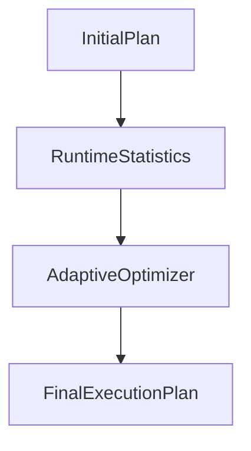
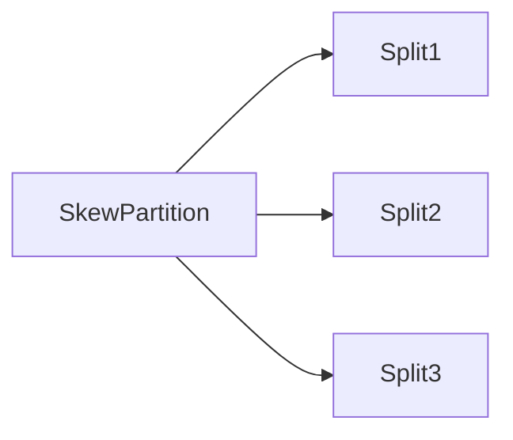

# Chapter 24 – Adaptive Query Execution (AQE)

Adaptive Query Execution (AQE) is an **advanced optimization feature introduced in Spark 3.0**.

AQE allows Spark to **optimize queries dynamically during runtime**.

Instead of relying only on the initial query plan, Spark can **adjust the plan based on runtime statistics**.

---

# 1️⃣ Why AQE Was Introduced

Traditional Spark execution:

```text
Query Plan → Execute
```

Problem:

Spark does not know **actual data distribution** until execution starts.

AQE solves this by adjusting the plan during runtime.

---

# 2️⃣ AQE Execution Flow



Spark collects runtime statistics and modifies the execution plan.

---

# 3️⃣ Key AQE Optimizations

AQE enables several important optimizations:

| Optimization                 | Description                             |
| ---------------------------- | --------------------------------------- |
| Shuffle Partition Coalescing | reduces small partitions                |
| Dynamic Join Strategy        | converts shuffle join to broadcast join |
| Skew Join Optimization       | handles skewed partitions               |

---

# 4️⃣ Shuffle Partition Coalescing

Problem:

```text
Too many small partitions
```

Example:

```text
200 partitions → each with tiny data
```

AQE merges them dynamically:

```text
200 partitions → 20 partitions
```

This reduces scheduling overhead.

---

# 5️⃣ Dynamic Join Strategy

AQE can convert a **shuffle join into a broadcast join** at runtime.

Example:

Initial plan:

```text
Sort Merge Join
```

If Spark detects a small dataset:

```text
Broadcast Hash Join
```

This improves performance.

---

# 6️⃣ Skew Join Optimization

Data skew example:

```text
Partition 1 → 90% of data
Partition 2 → 5%
Partition 3 → 5%
```

AQE splits large partitions into smaller tasks.

Visualization:



Executors process partitions more evenly.

---

# 7️⃣ Enabling AQE

Configuration:

```bash
spark.sql.adaptive.enabled=true
```

Other important configs:

```bash
spark.sql.adaptive.coalescePartitions.enabled=true
spark.sql.adaptive.skewJoin.enabled=true
```

---

# 8️⃣ Example Query

```python
df = spark.read.parquet("orders")

df.join(customers,"customer_id") \
  .groupBy("country") \
  .sum("amount") \
  .show()
```

AQE monitors runtime statistics and optimizes execution.

---

# 9️⃣ Benefits of AQE

| Benefit            | Description              |
| ------------------ | ------------------------ |
| Better performance | optimized execution plan |
| Handles skew       | splits large partitions  |
| Efficient joins    | dynamic join strategy    |

---

# 🔟 Real Production Example

Data pipeline:

```text
1 TB dataset
```

Initial query plan:

```text
SortMergeJoin
```

Runtime statistics show small dimension table.

AQE changes strategy:

```text
BroadcastHashJoin
```

Execution becomes significantly faster.

---

# 1️⃣1️⃣ Interview Questions

### What is Adaptive Query Execution?

AQE dynamically optimizes Spark queries during runtime.

---

### When was AQE introduced?

Spark 3.0.

---

### What optimizations does AQE perform?

Shuffle partition coalescing, dynamic join selection, and skew handling.

---

# Key Takeaway

Adaptive Query Execution enables Spark to **modify query plans dynamically based on runtime data**, leading to faster and more efficient query execution.

---

⬅️ [Previous: Dynamic Partition Pruning](./23-dynamic-partition-pruning.md)
