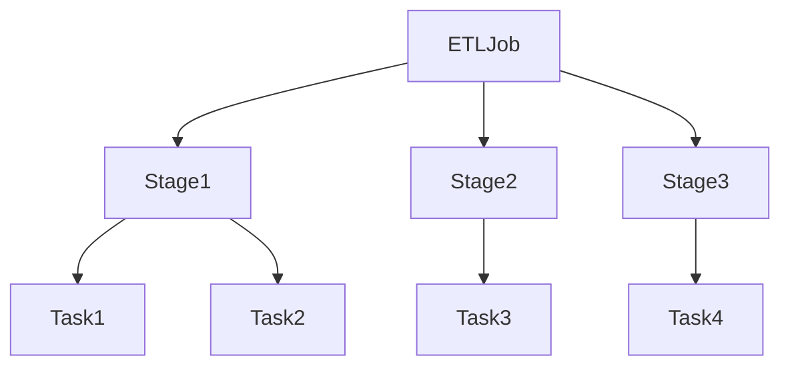
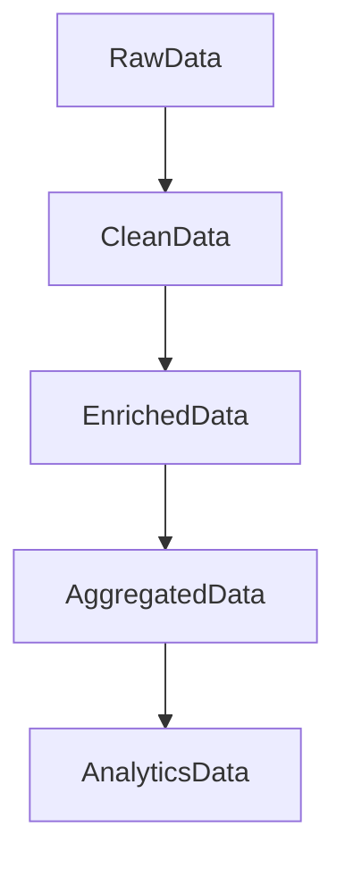

# Chapter 26 – Production Spark ETL Pipeline (Real-World Example)

This chapter demonstrates a **real production-style Spark ETL pipeline** similar to what large companies use for data processing.

ETL stands for:

```text
Extract → Transform → Load
```

Spark is commonly used for ETL pipelines because it can process **large-scale datasets across distributed clusters**.

---

# 1️⃣ Example Business Scenario

Suppose an **e-commerce company** wants to analyze transaction data.

Daily data sources:

| Source       | Description        |
| ------------ | ------------------ |
| Transactions | customer purchases |
| Customers    | customer details   |
| Products     | product catalog    |

The goal is to build a **daily analytics dataset**.

---

# 2️⃣ ETL Pipeline Architecture


Pipeline stages:

```text
Raw Data → Cleaning → Transformation → Aggregation → Storage
```

---

# 3️⃣ Extract Phase

Spark reads data from distributed storage.

Example sources:

* Parquet files
* CSV files
* streaming data

Example code:

```python
transactions = spark.read.parquet("s3://data-lake/transactions")

customers = spark.read.parquet("s3://data-lake/customers")

products = spark.read.parquet("s3://data-lake/products")
```

Spark automatically distributes the data across partitions.

---

# 4️⃣ Data Cleaning

Remove invalid or corrupted records.

Example:

```python
transactions_clean = transactions.filter("amount > 0")
```

Remove null records:

```python
transactions_clean = transactions_clean.dropna()
```

---

# 5️⃣ Data Transformation

Join datasets to create enriched data.

Example join:

```python
sales = transactions_clean \
        .join(customers, "customer_id") \
        .join(products, "product_id")
```

Spark may use:

* broadcast join
* shuffle join

depending on dataset size.

---

# 6️⃣ Aggregation

Compute metrics such as total revenue per region.

Example:

```python
revenue = sales.groupBy("country") \
               .sum("amount")
```

Output example:

| Country | Revenue |
| ------- | ------- |
| USA     | 2M      |
| India   | 1.3M    |
| UK      | 900K    |

---

# 7️⃣ Data Partitioning

Partition data for faster queries.

Example:

```python
revenue.write.partitionBy("country") \
       .parquet("s3://analytics/revenue")
```

Partitioned data improves query performance.

---

# 8️⃣ Load Phase

Write transformed data to analytics storage.

Example targets:

* data warehouse
* data lake
* BI systems

Example:

```python
revenue.write.mode("overwrite") \
       .parquet("s3://analytics/revenue_daily")
```

---

# 9️⃣ Pipeline Scheduling

ETL pipelines run using orchestration tools.

Common orchestrators:

* Apache Airflow
* Apache Oozie
* Prefect

Example pipeline schedule:

```text
Every day at 2 AM
```

---

# 🔟 Spark ETL Job Execution

Execution hierarchy:



Each stage processes distributed partitions.

---

# 1️⃣1️⃣ Production Optimizations

Production pipelines use several optimization techniques.

| Optimization   | Purpose               |
| -------------- | --------------------- |
| Partitioning   | faster reads          |
| Broadcast join | avoid shuffle         |
| Caching        | reuse datasets        |
| AQE            | adaptive optimization |

Example broadcast join:

```python
from pyspark.sql.functions import broadcast

sales = transactions.join(broadcast(products), "product_id")
```

---

# 1️⃣2️⃣ Monitoring Pipeline

Spark pipelines are monitored using:

* Spark UI
* cluster metrics
* logs

Important metrics:

| Metric        | Meaning             |
| ------------- | ------------------- |
| Job duration  | total pipeline time |
| Shuffle spill | memory pressure     |
| Task failures | data skew           |

---

# 1️⃣3️⃣ Real Production Scale Example

Example company pipeline:

```text
Daily transactions → 5 TB
Cluster size → 20 nodes
Executors → 80
Runtime → 40 minutes
```

Spark processes data across distributed executors.

---

# 1️⃣4️⃣ ETL Pipeline Summary

Complete pipeline flow:



---

# Interview Questions

### What is ETL in Spark?

ETL is the process of extracting data, transforming it using Spark, and loading the results into storage.

---

### Why is Spark suitable for ETL pipelines?

Because it supports distributed processing and large-scale data transformations.

---

### What are common ETL optimizations?

Partitioning, broadcast joins, caching, and Adaptive Query Execution.

---

# Key Takeaway

Spark ETL pipelines enable organizations to process **massive datasets efficiently** using distributed computation.

Typical ETL workflow:

```text
Extract → Clean → Transform → Aggregate → Load
```

These pipelines power modern analytics platforms.
