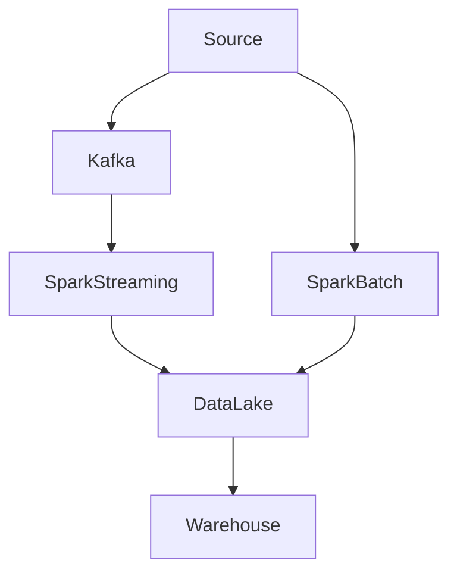
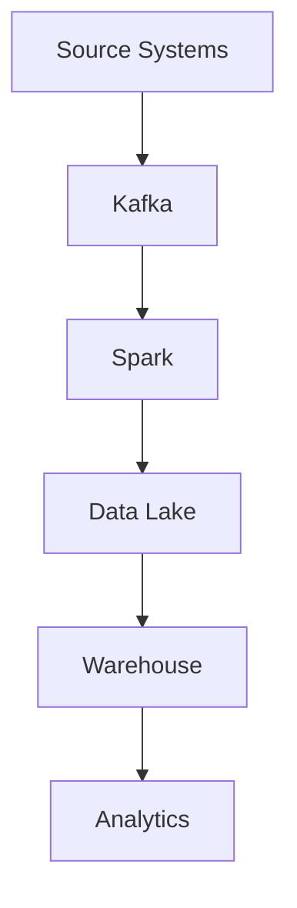

# Chapter 28 – Modern Data Engineering Architecture (Kafka → Spark → Data Lake → Warehouse)

Modern data platforms process data from multiple sources and transform it into analytics-ready datasets.

A common architecture used in production systems is:

**Kafka → Spark → Data Lake → Data Warehouse → BI Tools**

This architecture supports real-time and batch data processing.

---

## 1️⃣ High-Level Data Engineering Architecture


This pipeline processes and delivers data for analytics and reporting.

---

## 2️⃣ Data Sources

Data platforms ingest data from multiple sources.

| Source | Example |
|--------|---------|
| Applications | mobile apps, websites |
| Databases | OLTP systems |
| Logs | server logs |
| Streaming systems | user activity streams |

Example event:

```json
{
 "user_id": 123,
 "product_id": 456,
 "amount": 120,
 "timestamp": "2026-03-08"
}
```

---

## 3️⃣ Streaming Ingestion Layer

Real-time events are ingested through streaming systems like Apache Kafka.

Kafka stores events in **topics**.

Example topic:

- `user_transactions`

Kafka benefits:

| Feature | Benefit |
|---------|---------|
| High throughput | millions of events |
| Fault tolerance | data replication |
| Scalability | distributed partitions |

---

## 4️⃣ Spark Processing Layer

Spark processes incoming data streams.

Two common processing modes:

| Mode | Description |
|------|-------------|
| Batch processing | scheduled jobs |
| Streaming processing | real-time analytics |

Example Spark streaming code:

```python
df = spark.readStream \
         .format("kafka") \
         .option("subscribe", "transactions") \
         .load()
```

Spark performs transformations:

- filtering
- enrichment
- aggregation

---

## 5️⃣ Data Lake Storage

Processed data is stored in a data lake.

Common storage systems:

- Amazon S3
- Azure Data Lake Storage
- HDFS

Data formats:

| Format | Advantage |
|--------|-----------|
| Parquet | columnar storage |
| ORC | compression |
| Delta Lake | ACID transactions |

Example output:

```python
df.write.parquet("s3://data-lake/transactions")
```

---

## 6️⃣ Data Warehouse Layer

Cleaned data is loaded into a warehouse for analytics.

Examples:

- Snowflake
- Google BigQuery
- Amazon Redshift

Warehouse queries are used by analysts.

Example query:

```sql
SELECT country, SUM(amount)
FROM transactions
GROUP BY country;
```

---

## 7️⃣ Analytics & BI Layer

Business intelligence tools visualize data.

Examples:

- Tableau
- Power BI
- Looker

Example dashboard:

| Country | Revenue |
|---------|---------|
| USA | 2M |
| India | 1.5M |
| UK | 900K |

---

## 8️⃣ Batch vs Streaming Architecture

Modern platforms support both.

| Processing Type | Example |
|-----------------|---------|
| Batch | daily ETL jobs |
| Streaming | real-time dashboards |

Example architecture:



---

## 9️⃣ Data Pipeline Monitoring

Data pipelines require monitoring.

Common monitoring tools:

- Apache Airflow
- Prometheus
- Grafana

Monitoring metrics:

| Metric | Meaning |
|--------|---------|
| Pipeline runtime | job duration |
| Task failures | data errors |
| Processing latency | streaming delay |

---

## 🔟 Real Production Example

Example large-scale data platform:

- **Events per day** → 5 billion
- **Kafka partitions** → 200
- **Spark cluster** → 50 nodes
- **Daily ETL data** → 20 TB

Spark processes massive datasets efficiently across distributed clusters.

---

## 1️⃣1️⃣ Complete Data Engineering Flow



---

## Interview Questions

- **What is a modern data engineering pipeline?**  
  A system that ingests, processes, and stores data for analytics.

- **Why use Kafka with Spark?**  
  Kafka provides scalable event streaming while Spark performs distributed data processing.

- **What is the role of a data lake?**  
  It stores large volumes of raw and processed data.

---

## Key Takeaway

Modern data platforms combine multiple technologies to process massive data pipelines.

Typical architecture:

**Kafka → Spark → Data Lake → Data Warehouse → BI Tools**

This architecture powers real-time analytics and large-scale data processing systems.
