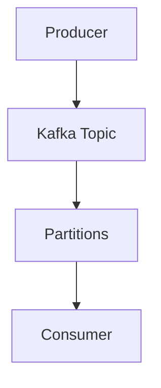
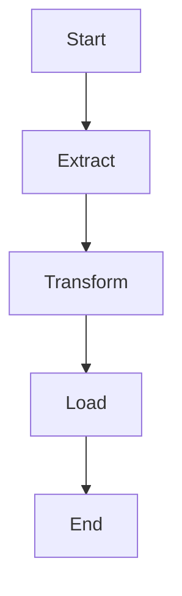
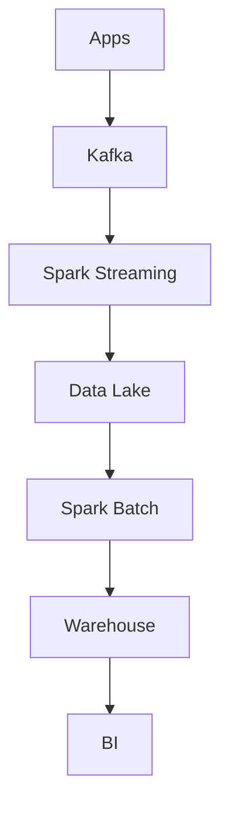

# Chapter 30 – Production Data Engineering Project
## Kafka → Spark → Data Lake → Warehouse → BI

This chapter demonstrates a real-world data engineering pipeline using modern technologies.

Pipeline technologies:

| Layer | Technology |
|-------|------------|
| Streaming | Apache Kafka |
| Processing | Apache Spark |
| Orchestration | Apache Airflow |
| Storage | Data Lake (S3 / ADLS / HDFS) |
| Analytics | Data Warehouse + BI tools |

This architecture powers modern data platforms and analytics systems.

---

## 1️⃣ Project Goal

Build a pipeline that processes e-commerce transaction events.

Example incoming event:

```json
{
 "user_id": 1203,
 "product_id": 200,
 "price": 150,
 "country": "India",
 "timestamp": "2026-03-09T10:30:00"
}
```

**Goal:**

- Real-time analytics dashboard
- Daily revenue aggregation
- Country-level sales reports

---

## 2️⃣ End-to-End Architecture


Data flows through multiple stages before reaching analytics dashboards.

---

## 3️⃣ Data Ingestion (Kafka)

Applications produce events into Kafka topics.

Example topic: `transactions`

Kafka architecture:



Kafka partitions allow parallel event consumption.

---

## 4️⃣ Spark Streaming Consumer

Spark reads streaming events from Kafka.

Example code:

```python
df = spark.readStream \
         .format("kafka") \
         .option("kafka.bootstrap.servers","localhost:9092") \
         .option("subscribe","transactions") \
         .load()
```

Spark converts the Kafka stream into a DataFrame stream.

---

## 5️⃣ Data Transformation

Transform incoming events.

Example transformations:

```python
transactions = df.selectExpr("CAST(value AS STRING)")
filtered = transactions.filter("price > 0")
```

Additional transformations:

- remove invalid data
- enrich with customer data
- derive new fields

---

## 6️⃣ Aggregation Example

Calculate revenue by country.

Example:

```python
revenue = filtered.groupBy("country").sum("price")
```

Output example:

| Country | Revenue |
|---------|---------|
| India | 2M |
| USA | 1.5M |
| UK | 900K |

---

## 7️⃣ Data Lake Storage

Processed data is stored in a data lake.

Common storage options:

- AWS S3
- Azure Data Lake
- HDFS

Example write operation:

```python
revenue.writeStream \
       .format("parquet") \
       .option("path","s3://data-lake/revenue") \
       .start()
```

Columnar formats improve query performance.

---

## 8️⃣ Batch ETL with Spark

Daily batch ETL jobs process historical data.

Example batch job:

```python
df = spark.read.parquet("s3://data-lake/revenue")
daily = df.groupBy("country").sum("price")
daily.write.parquet("s3://analytics/daily_revenue")
```

Batch jobs compute:

- daily reports
- weekly analytics
- monthly KPIs

---

## 9️⃣ Workflow Orchestration

Batch pipelines are scheduled using Apache Airflow.

Example DAG:



Airflow manages dependencies and schedules jobs.

Example schedule: **Daily at 02:00 AM**

---

## 🔟 Data Warehouse Layer

Cleaned data is loaded into a warehouse.

Popular warehouses:

- Snowflake
- Amazon Redshift
- Google BigQuery

Example query:

```sql
SELECT country, SUM(price)
FROM revenue
GROUP BY country;
```

---

## 1️⃣1️⃣ BI Dashboards

Business intelligence tools visualize the data.

Examples: Tableau, Power BI, Looker

Example dashboard:

| Metric | Value |
|--------|-------|
| Daily Revenue | $5M |
| Top Country | USA |
| Orders | 1.2M |

---

## 1️⃣2️⃣ Monitoring and Observability

Production pipelines require monitoring.

Important tools:

| Tool | Purpose |
|------|---------|
| Spark UI | job monitoring |
| Prometheus | metrics collection |
| Grafana | visualization |

Important metrics:

- job runtime
- shuffle size
- task failures
- streaming latency

---

## 1️⃣3️⃣ Scaling the Pipeline

Production pipelines scale horizontally.

Example cluster:

| Nodes | Executors | Total Cores |
|-------|-----------|-------------|
| 20 | 80 | 320 |

Scaling allows pipelines to process terabytes of data daily.

---

## 1️⃣4️⃣ Complete Pipeline Flow



---

## Interview Questions

- **What technologies are used in modern data pipelines?**  
  Kafka, Spark, data lakes, warehouses, and BI tools.

- **Why combine Kafka and Spark?**  
  Kafka handles high-throughput event streaming while Spark processes data in distributed clusters.

- **What is the role of Airflow?**  
  Airflow schedules and orchestrates ETL pipelines.

---

## Key Takeaway

Modern data engineering pipelines integrate multiple systems to process large-scale data.

Typical architecture:

**Kafka → Spark → Data Lake → Warehouse → BI**

These pipelines power real-time analytics platforms used by modern companies.
