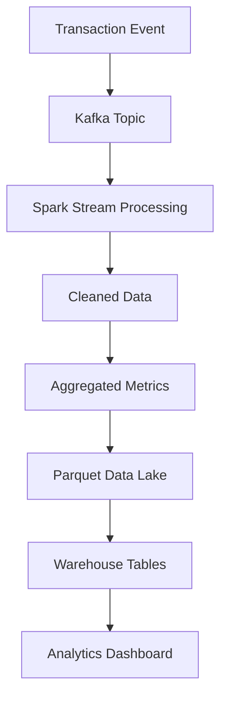

# System Design – Real-Time Data Engineering Pipeline

This document describes the end-to-end architecture of the production data engineering pipeline implemented in this repository.

The system processes transaction events and produces analytics-ready datasets.

---

## 1️⃣ High-Level System Architecture


---

## 2️⃣ System Components

| Component | Purpose |
|-----------|---------|
| Applications | generate transaction events |
| Backend APIs | send events to Kafka |
| Kafka | streaming ingestion layer |
| Spark Streaming | real-time data processing |
| Data Lake | scalable storage for raw/processed data |
| Batch Spark Jobs | compute analytics datasets |
| Data Warehouse | optimized analytical queries |
| BI Dashboards | business reporting |

---

## 3️⃣ Data Flow

The pipeline processes data in several stages.



---

## 4️⃣ Streaming Processing Layer

Spark streaming reads data continuously from Kafka.

**Processing steps:**

1. Event ingestion
2. Data validation
3. Filtering invalid records
4. Aggregations
5. Write to Data Lake

Example streaming logic:

```python
df = spark.readStream \
    .format("kafka") \
    .option("subscribe","transactions") \
    .load()
```

---

## 5️⃣ Batch Processing Layer

Batch jobs run daily to generate analytics tables.

**Tasks include:**

- Daily revenue aggregation
- Country-level sales metrics
- Monthly business KPIs

Batch job example:

```python
df = spark.read.parquet("data-lake/revenue")
daily_metrics = df.groupBy("country").sum("price")
```

---

## 6️⃣ Storage Layer

The system uses a data lake architecture.

**Recommended formats:**

| Format | Advantage |
|--------|-----------|
| Parquet | columnar storage |
| ORC | high compression |
| Delta Lake | ACID transactions |

Example output structure:

```
data-lake/
  transactions/
  revenue/
  daily_metrics/
```

---

## 7️⃣ Analytics Layer

Data warehouse queries support BI dashboards.

Example query:

```sql
SELECT country, SUM(revenue)
FROM sales
GROUP BY country;
```

Dashboard tools visualize the results. Examples: Tableau, Power BI, Looker

---

## 8️⃣ Scalability

The system scales horizontally.

Example cluster configuration:

| Resource | Example |
|----------|---------|
| Kafka partitions | 50 |
| Spark executors | 40 |
| Total cores | 160 |

This architecture can process terabytes of data per day.

---

## 9️⃣ Monitoring and Observability

Monitoring ensures system reliability.

**Tools used:**

| Tool | Purpose |
|------|---------|
| Spark UI | job performance |
| Prometheus | metrics collection |
| Grafana | visualization |
| Airflow | pipeline scheduling |

**Key metrics:** pipeline runtime, shuffle size, streaming latency, task failures

---

## 🔟 System Architecture Summary

Complete system pipeline:


---

## Key Takeaway

This architecture enables scalable analytics pipelines using distributed systems.

Typical production pipeline:

**Applications → Kafka → Spark Processing → Data Lake → Data Warehouse → BI Dashboards**

Such systems power modern data-driven platforms and analytics applications.
