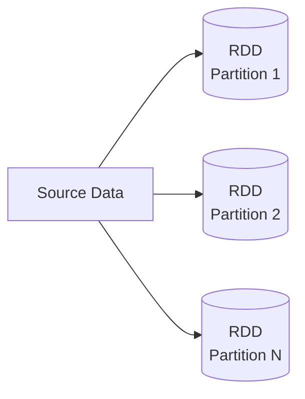
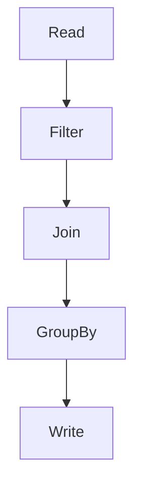
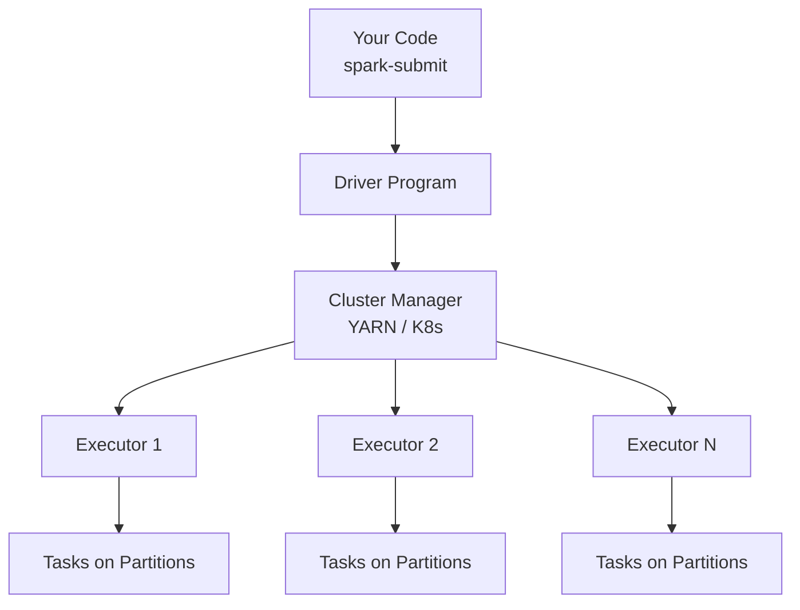
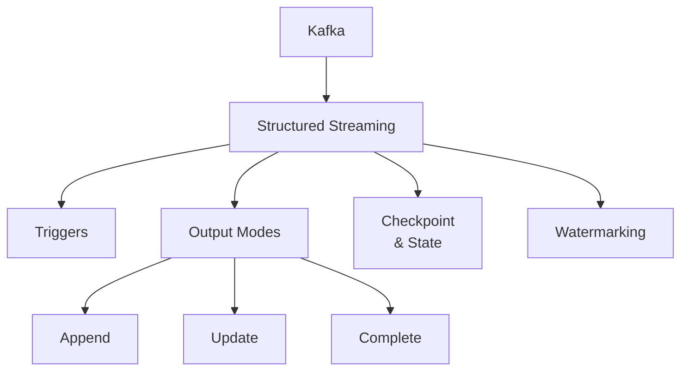
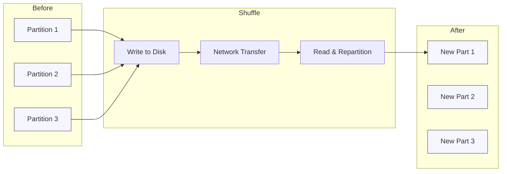

# Chapter 32 – Apache Spark Interview Theory Cheatsheet (55 Questions)

This chapter is your **Spark theory brain map** for interviews.

Use it like this:

- **Skim the visuals before interview day**
- For each section, **read the “Story + Hook” first**, then the answers
- Revisit key diagrams: **Architecture, RDD→DataFrame, Job→Stage→Task, Shuffle**

---

## 1️⃣ Spark in One Picture – Big-Picture Visual

```mermaid
flowchart LR
  subgraph Input
    A[Batch Files\n(Parquet, CSV, JSON)]
    B[Streams\n(Kafka, Kinesis)]
  end

  subgraph Spark[Apache Spark Engine]
    C[Spark Core\nRDD / DataFrame / Dataset]
    D[Spark SQL]
    E[Structured Streaming]
    F[MLlib]
    G[GraphX]
  end

  subgraph Output
    H[Data Lake\nParquet / Delta]
    I[Warehouse\nSnowflake, BigQuery]
    J[Dashboards\nPower BI, Tableau]
  end

  A --> C
  B --> E
  C --> D
  D --> H
  E --> H
  H --> I
  I --> J
```

**Story:** *Spark sits in the middle, eating data from batch + streams and feeding data lakes, warehouses, and dashboards.*

---

## 2️⃣ Core Concepts & Definitions (Q1–Q10)

### 🎯 Mental hook

- **Spark = FAST ENGINE** (in-memory)
- **RDD = Foundation**, **DataFrame = Daily driver**
- **Transformations = Recipe**, **Actions = Serve the dish**

---

### Q1. What is Apache Spark?

**Answer:** A **fast, in-memory, distributed processing engine** for big data – used for batch, streaming, SQL, and ML.

> Interview line: **“Spark is the in-memory computation engine that powers most modern big data pipelines.”**

---

### Q2. Key features of Spark

- **Speed:** In-memory, up to ~100x faster than disk-based MapReduce
- **Ease of use:** APIs in Python/Scala/Java/R + SQL
- **Unified engine:** Batch, streaming, SQL, ML all in one
- **Fault-tolerant:** RDD lineage, retries
- **Flexible deployment:** YARN, Kubernetes, Mesos, Standalone

**Hook:** *“SUFF” – Speed, Unified engine, Fault tolerance, Flexible deployment.*

---

### Q3. Main modules of Spark

| Module | Purpose |
|--------|---------|
| Spark Core | RDD, task scheduling, memory mgmt |
| Spark SQL | DataFrames, SQL engine, Catalyst |
| Structured Streaming | Streaming on DataFrames |
| MLlib | Distributed machine learning |
| GraphX | Graph processing |

**Hook:** *“S2MG” – SQL, Streaming, MLlib, GraphX on top of Core.*

---

### Q4. Spark vs Hadoop MapReduce

- **Spark:** In-memory, fewer disk writes, DAG-based, unified APIs.
- **MapReduce:** Disk-heavy, multiple jobs chained, slower.

> Interview line: **“MapReduce writes to disk after each step; Spark keeps data in memory across steps.”**

---

### Q5. What is an RDD?

**RDD (Resilient Distributed Dataset)** is:

- **Immutable**: cannot be modified, only transformed
- **Distributed**: partitioned across cluster
- **Resilient**: can be recomputed from lineage



**Hook:** *“3 Ds – Distributed, Deterministic lineage, Durable via recompute.”*

---

### Q6. Transformations vs Actions

- **Transformations (lazy):** `map`, `filter`, `groupBy`, `join`
- **Actions (trigger execution):** `count`, `collect`, `show`, `save`

**Hook:** *Transformations = “PLAN”, Actions = “RUN”.*

---

### Q7. Lazy Evaluation

Spark **builds a plan first** (DAG of transformations) and **executes only when an action is called**.

> Interview line: **“Lazy evaluation lets Spark optimize the whole pipeline instead of step-by-step.”**

---

### Q8. DAG (Directed Acyclic Graph)



- Nodes = RDD/DataFrame versions
- Edges = transformations
- No cycles; flows forward only

---

### Q9. Narrow vs Wide Transformations

| Type | Example | Data Movement |
|------|---------|---------------|
| Narrow | `map`, `filter` | No shuffle |
| Wide | `groupBy`, `join` | Requires shuffle |

**Hook:** *Narrow = “Local only”; Wide = “Network shuffle”.*

---

### Q10. SparkSession vs SparkContext

- **SparkContext:** Old entry point, RDD-based (Spark 1.x).
- **SparkSession:** Unified entry (Spark 2+): SQL, DataFrame, Streaming, Catalog.

> Interview line: **“In modern Spark, we always start with SparkSession – it internally manages SparkContext.”**

---

## 3️⃣ Spark Architecture – Driver, Executors, Jobs (Q11–Q20)

### 🔭 Visual: Spark Cluster



**Hook:** *“Driver decides, Cluster Manager allocates, Executors execute.”*

---

### Q11–Q15. Core architecture pieces

- **Driver:** Coordinates, builds DAG, schedules jobs/stages/tasks.
- **Executors:** Run tasks, hold cached data.
- **Worker node:** Machine that hosts executors.
- **Cluster Manager:** YARN / K8s / Mesos / Standalone.

**Client vs Cluster mode (Q16):**

- **Client mode:** Driver on submitting machine (good for dev).
- **Cluster mode:** Driver inside cluster (good for production).

---

### Q17–Q20. Job → Stage → Task + Spark UI

```mermaid
flowchart LR
  A[Action Called] --> B[Job]
  B --> C1[Stage 1\n(no shuffle)]
  B --> C2[Stage 2\n(after shuffle)]
  C1 --> T1[Tasks per partition]
  C2 --> T2[Tasks per partition]
```

- **Job:** One action = one job.
- **Stage:** Group of tasks separated by shuffle.
- **Task:** Unit of work per partition.
- **Spark UI:** See jobs, stages, tasks, shuffles, storage.

**Hook:** *Hierarchy = **Job → Stage → Task***.

---

## 4️⃣ RDD vs DataFrame vs Dataset (Q21–Q30)

### Q21. RDD vs DataFrame vs Dataset

| Feature | RDD | DataFrame | Dataset |
|--------|-----|-----------|---------|
| Type safety | Yes | No | Yes (Scala/Java) |
| Optimization | Manual | Catalyst | Catalyst |
| API style | Low-level | SQL-like | Typed |
| Typical use | Custom logic | ETL, analytics | Strongly typed apps |

**Rule of thumb:** *“Use DataFrames for 90% of work.”*

---

### Q22–Q23. Catalyst & Tungsten

- **Catalyst Optimizer:** Analyzes logical plan, rewrites it, picks best physical plan.
- **Tungsten Engine:** Low-level execution – off-heap memory, code generation, cache-aware.

> Interview line: **“DataFrames are fast because Catalyst builds an optimized plan and Tungsten runs it efficiently.”**

---

### Q24. Schema

Schema = **column names + types** for a DataFrame.

**Production rule:** Define schemas explicitly rather than relying on inference.

---

### Q25. `map()` vs `flatMap()`

- `map` → **one input → one output**
- `flatMap` → **one input → zero/many outputs**, then flattened

---

### Q26. `groupByKey()` vs `reduceByKey()`

- `groupByKey`: sends **all values** for a key across network (heavy).
- `reduceByKey`: **aggregates locally**, then shuffles only reduced data (much cheaper).

> Interview line: **“On big data, avoid `groupByKey`; prefer `reduceByKey` or `aggregateByKey`.”**

---

### Q27–Q28. Caching & Persistence

- **Why:** Avoid recomputing expensive steps used multiple times.
- **`cache()`:** Default storage level.
- **`persist(level)`:** Choose custom storage (`MEMORY_ONLY`, `MEMORY_AND_DISK`, etc.).

**Hook:** *“Cache what you reuse. Don’t cache everything.”*

---

### Q29–Q30. Partitioning, `repartition()` vs `coalesce()`

- **Partitioning:** Controls parallelism.
- **`repartition(n)`:** Can **increase or decrease** partitions, triggers full shuffle.
- **`coalesce(n)`:** Only **reduces** partitions, usually avoids full shuffle.

> Rule: **Increase = `repartition`, Decrease = `coalesce`.**

---

## 5️⃣ Spark SQL & Streaming Essentials (Q31–Q40)

### Q31–Q32. Spark SQL & Temp Views

- **Spark SQL:** Run SQL on DataFrames / tables.
- **Temp view:** `df.createOrReplaceTempView("t")` then `spark.sql("SELECT ... FROM t")`.

---

### Q33–Q40. Streaming Mind-Map



Key concepts:

- **Structured Streaming:** Treats stream as **unbounded table**.
- **Triggers:** When to run (`micro-batch`, `once`, `continuous`).
- **Checkpointing:** For **fault-tolerance & exactly-once** semantics.
- **Watermarks:** How long to wait for **late events**.
- **`foreachBatch()`:** Run custom logic per micro-batch (upserts, multiple sinks).

> Interview line: **“In production streams, I always enable checkpointing and define watermarks on event-time columns.”**

---

## 6️⃣ Performance Tuning – What Interviewers Love (Q41–Q50)

### 🔥 Visual: Why shuffle hurts



**Hook:** *“Shuffle = Disk + Network + Repartition.”*

---

### Q41. Data Skew

**Problem:** One or few keys have huge data → one task becomes **very slow** (hot partition).

**Fixes:**

- **Salting:** Add random suffix to skewed keys before grouping/joining.
- **Broadcast small side** of join.
- Increase partitions / use skew hints (Spark 3 AQE).

---

### Q42. Broadcast Join

- **Idea:** Send small table to all executors to avoid shuffle.
- Trigger via `broadcast(df)` or automatic if below threshold.

> Interview line: **“If one side of the join is small (~tens of MB), I broadcast it to eliminate shuffle.”**

---

### Q43–Q47. Shuffle, Partitions, Predicate Pushdown, Column Pruning

- **Shuffle:** Expensive because: write → network → read.
- **`spark.sql.shuffle.partitions`:** Number of shuffle partitions (default 200).
- **Predicate pushdown:** Push filters to source (Parquet, JDBC).
- **Column pruning:** Read only needed columns (avoid `SELECT *`).

**Hook:** *“Filter early, select lightly.”*

---

### Q45. Adaptive Query Execution (AQE)

- Auto-tunes **shuffle partitions**.
- Can change join strategies at runtime.
- Handles skewed joins automatically.

> Interview line: **“On Spark 3, I keep `spark.sql.adaptive.enabled=true` to let AQE auto-tune joins and partitions.”**

---

### Q48–Q49. Accumulators & Broadcast Variables

- **Accumulators:** Write-only counters from executors, readable on Driver.
- **Broadcast variables:** Read-only variables cached on executors (config maps, lookup tables).

---

### Q50. File formats

| Format | Best For |
|--------|----------|
| Parquet | Analytics, columnar, compression |
| ORC | Hive ecosystems |
| Avro | Row-based exchange, schema evolution |
| Delta Lake | ACID + streaming + time-travel |
| JSON/CSV | Interchange, not performance |

**Rule:** *“Parquet/Delta for production analytics, avoid raw CSV/JSON at scale.”*

---

## 7️⃣ Advanced Topics – Lakehouse & Beyond (Q51–Q55)

### Q51. Delta Lake

Adds **ACID, schema enforcement, time travel, and MERGE** on top of Parquet.

```mermaid
flowchart TD
  P[Plain Parquet\n(no transactions] --> D[Delta Lake\nACID + Schema + Time Travel]
```

> Interview line: **“We use Delta Lake to turn our data lake into a lakehouse with ACID, upserts, and unified batch + streaming.”**

---

### Q52–Q53. MLlib & GraphX

- **MLlib:** Spark’s ML library – scalable ML algorithms and Pipelines.
- **GraphX:** Graph-processing library for networks (nodes, edges).

---

### Q54. Fault Tolerance in Spark

- **RDD lineage:** Recompute lost partitions.
- **Checkpointing:** Persist state to durable storage (esp. streaming).
- **Replication (via storage levels):** Extra safety for cached data.

**Hook:** *“Spark remembers HOW to build data, not just the data itself.”*

---

### Q55. Limitations of Spark

- High memory usage → can be expensive.
- Overkill for **small data** (Pandas is enough).
- Micro-batch streaming, not pure sub-ms real-time (Flink is better).
- Depends on external storage (HDFS, S3, etc.).

> Interview line: **“Spark is great for large-scale data processing; for small or ultra-low-latency workloads, I pick simpler or more specialized tools.”**

---

## 🔁 Last-Minute Revision Grid (All 55 in One Table)

Use this 1–2 minutes before the interview.

| Area | What to remember |
|------|------------------|
| Basics | Spark = in-memory engine, RDD basics, lazy evaluation, DAG, narrow vs wide |
| Architecture | Driver, Executors, Cluster Manager, Job → Stage → Task, Spark UI |
| APIs | RDD vs DataFrame vs Dataset, `map` vs `flatMap`, `groupByKey` vs `reduceByKey` |
| Storage & Caching | Partitioning, `repartition` vs `coalesce`, cache vs persist |
| SQL & Streaming | Spark SQL, temp views, Structured Streaming, triggers, checkpoints, watermarks, `foreachBatch` |
| Performance | Shuffle, skew, broadcast join, shuffle partitions, AQE, predicate pushdown, column pruning |
| Advanced | Delta Lake, MLlib, GraphX, fault tolerance via lineage, Spark limitations |

---

## ✅ How to Answer in the Interview

- Start with **one-line definition**
- Add **real-world example**: “In my last project, we used…”
- End with **trade-off or best practice** (e.g., “avoid `groupByKey` on big data”)

If you walk through this chapter a few times and visualize the diagrams, you’ll be able to **recall these 55 questions naturally in the interview**.

