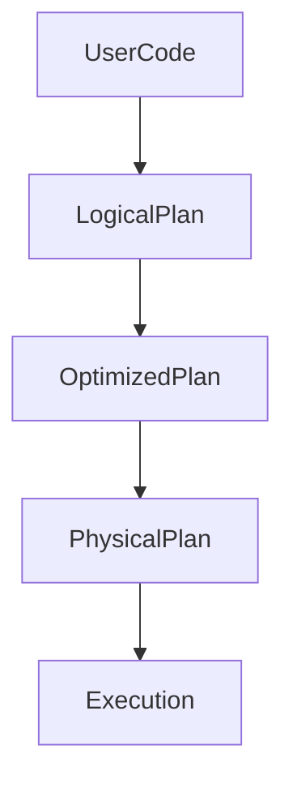
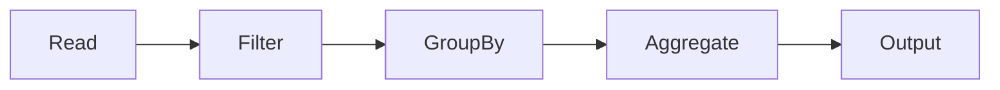
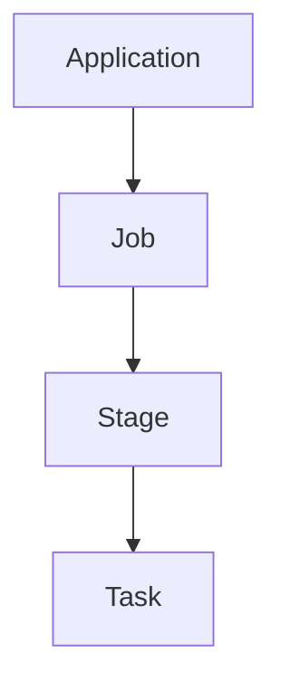
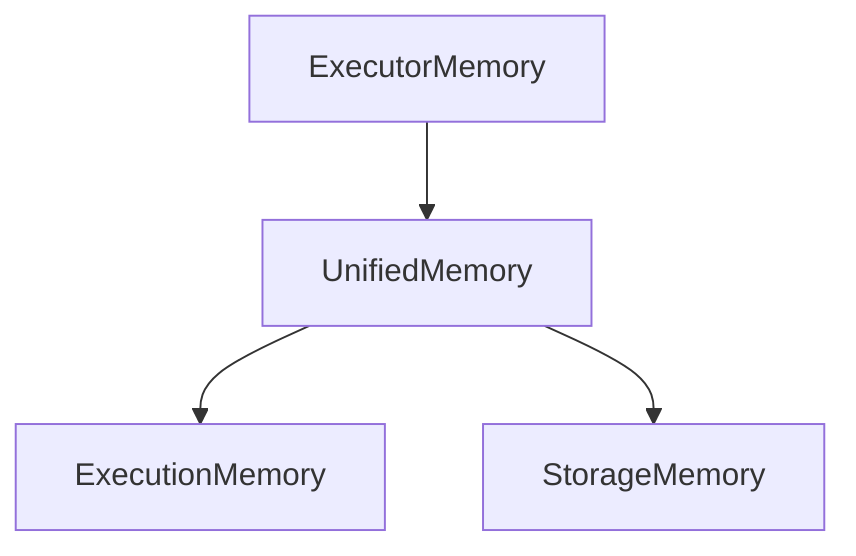
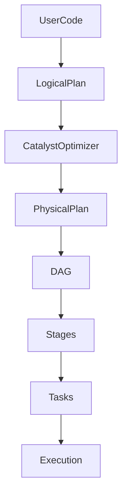

# Chapter 27 – Spark Internals Deep Dive

Understanding Spark internals helps engineers:

* debug slow Spark jobs
* optimize pipelines
* diagnose shuffle problems
* improve cluster performance

This chapter explains how Spark works **inside the engine**.

---

# 1️⃣ Spark Execution Overview

Spark execution begins when a user writes code.

Example:

```python
df = spark.read.parquet("orders")

df.filter("amount > 100").groupBy("country").sum("amount").show()
```

Spark converts this code into an execution plan.

Execution flow:



---

# 2️⃣ Logical Plan

Spark first creates a **logical plan**.

Logical plan describes:

* data source
* transformations
* filters
* aggregations

Example logical operations:

```text
Read Orders
Filter amount > 100
Group by country
Aggregate sum(amount)
```

This stage does **not execute the query yet**.

---

# 3️⃣ Catalyst Optimizer

Spark uses the **Catalyst Optimizer** to improve queries.

Catalyst performs multiple optimizations.

| Optimization       | Description                    |
| ------------------ | ------------------------------ |
| Predicate Pushdown | filters applied at data source |
| Column Pruning     | read only required columns     |
| Constant Folding   | simplify expressions           |

Example optimization:

Before optimization:

```text
Read all columns
Filter later
```

After optimization:

```text
Read only required columns
Apply filter early
```

---

# 4️⃣ Physical Plan

After optimization, Spark creates a **physical execution plan**.

The physical plan determines:

* join strategy
* shuffle operations
* partition processing

Example join strategies:

| Strategy          | Description                |
| ----------------- | -------------------------- |
| Broadcast Join    | small dataset broadcast    |
| Shuffle Hash Join | distributed hash join      |
| Sort Merge Join   | sorted join for large data |

---

# 5️⃣ DAG Generation

Spark converts transformations into a **Directed Acyclic Graph (DAG)**.



Each node represents a transformation.

---

# 6️⃣ Stage Creation

Spark divides DAG into stages.

Stages are separated by **shuffle boundaries**.

Example:

```text
Stage 1
Read + Filter

Stage 2
GroupBy + Aggregation
```

Shuffle happens between stages.

---

# 7️⃣ Task Creation

Each stage contains multiple tasks.

Example:

```text
Dataset partitions → 200
Tasks → 200
```

Each task processes one partition.

Execution hierarchy:



---

# 8️⃣ Shuffle Internals

Shuffle redistributes data across executors.

Example operation:

```python
df.groupBy("country").sum("amount")
```

Before shuffle:

| Executor | Data  |
| -------- | ----- |
| 1        | USA   |
| 2        | India |
| 3        | USA   |

After shuffle:

| Executor | Data  |
| -------- | ----- |
| 1        | USA   |
| 2        | India |

Shuffle steps:

```text
Write intermediate data
Transfer across network
Sort data
Read by next stage
```

Shuffle is the **most expensive Spark operation**.

---

# 9️⃣ Tungsten Execution Engine

Spark uses the **Tungsten engine** to optimize performance.

Key improvements:

| Feature                | Benefit             |
| ---------------------- | ------------------- |
| Binary memory format   | faster processing   |
| Code generation        | optimized execution |
| CPU cache optimization | improved CPU usage  |

Example:

Spark generates optimized JVM bytecode for execution.

---

# 🔟 Memory Management Internals

Spark uses **Unified Memory Management**.

Memory components:



Execution memory:

* joins
* aggregations
* shuffle buffers

Storage memory:

* cached data
* persisted datasets

---

# 1️⃣1️⃣ Task Execution Lifecycle

Task lifecycle:

```text
Task Scheduled
Task Assigned to Executor
Task Execution
Task Completion
Result Returned to Driver
```

If task fails:

Spark retries execution.

---

# 1️⃣2️⃣ Fault Tolerance

Spark ensures fault tolerance using **RDD lineage**.

Example:

```text
Read Data
 → Filter
 → Map
 → Reduce
```

If partition fails:

Spark recomputes data using lineage.

This avoids storing multiple replicas.

---

# 1️⃣3️⃣ Adaptive Query Execution (AQE)

AQE dynamically optimizes queries during runtime.

Capabilities:

| Feature                | Benefit                 |
| ---------------------- | ----------------------- |
| Dynamic join selection | choose optimal join     |
| Skew handling          | fix data skew           |
| Partition coalescing   | reduce small partitions |

Enable AQE:

```bash
spark.sql.adaptive.enabled=true
```

---

# 1️⃣4️⃣ Spark Internals Summary

Spark execution pipeline:



---

# Interview Questions

### What happens internally when Spark executes a job?

Spark converts user code into logical plan → optimized plan → physical plan → DAG → stages → tasks.

---

### What is Catalyst Optimizer?

Catalyst is Spark's query optimization engine.

---

### Why is shuffle expensive?

Because data must be written to disk, transferred over the network, and re-partitioned.

---

# Key Takeaway

Spark internals consist of multiple layers:

```text
Logical planning
Query optimization
Physical execution
Distributed task scheduling
Memory management
```

Understanding these layers allows engineers to **debug performance issues and optimize Spark pipelines effectively**.
